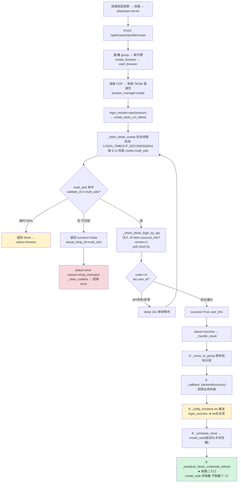
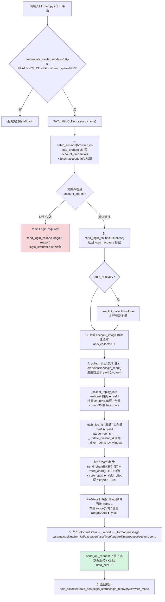
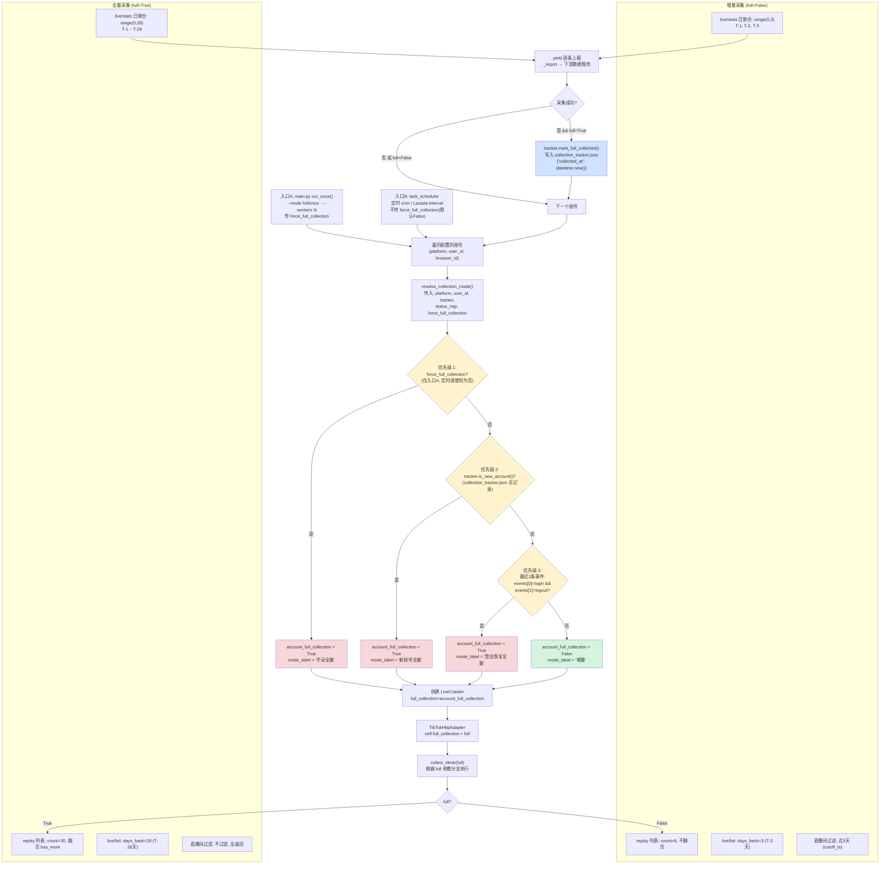
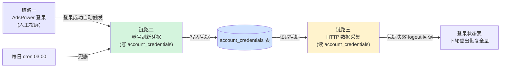

# TikTok 三大链路流程图

> 创建：2026-06-03 · 更新：2026-06-04（按 adapter/collector/login_monitor/tiktok_refresher 实际代码核实行号）
> 关联代码：`services/adspower-server/`、`services/live-crawler/`
> 关联 plan：`docs/plans/2026-05-28-tiktok-http-refactor.md`
>
> TikTok 拆为三块独立链路：**AdsPower 登录(人工投屏)**、**养号刷新凭据**、**HTTP 数据采集**。
> 三者通过 `account_credentials` 表与登录回调解耦。

## 一、TikTok AdsPower 登录(人工投屏)

人工投屏复登入口，cookie 命中后必须经 API 二次验证，登录成功后自动触发养号刷新(链路二)。



要点：cookie 命中后**必须**经 `_check_tiktok_login_by_api` 二次验证（注入 JS fetch `account_info`，判 `code==0 && user_id`），失败则 sleep 15s 回到轮询；ws 在 ③ 同步发完；5s 延迟只管关浏览器时机，不影响 ws 与业务；⑤ 仅在 `TIKTOK_REFRESH_ON_LOGIN` 开启且 success 时调度。

## 二、养号刷新凭据(登录成功自动触发 + 每日 cron)

两个触发源(复登即时 + cron 兜底)汇到同一个 `refresh_account`；logout 回调一律基于 HTTP 验证。

```mermaid
flowchart TD
    subgraph SA["触发源 A:登录成功(adspower-server 后台 task)"]
        A1["_refresh_tiktok_credential<br/>sleep(CLOSE_DELAY+2 ≈7s) 起步"] --> A2{"轮询 check_browser_active<br/>GET /api/v2/browser/check/{id}<br/>每10s 最长15min"}
        A2 -->|Inactive 关了| A5[触发刷新]
        A2 -->|15分钟超时| A3["stop_browser 强制关<br/>sleep5 + 二次确认"]
        A3 --> A4{仍活跃?}
        A4 -->|关了| A5
        A4 -->|是| AX[放弃 cron兜底]
        A5 --> A6["httpx POST {MONITOR_API_URL}/api/refresh_tiktok_credential<br/>X-API-Token timeout=180s payload={account_id}"]
        A6 --> A7["live-crawler 校验 X-API-Token<br/>→ run_in_threadpool"]
    end

    subgraph SB["触发源 B:每日 cron 03:00"]
        B1["jobs.refresh_tiktok_credentials<br/>_load_tiktok_accounts<br/>(动态分组/动态名单/静态)"] --> B2["逐个 refresh_account<br/>失败汇总飞书告警"]
    end

    A7 --> R
    B2 --> R

    subgraph R["TikTokRefresher.refresh_account(account_id, group_name, proxy)"]
        R1["1. _load_profile_context<br/>查 AdsPower group_name/proxy(权威值)"] --> R2["2. 开浏览器 → listen_api(FALLBACK_APIS)<br/>→ 导航 analytics → sleep3"]
        R2 --> R3["3. get_listened_data wait=15s count=1"]
        R3 --> R4{"4. 拦到?"}
        R4 -->|拦到| R5["_finalize_success<br/>_extract_context 提上下文"]
        R4 -->|超时| R6["_handle_failure_with_login_check<br/>历史凭据补全 cookies/qs/region"]
        R6 --> R6V{"HTTP 验证在线?"}
        R6V -->|在线| R6R["_retry_navigation_and_capture<br/>重挂监听 二次导航 等15s"]
        R6V -->|明确登出| R9
        R6V -->|状态未知(异常)| RN["不发回调 本次放弃"]
        R6R -->|拿到| R5
        R6R -->|仍空| RN
        R5 --> R7{"5. _check_login_status"}
        R7 --> R7A["_check_login_by_api<br/>curl_cffi+cookies 直连 account_info"]
        R7A -->|ok user_id| R8[通过]
        R7A -->|code≠0| R9[失败 有reason]
        R7A -->|异常| R10["降级 _check_sessionid_cookie<br/>查 sessionid 存在+未过期(buffer 1d)"]
        R10 --> R8
        R10 --> R9
        R8 --> R11["save_credentials 写 account_credentials<br/>+ send_login_callback(success, credential_refreshed)"]
        R9 --> R12["send_login_callback(logout, reason)"]
    end

    style R11 fill:#d4f4dd
    style R12 fill:#f8d7da
    style AX fill:#fff3cd
    style RN fill:#fff3cd
```

要点：
- **profile 冲突**靠轮询确认 Inactive 根治；15 分钟超时则主动 `stop_browser` 强制关再刷新；强制关后仍活跃则放弃，由 cron 兜底。
- **拦截超时不等于登出**：先用 curl_cffi + 浏览器 cookies + 历史 query_string 直连 `account_info` 验证——在线则重试一次导航抓取，明确登出才发 logout，调用异常（状态未知）一律不发回调，避免污染登录态。
- **登录态验证三层降级**：`_check_login_by_api`(HTTP code) → 异常降级 `_check_sessionid_cookie`(cookie 存在+未过期) → 未知。
- **region 三层提取**：query_string 的 `carrier_region` → `region` → `store_region`，取大写。
- **`_extract_context` 产出**：cookies(list)、query_string(原文)、creator_id(响应体)、user_agent(请求头)、region。

## 三、HTTP 数据采集(读凭据跑采集)

采集只读 `account_credentials`，不开浏览器；时区/时间窗按 region 走 `TIKTOK_REGION_PROFILES`；每个接口结果独立 yield 上报，业务码异常不污染下游。



要点：
- `setup_session` 已前移到 adapter，作为首道验证；验证结果（`login_result`）连同 `cred`/`session` 注入 `collect_tiktok`，避免重复请求 `account_info`。
- 注入模式下 account_info 由 adapter 单独上报（步骤 3），`collect_tiktok` 内部跳过该 yield；仅自建会话（向后兼容旧调用）时才在生成器内 yield account_info。
- 凭据失效时抛 `LoginRequired` 转 logout 回调，下一轮据登出恢复标记决定全量。
- `ok=False` 的 item（单房间/单日失败）只记 `error` 并 `continue`，不污染下游、不中断整轮。

### 3.1 采集模式判断逻辑（main.py → resolve_collection_mode）

从 `main.py` 启动入口开始，每个账号的采集模式（增量/全量）按以下优先级判断：



**关键代码文件映射**（行号按 2026-06-04 核实）：
- `main.py:229`（入口A，串行，传 `force_full_collection`）/ `scheduler/task_scheduler.py:256`（入口B，定时，不传）→ `resolve_collection_mode()` 调用
- `core/collection_mode.py:10-32` → 四级优先级判断（两个入口共用同一函数）
- `core/collection_tracker.py:is_new_account / mark_full_collected` → 新账号判定与全量标记
- `crawlers/http/tiktok/adapter.py:87-89` → 登出即时恢复 `login_recovery` → `full_collection=True`
- `crawlers/http/tiktok/collector.py:227-238` → `_time_window()` 时间窗计算（`days_back` 增量3/全量28）
- `crawlers/http/tiktok/collector.py:553-563` → `filter_rooms_by_window()` 直播间过滤
- `crawlers/http/tiktok/collector.py:277-285` → `_local_yesterday()` live/stats 日聚合锚点
- `crawlers/http/tiktok/collector.py:725-728` → live/stats 日聚合范围 `range(0,3)` / `range(0,28)`
- `crawlers/http/tiktok/collector.py:79` → `TIKTOK_REGION_PROFILES` 含 11 国（JP/SG/MY/CN/ID/TH/VN/PH/BR/MX/US）

> **两入口一致性**：`main.py`（手动/命令行）与 `task_scheduler.py`（定时调度）共用 `resolve_collection_mode()`、登出即时恢复检测、`mark_full_collected()` 标记、`append_full_recovery_event_if_needed()` 事件链，逻辑完全一致。唯一差异：定时调度不传 `force_full_collection`（默认 `False`），因此无"手动全量"档位——这是预期设计，cron 自动任务只走「新账号全量 / 登出恢复全量 / 增量」三档。

**时间窗口对比表**：

| 维度 | 增量 (full=False) | 全量 (full=True) |
|------|------------------|------------------|
| **触发条件** | 老账号 + 无登出事件 | `--mode full` / 新账号 / 登出恢复 |
| **replay 列表** | `count=6`, 不翻页 | `count=30`, 翻页至 `has_more=false` |
| **live/list 时间窗** | `days_back=3` (T-3) | `days_back=28` (T-28) |
| **直播间过滤** | 近 3 天 (`cutoff_ts`) | 全部返回 |
| **live/stats 日聚合** | `range(0,3)` (T-1/T-2/T-3) | `range(0,28)` (T-1 ~ T-28) |
| **tracker 更新** | 无 | 成功后 `mark_full_collected()` |

## 三块链路的衔接关系



