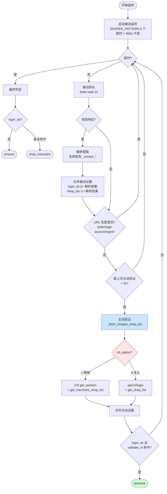
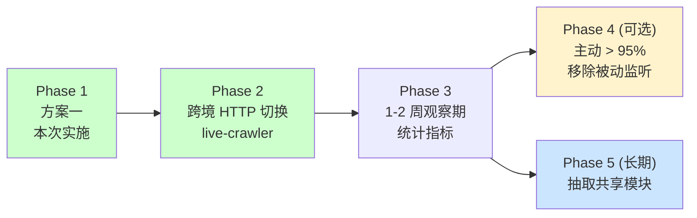

# Shopee 登录检测重构技术规格文档

> 基于 [current-state-analysis.md](./current-state-analysis.md) 的现状梳理与补充信息，输出完整的重构方案。
>
> **设计原则**：能不加分支就不加，让现有兜底机制（被动监听、900s 超时、节流）自然处理边界情况。

## 1. 概述

### 1.1 重构目标

解决 adspower-server 被动监听 Shopee 登录检测的可靠性问题，并适配 2026-05-22 起子账号强制 Google OAuth 登录的新流程。

### 1.2 核心变更（共 3 项）

| 变更项 | 说明 | 触发原因 |
|--------|------|---------|
| **新增主动验证快速路径** | URL 离开登录页后立即调用 API 验证，5s 节流 | 被动监听丢包率高（15-20%） |
| **新增跨境店多店列表接口监听** | `get_merchant_shop_list` 加入监听 + 主动验证 | 跨境多店账号无法枚举店铺 |
| **跨境店切换改为 HTTP API** | live-crawler 跨境店切换走 `switch_merchant_shop` + `set_language` | 浏览器点击 Details 在跨境店无效 |

### 1.3 不做的事（明确边界）

- ❌ **不区分主/子账号超时**：统一保持 `settings.LOGIN_TIMEOUT_SECONDS = 900s`，登录涉及 OTP/验证码/OAuth 时间不可控
- ❌ **不识别 OAuth 中转页**：在 `agentaccount` 域名时主动验证自然失败，被动监听兜底
- ❌ **不抽取共享模块**：保持两端独立，避免跨服务发布耦合（演进 Phase 再考虑）

### 1.4 预期收益

- **登录成功率**：从 ~85% 提升至 >95%（消除被动监听漏包）
- **检测时延**：从 15-20s 降至 3-5s（URL 跳转后立即验证）
- **代码可维护性**：删除 4 项补丁性代码，代码净减少约 100 行

---

## 2. 当前问题分析

### 2.1 核心缺陷

#### 缺陷 1：被动监听不可靠

adspower-server 依赖 `tab.listen` 被动捕获接口响应，三类失败模式：
- 网络抖动漏包
- 某些账号登录后不主动请求 `get_shop_list`，监听永远等不到
- 登录瞬间页面跳转、frame 重载，响应在监听窗口外触发

**影响**：触发 `fallback_triggered` 补丁，造成 15-20% 检测超时。

#### 缺陷 2：跨境店多店列表接口未接入

`get_merchant_shop_list` 已被确认可用（[现状分析 §3.1](./current-state-analysis.md#31-跨境店已确认)），但当前两端代码都未使用：跨境多店账号只能通过 `get_session.current_shop_id` 拿到当前店，无法枚举授权店铺，validate_id 不在当前店时只能判 `shop_mismatch`。

#### 缺陷 3：跨境店切换接口缺位

跨境店切换需 `switch_merchant_shop` + `set_language` 两步 HTTP 调用（[现状分析 §四.P0](./current-state-analysis.md#四待补充信息优先级排序)），当前 live-crawler 误用本土店浏览器点击逻辑。

### 2.2 技术债清单（精简版）

| 编号 | 技术债 | 优先级 | 清理方式 |
|------|--------|--------|---------|
| TD-1 | 跨境店缺 HTTP 切换链路 | **P0** | live-crawler 新增 `_switch_to_shop_by_http` |
| TD-2 | 跨境店缺 `get_merchant_shop_list` 接入 | **P0** | 监听 + 主动验证两处补全 |
| TD-3 | `_check_session_cookie` Cookie 兜底 | P1 | 主动验证替代后删除 |
| TD-4 | `_trigger_shop_info` 触发兜底 | P1 | 主动验证替代后删除 |
| TD-5 | `fallback_triggered` 状态标记 | P1 | 删除整个兜底链 |
| TD-6 | 4 个 `_extract_*` 提取方法 | P2 | 复用现有解析，不强求合并 |

> 注：原 P0 中的"OAuth 30s 超时"问题已通过保持 900s 默认超时自然解决，无需单独处理。

---

## 3. 方案对比

### 3.1 方案一：监听安全网 + URL 触发主动验证 ⭐ 推荐

#### 3.1.1 核心思路（3 条规则）

1. **被动监听一直跑**：保留现有 `tab.listen` 作为兜底
2. **URL 离开登录页后主动验证**：每 5s 节流一次
3. **主动 OR 被动任一命中即成功**：合并双路径证据

OAuth 子账号、域名错误、中转页等所有边界情况，都被这 3 条规则自然兜住——无需任何额外分支。

#### 3.1.2 流程图



#### 3.1.3 监听接口完整列表

| 接口 | 适用账号 | 提取字段 | 备注 |
|------|---------|---------|------|
| `api/v2/login/` | 本土店 | `shopid` 或 `user.shop_id` | 现有 |
| `subaccount/get_shop_list/` | 本土多店子账号 | `shops[].shop_id` | 现有 |
| `selleraccount/shop_info/` | 本土单店子账号兜底 | `data.shop_id` | 现有 |
| `cnsc/selleraccount/get_session/` | 跨境店 | `sub_account_info.current_shop_id` | 现有 |
| **`cnsc/selleraccount/get_merchant_shop_list/`** | 跨境多店账号 | `data.shops[].shop_id` | **新增** |

#### 3.1.4 优缺点

**优点**：
- ✅ 改动最小：约 50 行新增 + 30 行重构
- ✅ 向后兼容：被动监听安全网保留
- ✅ 无新增分支：OAuth/域名错误等边界由现有兜底自然处理

**缺点**：
- ⚠️ 双路径共存增加少量复杂度
- ⚠️ 与 live-crawler 仍有重复代码（接受）

**风险等级**：**低**

---

### 3.2 方案二：提取 ShopeeAuthClient 共享模块（不推荐）

封装 `verify_login` / `get_shop_ids` / `switch_shop_by_http` 到共享模块。

**为什么不推荐**：
- 引入跨服务耦合，需协调发布
- JS 注入接口不一致（DrissionPage vs browser_api），需适配层
- 当前重复代码量不大，抽取成本 > 收益

**适用时机**：Phase 4+ 当跨服务接口变更频繁时再考虑。

---

### 3.3 方案三：纯主动轮询（移除被动监听）（不推荐）

完全删除 `tab.listen`，只用主动轮询 URL + 验证。

**为什么不推荐**：
- 丢失安全网，域名推断错误时 900s 全浪费
- URL 关键字识别失效时无兜底
- 风险等级**高**，不适合作为首次重构

**适用时机**：Phase 3 验证主动验证成功率 > 95% 后再考虑切换。

---

### 3.4 渐进演进路径



---

## 4. 推荐方案详细设计（方案一）

### 4.1 adspower-server 改动

#### 4.1.1 新增 `_fetch_shopee_shop_ids` 主动验证方法

```python
def _fetch_shopee_shop_ids(self, session) -> tuple[bool, set[int]]:
    """主动验证登录态并获取 shop_id 集合。

    Returns:
        (login_ok, shop_ids)
    """
    tab = session.drissionpage_tab

    if session.cb_option == 1:
        # 跨境店：get_session + get_merchant_shop_list
        _, sd = self._js_fetch_json(
            tab, "https://seller.shopee.cn/api/cnsc/selleraccount/get_session/"
        )
        if not sd or sd.get("code") != 0:
            return False, set()

        current = self._to_int(
            (sd.get("sub_account_info") or {}).get("current_shop_id")
        )
        shop_ids = {current} if current else set()

        _, ld = self._js_fetch_json(
            tab, "https://seller.shopee.cn/api/cnsc/selleraccount/get_merchant_shop_list/"
        )
        if ld and ld.get("code") == 0:
            shops = ld.get("data", {}).get("shops", [])
            shop_ids |= {self._to_int(s.get("shop_id")) for s in shops if s.get("shop_id")}
        return True, shop_ids

    # 本土店：api/v2/login + get_shop_list
    domain = get_shopee_seller_domain(session.country)
    _, ld_login = self._js_fetch_json(tab, f"https://{domain}/api/v2/login/")
    if not ld_login or ld_login.get("errcode") != 0:
        return False, set()

    current = self._to_int(
        ld_login.get("shopid") or (ld_login.get("user") or {}).get("shop_id")
    )
    shop_ids = {current} if current else set()

    _, ld_list = self._js_fetch_json(
        tab, f"https://{domain}/api/selleraccount/subaccount/get_shop_list/"
    )
    if ld_list and ld_list.get("code") == 0:
        shops = ld_list.get("shops", [])
        shop_ids |= {self._to_int(s.get("shop_id")) for s in shops if s.get("shop_id")}

    return True, shop_ids
```

#### 4.1.2 重构 `_listen_once`

```python
def _listen_once(self, session) -> dict | None:
    """混合监听：被动安全网 + 主动快速路径。

    Returns:
        {"login_ok": bool, "shop_ids": set[int]} 或 None（超时未拿到任何证据）
    """
    tab = session.drissionpage_tab
    tab.listen.start(self.SHOPEE_PATTERN)

    deadline = time.time() + settings.LOGIN_TIMEOUT_SECONDS  # 900s 不变
    login_ok = False
    shop_ids: set[int] = set()
    last_active_verify = 0.0

    while time.time() < deadline:
        # ① 被动排水
        packet = tab.listen.wait(timeout=1)
        if packet:
            ok, sid, sids = self._parse_passive_packet(packet)
            login_ok = login_ok or ok
            if sid:
                shop_ids.add(sid)
            shop_ids.update(sids)

        # ② 主动验证：URL 离开登录页 + 5s 节流
        url = tab.url or ""
        not_in_login_page = (
            "seller/login" not in url
            and "account/signin" not in url
        )
        if not_in_login_page and time.time() - last_active_verify > 5:
            last_active_verify = time.time()
            ok, sids = self._fetch_shopee_shop_ids(session)
            login_ok = login_ok or ok
            shop_ids.update(sids)

        # ③ 命中即退出
        if login_ok and str(session.validate_id) in {str(i) for i in shop_ids}:
            break

    tab.listen.stop()
    return {"login_ok": login_ok, "shop_ids": shop_ids} if (login_ok or shop_ids) else None
```

判定逻辑（`_run` 中）：

| 结果 | 判定 | 回调 |
|------|------|------|
| `result is None` | 超时无任何证据 | `error / timeout` |
| `login_ok = False` | 拿到 shop_id 但登录态未确认 | `error / timeout` |
| `login_ok = True` 且 validate_id 命中 | 成功 | `success` |
| `login_ok = True` 但 validate_id 未命中 | 店铺不匹配 | `error / shop_mismatch`（清 cookie） |

#### 4.1.3 可删除的代码

实施 Phase 3 时清理（验证主动验证稳定后）：

- `_check_session_cookie()`
- `_trigger_shop_info()`
- `fallback_triggered` 变量及相关分支
- `_inject_js_with_retry()` 可与 `_js_fetch_json` 整合（可选）

### 4.2 live-crawler 改动

#### 4.2.1 新增 `_switch_to_shop_by_http`（跨境店专用）

```python
def _switch_to_shop_by_http(self, target_shop_id: str, region: str) -> bool:
    """跨境店通过 HTTP API 切换店铺。

    Steps:
        ① POST switch_merchant_shop/  切换店铺
        ② POST set_language/          设置语言（必需）
        ③ GET  get_session/           校验 current_shop_id == target

    Returns:
        True: 切换成功
        False: 失败（HTTP 403 表示 Cookie 过期）
    """
    if not self.is_cross_border:
        logger.error("HTTP 切换仅适用于跨境店")
        return False

    common_params = {
        "cnsc_shop_id": self.media_shop_id,
        "cbsc_shop_region": region.upper(),
        "SPC_CDS": self._get_cookie("SPC_CDS"),
        "SPC_CDS_VER": "2",
    }

    # ① 切换
    status, _ = self.browser_api.run_js_fetch(
        url="https://seller.shopee.cn/api/cnsc/selleraccount/switch_merchant_shop/",
        method="POST",
        params=common_params,
        body={"shop_id": int(target_shop_id)},
    )
    if status == 403:
        logger.warning("Cookie 已过期，需重新登录")
        return False
    if status != 200:
        return False

    # ② 设置语言（必需）
    self.browser_api.run_js_fetch(
        url="https://seller.shopee.cn/api/cnsc/selleraccount/set_language/",
        method="POST",
        params=common_params,
        body={"language": "zh-CN"},
    )

    # ③ 校验
    _, sd = self.browser_api.run_js_fetch(
        url="https://seller.shopee.cn/api/cnsc/selleraccount/get_session/",
        method="GET",
    )
    new_current = (sd or {}).get("sub_account_info", {}).get("current_shop_id")
    return str(new_current) == str(target_shop_id)
```

#### 4.2.2 修改 `_switch_to_shop` 分流

```python
def _switch_to_shop(self, target_shop_id: str) -> bool:
    if self.is_cross_border:
        region = self._get_shop_region_from_remark() or self.country_domain.upper()
        return self._switch_to_shop_by_http(target_shop_id, region)
    # 本土店保持原有浏览器点击 Details 逻辑
    return self._switch_to_shop_by_browser(target_shop_id)
```

### 4.3 错误处理（精简）

| 错误场景 | 处理策略 |
|---------|---------|
| 主动验证返回非 200 / `errcode != 0` | 5s 后重试，被动监听同时跑 |
| 域名推断错误 | 主动持续失败 → 被动监听捕获真实流量兜底 |
| OAuth 中转页 | 主动验证自然失败 → 等待循环继续 |
| 跨境切换 HTTP 403 | live-crawler 触发 `cookie_expired` 重登 |
| 900s 超时无任何证据 | 回调 `error / timeout` |
| validate_id 不匹配 | 回调 `shop_mismatch` + 清 cookie |

---

## 5. 实施计划（3 阶段）

### Phase 1：核心重构（约 2 天）

**adspower-server**：
- [ ] `SHOPEE_PATTERN` 加入 `cnsc/selleraccount/get_merchant_shop_list/`
- [ ] 实现 `_fetch_shopee_shop_ids`（跨境/本土双分支）
- [ ] 重构 `_listen_once`：被动 + 主动节流双路径
- [ ] 简化 `_run` 判定逻辑
- [ ] 单元测试覆盖 4 类场景（跨境成功/失败、本土成功/失败）

**live-crawler**：
- [ ] 实现 `_switch_to_shop_by_http`（跨境店专用）
- [ ] 修改 `_switch_to_shop` 按 `is_cross_border` 分流
- [ ] 修改 `_fetch_login_info_via_js` 支持 `get_merchant_shop_list`（可选优化）
- [ ] 单元测试覆盖 HTTP 403 / 切换成功 / 语言设置失败

### Phase 2：清理（约 0.5 天，Phase 1 验证稳定后）

- [ ] 删除 `_check_session_cookie`
- [ ] 删除 `_trigger_shop_info`
- [ ] 删除 `fallback_triggered` 标记及相关分支
- [ ] 更新代码注释和子项目 CLAUDE.md

### Phase 3：灰度验证（1-2 周观察）

- [ ] 灰度发布：10% → 30% → 全量
- [ ] 监控登录成功率、平均时延、主动/被动命中率
- [ ] 收集生产日志确认稳定后再做 Phase 2 清理

---

## 6. 测试策略

### 6.1 单元测试

| 测试模块 | 覆盖场景 |
|---------|---------|
| `test_fetch_shopee_shop_ids_cb` | 跨境 get_session 成功 + merchant_shop_list 成功/失败/接口未授权 |
| `test_fetch_shopee_shop_ids_local` | 本土 login 成功 + get_shop_list 成功/失败 |
| `test_fetch_shopee_shop_ids_logout` | 登录态失效（errcode != 0 / code != 0） |
| `test_listen_once_merge` | 主动 OR 被动证据合并、命中提前退出、超时返回 None |
| `test_listen_once_throttle` | 5s 节流验证（同一秒内只触发一次主动） |
| `test_switch_to_shop_by_http` | 切换成功 / HTTP 403 / set_language 失败 / 校验失败 |

### 6.2 集成测试场景

| 场景 | 账号样本 | 预期 |
|------|---------|------|
| 跨境主账号登录 | （待补充） | 主动验证拿到完整 shop list，validate_id 命中 |
| 跨境子账号 OAuth 登录 | k1curyr1 | 中转页时主动失败，跳出后主动成功 |
| 本土多店子账号 | k1a414nc | get_shop_list 返回数组 |
| 本土单店子账号 | k1br26np | get_shop_list 失败，被动监听捕获 shop_info 兜底 |
| 跨境店切换 | 跨境多店账号 | switch_merchant_shop + set_language 两步成功 |
| 域名推断错误 | 模拟 country=MY 实际 SG | 主动持续失败 → 被动监听兜底成功 |

---

## 7. 风险与回滚

### 7.1 风险点（精简后只剩 2 项）

| 风险点 | 影响 | 缓解 |
|-------|------|------|
| 跨境 `get_merchant_shop_list` 子账号无权限 | 主动验证拿不到列表 | 已有兜底（仅 current_shop_id 也算 login_ok） |
| 跨境 HTTP 切换 403 未识别导致死循环 | live-crawler 反复重试 | 显式检测 403 → 立即触发 `cookie_expired` 回调 |

### 7.2 监控指标

| 指标 | 目标 | 报警阈值 |
|------|------|---------|
| 登录成功率 | > 95% | < 90% |
| 平均检测时延 | < 5s | > 15s |
| 主动验证命中率 | > 70% | < 50% |
| 被动监听触发率 | < 30% | > 50%（说明主动失效） |

### 7.3 回滚步骤

1. 配置开关 `ENABLE_ACTIVE_VERIFY=false` 关闭主动验证（保留被动监听）
2. git revert 最近 commit
3. 观察 30 分钟确认指标恢复

---

## 8. 关联文档

- [现状分析](./current-state-analysis.md) - 三维度账号体系、当前流程梳理
- [Shopee 特殊规则](../../../.claude/rules/shopee-special-rules.md) - 域名映射、时区
- [登录回调规范](../../../.claude/rules/login-callback-spec.md) - 回调字段与三态

## 9. 待补充信息（不阻塞实施）

| 编号 | 问题 | 影响 |
|------|------|------|
| OPEN-1 | 跨境主账号登录后 URL 模式 | 文档完整性 |
| OPEN-2 | PH/TW 的 OTP 页 URL 变体 | 仅在被误判为非登录页时影响（现有逻辑已兜底） |
| OPEN-3 | 跨境子账号 `get_merchant_shop_list` 权限差异 | 已有 fallback（current_shop_id 仍可用） |
