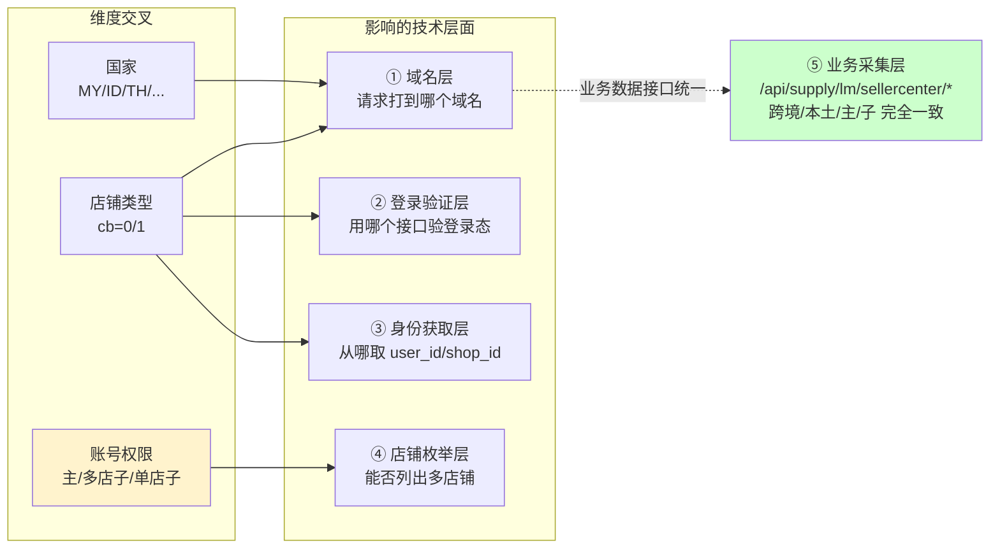
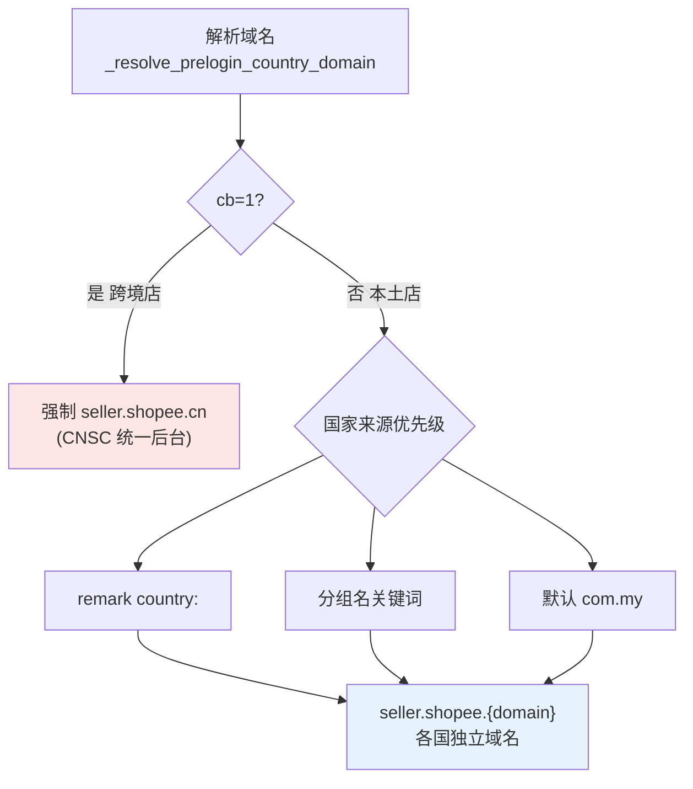
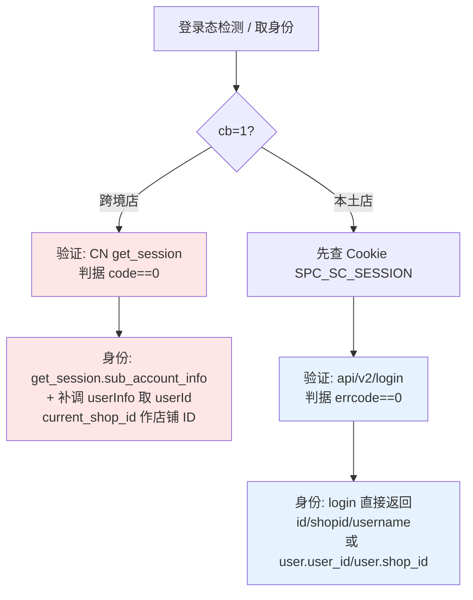
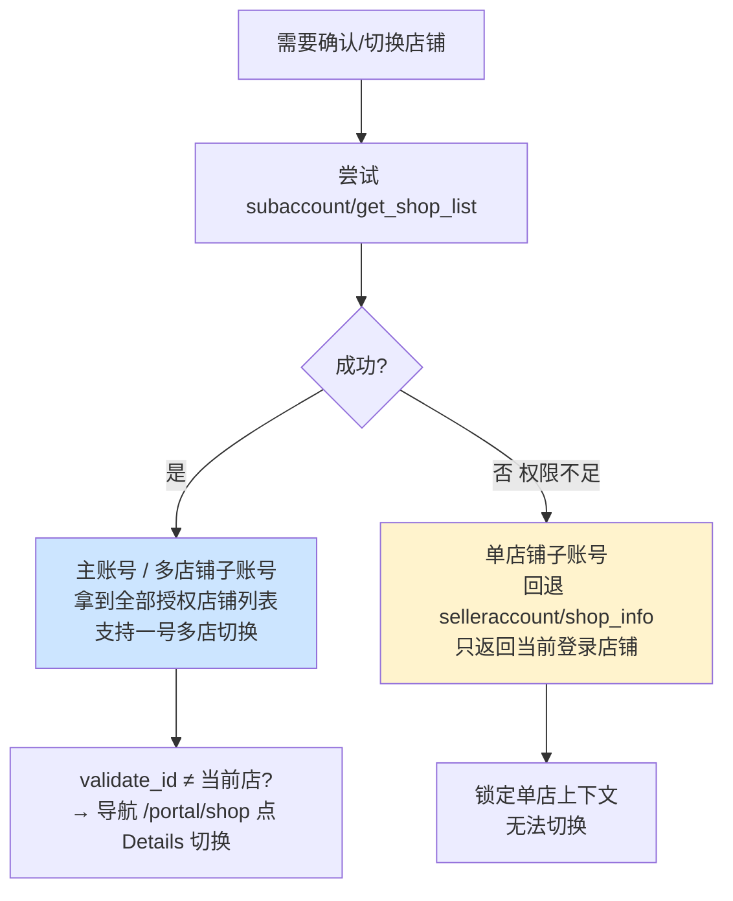
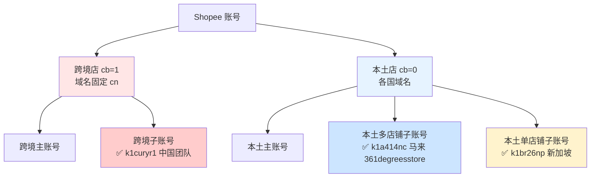
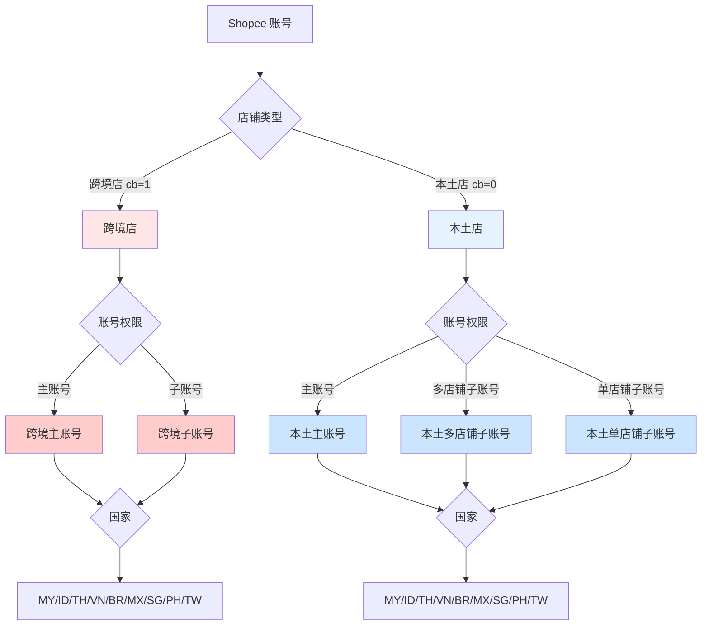
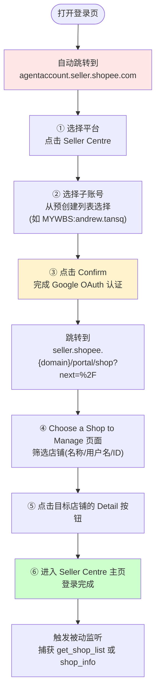

# Shopee 登录检测逻辑现状分析

> 梳理 live-crawler 和 adspower-server 两端当前的实现逻辑，识别分支点、缺失环节和需补充的信息

## 一、核心维度与分支点

### 1.1 账号体系全景

Shopee 卖家账号由**三个正交维度**交叉决定,任何一个具体账号都是这三者的组合：

| 维度 | 取值 | 数据来源 |
|------|------|---------|
| **店铺类型** | 跨境店 (cb=1) / 本土店 (cb=0) | AdsPower remark `cb:` 字段 |
| **账号权限** | 主账号 / 多店铺子账号 / 单店铺子账号 | 运行时由 `get_shop_list` 成功与否推断 |
| **国家站点** | MY/ID/TH/VN/BR/MX/SG/PH/TW | remark `country:` > 分组名 > 默认 com.my |

关键认知：**主账号与子账号只是"登录过程"和"取身份信息的接口"不同，监控用的业务数据接口完全一致**；真正决定 API 域名的是"店铺类型 + 国家"，而非账号权限。



#### 1.1.1 ① 域名层：店铺类型 + 国家决定域名



跨境店无论实际卖到哪个国家，域名永远是 `cn`；实际国家仅通过 `get_or_set_shop` 反查 `shop_region`，**只用于币种上报，不改域名**。本土店则各国域名独立，无统一后台。

#### 1.1.2 ②③ 登录验证层 + 身份获取层：店铺类型决定接口



#### 1.1.3 ④ 店铺枚举层：账号权限决定能否列店



这是主账号与子账号在 API 层**唯一的实质差异**：`get_shop_list` 能否成功。业务数据接口对主子账号无差别，取决于子账号被授予的角色权限。

#### 1.1.4 实际存在的账号类型组合（已验证样本）



> 说明：跨境主账号 vs 子账号是否需区分、跨境店是否有多店铺接口，目前代码未明确，见 [§3.1 跨境店的未知点](#31-跨境店的未知点)。

### 1.2 三个维度的组合



### 1.3 当前已知的分支映射

| 维度 | 分支 | live-crawler 处理 | adspower-server 处理 | 缺失/问题 |
|------|------|-------------------|---------------------|-----------|
| **店铺类型** | 跨境店 (cb=1) | ✅ CN 域名 `seller.shopee.cn` | ✅ `session.cb_option == 1` | ❓ 跨境店是否有多店铺列表接口？ |
| | 本土店 (cb=0) | ✅ 国家域名 `seller.shopee.{domain}` | ✅ `session.cb_option == 0` | - |
| **账号权限** | 主账号 | ✅ `get_shop_list` 取列表 | ⚠️ 被动监听 | ❓ 主账号一定有列表权限吗？ |
| | 多店铺子账号 | ✅ `get_shop_list` 取列表 | ⚠️ 被动监听 | - |
| | 单店铺子账号 | ✅ 兜底 `shop_info` | ⚠️ 被动监听兜底接口 | ❓ 如何提前判断账号类型？ |
| **国家** | MY/ID/TH/... | ✅ 动态替换域名 | ⚠️ 仅靠 `session.country` 推断 | ❌ 推断错误无纠正机制 |

## 二、当前实现的详细流程

### 2.1 live-crawler 登录检测流程

```mermaid
flowchart TD
    Start(["首次访问采集页"]) --> Init["初始化<br/>解析 cb_option<br/>解析 country_domain"]
    
    Init --> OpenPage["打开采集页面<br/>替换为当前域名"]
    
    OpenPage --> CheckLogin["检查登录状态<br/>_check_login_status"]
    
    CheckLogin --> IsCB1{"cb_option?"}
    
    IsCB1 -->|1 跨境店| ApiCN["主动 JS fetch<br/>CN get_session"]
    IsCB1 -->|0 本土店| CookieCheck["Cookie 预检<br/>SPC_SC_SESSION"]
    
    CookieCheck -->|缺失| LoggedOut["判定登出"]
    
    %% 修复点：用双引号包裹包含 {domain} 的文本
    CookieCheck -->|存在| ApiLocal["主动 JS fetch<br/>{domain}/api/v2/login/"]
    
    ApiCN --> ApiResult{"API 验证"}
    ApiLocal --> ApiResult
    
    ApiResult -->|失败| LoggedOut
    ApiResult -->|成功| FetchInfo["获取登录信息<br/>_fetch_login_info_via_js"]
    
    LoggedOut --> AutoRelogin["尝试自动重登<br/>点击已保存账号"]
    AutoRelogin -->|失败| SendLogout["发送 logout 回调"]
    AutoRelogin -->|成功| FetchInfo
    
    FetchInfo --> Branch1{"cb_option?"}
    
    Branch1 -->|1| FetchCN["CN get_session<br/>+ userInfo"]
    
    %% 修复点：用双引号包裹包含 {domain} 的文本
    Branch1 -->|0| FetchLocal["{domain}/api/v2/login"]
    
    FetchCN --> ExtractIDs["提取 media_user_id<br/>media_shop_id"]
    FetchLocal --> ExtractIDs
    
    ExtractIDs --> GetValidate["从 remark 取<br/>validate_id"]
    
    GetValidate --> HasValidate{"validate_id?"}
    HasValidate -->|否| ErrNoValidate["返回 False<br/>终止采集"]
    
    HasValidate -->|是| Branch2{"cb_option?"}
    
    Branch2 -->|0 本土店| QueryCountry["查询店铺国家<br/>_get_shop_country_by_id"]
    Branch2 -->|1 跨境店| CheckRemark{"remark 有国家?"}
    
    QueryCountry --> TryList["尝试 get_shop_list"]
    TryList -->|成功| MatchDomain{"域名匹配?"}
    TryList -->|失败 权限不足| TryInfo["兜底 shop_info"]
    TryInfo --> MatchDomain
    
    MatchDomain -->|不匹配| UpdateDomain["切换域名<br/>_update_country_domain"]
    MatchDomain -->|匹配| SyncRemark["同步 remark 国家"]
    UpdateDomain --> SyncRemark
    
    CheckRemark -->|否| QueryCB["CN get_or_set_shop<br/>查跨境店国家"]
    CheckRemark -->|是| EnsureShop["确保正确店铺<br/>_ensure_correct_shop"]
    
    QueryCB --> SyncRemarkCB["同步 remark<br/>用于币种上报"]
    SyncRemarkCB --> EnsureShop
    
    SyncRemark --> EnsureShop
    
    %% 修复点：用双引号包裹包含 == 的文本
    EnsureShop --> ShopMatch{"media_shop_id<br/>== validate_id?"}
    
    ShopMatch -->|是| SendSuccess["发送 success 回调<br/>开始采集"]
    ShopMatch -->|否| SwitchShop["切换店铺<br/>_switch_to_shop"]
    
    SwitchShop --> ClickDetails["导航到店铺列表<br/>点击 Details"]
    ClickDetails --> VerifySwitch["重新获取 login 信息<br/>验证切换"]
    VerifySwitch -->|成功| SendSuccess
    VerifySwitch -->|失败| ErrSwitch["返回 False<br/>终止采集"]
    
    style IsCB1 fill:#ffe6e6
    style Branch1 fill:#ffe6e6
    style Branch2 fill:#ffe6e6
```



### 2.2 adspower-server 登录监听流程

```mermaid

graph TD
    Start([开始登录监听]) --> StartListen[启动接口监听<br/>api/v2/login, get_shop_list, shop_info, cn get_session]

    StartListen --> InitVars["初始化变量<br/>login_shop_id=None<br/>shop_list_ids=[]<br/>fallback_triggered=False"]

    InitVars --> LoopStart{"超时?<br/>LOGIN_TIMEOUT"}

    LoopStart -->|否| CookieCheckTime{"到Cookie检查间隔?<br/>5秒"}
    LoopStart -->|是| FinalVerify

    CookieCheckTime -->|否| WaitPacket
    CookieCheckTime -->|是| CookieCheckLogic{"Cookie有效<br/>且未获取shop_id<br/>且未触发兜底?"}

    CookieCheckLogic -->|是| TriggerFallback["触发兜底页面<br/>creator-center/insight/live"]
    CookieCheckLogic -->|否| WaitPacket
    TriggerFallback --> SetFallbackFlag["fallback_triggered=true"]
    SetFallbackFlag --> WaitPacket

    WaitPacket["等待接口响应<br/>2秒超时"] --> PacketReceived{"收到响应?"}

    PacketReceived -->|否| LoopStart
    PacketReceived -->|是| ParsePacket["解析响应体"]

    ParsePacket --> MatchUrl{"匹配哪个接口?"}

    MatchUrl -->|api/v2/login| ExtractLoginId["提取shop_id<br/>从根或user对象"]
    MatchUrl -->|get_shop_list| ExtractListIds["提取shops数组<br/>所有shop_id"]
    MatchUrl -->|shop_info| ExtractShopInfoId["提取data.shop_id<br/>兜底接口"]
    MatchUrl -->|cn get_session| ExtractCnId["提取current_shop_id<br/>跨境店接口"]

    ExtractLoginId --> StoreLoginId["存储到login_shop_id"]
    ExtractListIds --> StoreListIds["追加到shop_list_ids"]
    ExtractShopInfoId --> StoreLoginId
    ExtractCnId --> StoreLoginId

    StoreLoginId --> CheckMatch{"任一shop_id<br/>== validate_id?"}
    StoreListIds --> CheckMatch

    CheckMatch -->|是| BreakLoop["立即退出循环"]
    CheckMatch -->|否| LoopStart

    BreakLoop --> FinalVerify["最终API验证<br/>必要条件"]

    FinalVerify --> ApiVerifyMethod{"跨境店 vs 本土店"}

    ApiVerifyMethod -->|跨境店<br/>cb_option=1| ApiCN["CN get_session<br/>检查code==0"]
    ApiVerifyMethod -->|本土店| ApiLocal["MY api/v2/login<br/>检查errcode==0"]

    ApiCN --> ApiResult{"API验证结果"}
    ApiLocal --> ApiResult

    ApiResult -->|失败| StopListen["停止监听"]
    ApiResult -->|成功| SetApiFlag["api_login_verified=true"]

    SetApiFlag --> StopListen
    StopListen --> ValidateResult{"验证逻辑"}

    ValidateResult --> HasApiVerified{"api_login_verified<br/>== true?"}
    HasApiVerified -->|否| CallbackError["回调error<br/>reason: API验证失败"]

    HasApiVerified -->|是| CheckLoginId{"login_shop_id<br/>== validate_id?"}
    CheckLoginId -->|是| CallbackSuccess["回调success<br/>立即设置login_status"]

    CheckLoginId -->|否| CheckListIds{"validate_id<br/>in shop_list_ids?"}
    CheckListIds -->|是| CallbackSuccess

    CheckListIds -->|否| CallbackMismatch["回调error<br/>reason: shop_mismatch<br/>清除Cookies"]

    CallbackSuccess --> NotifyFrontend["通知前端<br/>login_success"]
    CallbackMismatch --> NotifyFrontendFail["通知前端<br/>login_failed"]
    CallbackError --> NotifyFrontendError["通知前端<br/>login_timeout/error"]

    NotifyFrontend --> ScheduleClose["调度关闭<br/>LOGIN_SUCCESS_DELAY"]
    NotifyFrontendFail --> ScheduleCloseFail["调度关闭<br/>LOGIN_FAILED_DELAY"]
    NotifyFrontendError --> ScheduleCloseError["调度关闭<br/>LOGIN_TIMEOUT_DELAY"]

    ScheduleClose --> MoveGroup{"target_group_id存在?"}
    MoveGroup -->|是| MoveToGroup["移动环境到分组"]
    MoveGroup -->|否| DelayClose
    MoveToGroup --> DelayClose

    ScheduleCloseFail --> DelayClose["延迟后关闭浏览器<br/>清理session"]
    ScheduleCloseError --> DelayClose

    DelayClose --> End([结束])

    style ApiVerifyMethod fill:#ffe6e6
    style HasApiVerified fill:#fff3cd
    style CallbackSuccess fill:#ccffcc
    style CallbackMismatch fill:#ffcccc
    style CallbackError fill:#ffcccc
```



### 2.3 子账号登录流程（2026-05 新流程）⚠️

> **重大变更**：2026-05-22 起，子账号的 Username/Password 登录方式全面停用，改为 Google OAuth 强制认证。



**关键特征**：
- **入口域名统一**：`agentaccount.seller.shopee.com`（跨境/本土、各国通用）
- **中转页面两层**：① Agent Account 主页（选平台+子账号） → ② Shop List 页面（选店铺）
- **监听时机延后**：登录态只有在进入 Seller Centre 主页后才稳定，需延长监听超时时长
- **识别标志**：URL 中包含 `agentaccount.seller.shopee.com` 或 `/portal/shop?next=` 即为子账号登录流程

## 三、关键问题与确认信息

### 3.1 跨境店（已确认✅）

| 问题 | 确认结果 |
|------|---------|
| 跨境店多店铺列表接口 | ✅ `GET https://seller.shopee.cn/api/cnsc/selleraccount/get_merchant_shop_list/`<br/>响应 `shops` 数组，每个店铺含 `region/shop_id/user_id/cb_option` 等字段<br/>示例：361degrees 账号管理 22 个跨国店铺 |
| 主账号 vs 子账号区别 | ✅ **数据采集和相关 API 完全一样，唯一区别是登录流程** |
| 跨境店切换店铺 | ⚠️ 支持切换，但逻辑与本土店不同；当前无可用账号样本，暂按单店铺处理（待补充） |

### 3.2 本土店（已确认✅）

| 问题 | 确认结果 |
|------|---------|---------|
| 单店铺子账号如何提前识别？ | ❌ 只能通过 `get_shop_list` 失败后才知道 | ✅ 有没有更早的判断方式？ |
| 主账号一定有 `get_shop_list` 权限吗？ | ⚠️ live-crawler 假设有 | ✅ 是否有反例？ |

### 3.3 域名与国家的未知点

| 问题 | 当前处理 | 需要确认 |
|------|---------|---------|
| 所有国家的登录页 URL 模式？ | ⚠️ 只知道 `seller/login` 和 `account/signin` | ✅ 是否有其他变体？（如 PH/TW） |
| 登录成功后的跳转 URL 模式？ | ❌ 未明确 | ✅ 各国跳转到的 URL 是否统一？ |
### 3.2 本土店（已确认✅）

| 问题 | 确认结果 |
|------|---------|
| 单店铺子账号如何提前识别？ | ✅ **无法提前识别**，只能通过 `get_shop_list` 失败后才知道，保持当前兜底逻辑 |
| 主账号一定有 `get_shop_list` 权限吗？ | ✅ **一般都有权限**，响应示例：<br/>`{"code":0, "account_type":"main_merchant", "shops":[...], "region_count":{...}}` |
| `shop_info` 接口适用场景 | ✅ 主账号/子账号/跨境类型的接口和响应都一样，保持当前 `_get_shop_country_by_shop_info` 逻辑 |

### 3.3 域名与登录流程（已确认✅ + 重大变更⚠️）

| 问题 | 确认结果 |
|------|---------|
| 子账号登录流程变更 | ⚠️ **2026-05-22 起强制 Google OAuth 登录**<br/>• 统一入口：`agentaccount.seller.shopee.com`<br/>• 两层中转：① Agent Account 主页（选平台+子账号） → ② `/portal/shop?next=/`（选店铺）<br/>• 识别标志：URL 含 `agentaccount.seller.shopee.com` 或 `/portal/shop?next=`<br/>• 监听时机延后：登录态稳定时间点在进入 Seller Centre 主页后 |
| 登录成功后跳转 URL | ✅ 子账号已确认：`agentaccount.seller.shopee.com` → `seller.shopee.{domain}/portal/shop?next=%2F` → Seller Centre 主页<br/>主账号跳转模式未明确（待补充） |
| 域名映射完整性 | ✅ 当前 `_SHOPEE_SELLER_DOMAIN_MAP` 已覆盖所有运营中国家 |

### 3.4 接口响应边界情况（已确认✅）

| 场景 | 响应示例 | 判定策略 |
|------|---------|---------|
| 未登录 - 本土店 | `{"errcode":1,"fields":null}` | **以 HTTP 200 + `errcode != 0` 判定未登录** |
| 未登录 - 跨境店 | `{"errcode":2, "message": "token not found"}` | **以 HTTP 200 + `code != 0` 或 `errcode != 0` 判定未登录** |
| 会话过期 | 应与未登录响应一致 | 同未登录处理逻辑 |
| 权限不足 | ✅ **不存在权限不足场景**（`get_shop_list` 和 `shop_info` 不会因权限被拒绝） | 失败即为登录态失效，非权限问题 |

## 四、待补充信息（优先级排序）

### P0 - 必须解决（阻塞重构）✅ 已确认

#### 1. 跨境店切换店铺流程（已确认）

**关键差异**：跨境店切换是 **HTTP API 调用**，而非本土店的浏览器点击 Details 按钮。

**切换步骤**：
```python
# ① 调用切换接口
POST https://seller.shopee.cn/api/cnsc/selleraccount/switch_merchant_shop/
Query params:
  - cnsc_shop_id: 当前店铺 ID
  - cbsc_shop_region: 当前店铺 region（大写，如 MY/TH/VN）
  - SPC_CDS: Cookie 中的值
  - SPC_CDS_VER: 2
Body: {"shop_id": target_shop_id}

# ② 切换成功后设置语言（必需）
POST https://seller.shopee.cn/api/cnsc/selleraccount/set_language/
Query params: 同上
Body: {"language": "zh-CN"}

# ③ 验证：重新获取 get_session，检查 current_shop_id 是否等于 target_shop_id
```

**错误处理**：
- HTTP 403 → Cookie 已过期，需重新登录
- HTTP 200 → 切换成功

**参考代码**：`D:\SpiderCode\dev\livelab-crawler\seller-shopee-spider\tasks\switch_shop.py`

#### 2. 主账号登录跳转 URL（已确认）

| 账号类型 | 登录后跳转 URL | 备注 |
|---------|---------------|------|
| 跨境主账号 | `https://seller.shopee.cn/?cnsc_shop_id={shop_id}` | 直接落地卖家中心首页，带店铺 ID 参数 |
| 本土主账号 | `https://seller.shopee.{domain}/` | 直接落地卖家中心首页，无中转页面 |
| 子账号（跨境/本土） | `agentaccount.seller.shopee.com` → `seller.shopee.{domain}/portal/shop?next=/` → Seller Centre | 两层中转（见 §2.3） |

**识别逻辑**：
- URL 含 `agentaccount.seller.shopee.com` 或 `/portal/shop?next=` → 子账号登录流程
- URL 直接是 `seller.shopee.{domain}/` 或 `seller.shopee.cn/?cnsc_shop_id=` → 主账号登录完成

#### 3. 监听接口调整（已确认）

**新增监听接口**：
- 跨境店：`get_merchant_shop_list`（替代或补充 `get_session` 的 `current_shop_id`）
- 本土店：保持现有 `get_shop_list` / `shop_info`

**子账号 OAuth 流程接口触发时机**：
- 登录态稳定时间点：进入 Seller Centre 主页后
- 建议监听超时从 30s 延长至 **60s**（两层中转页面 + Google OAuth 耗时）

**更新后的监听优先级**：

| 账号类型 | 监听接口 | 超时 |
|---------|---------|------|
| 跨境主账号 | ① `get_session` → ② `get_merchant_shop_list`（新增） | 30s |
| 跨境子账号 | ① `get_session` → ② `get_merchant_shop_list`（新增） | **60s** |
| 本土主账号 | ① `api/v2/login` → ② `get_shop_list` | 30s |
| 本土子账号 | ① `api/v2/login` → ② `get_shop_list` | **60s** |

### P1 - 优化体验（非阻塞）

1. **跨境店主账号与子账号在 `get_merchant_shop_list` 权限上的差异**
   - 是否存在只有主账号能调用的情况？
   
2. **各国 OTP 页面的 URL 特征统一性**
   - 当前假设所有国家的 OTP 页面都包含 `account/signin` 或 `seller/login`
   - 是否有反例？

---

## 五、基于确认信息的优化方向

根据已补充信息，重构可聚焦以下方向：

### 5.1 统一认证客户端设计

```python
class ShopeeAuthClient:
    """统一跨境/本土、主账号/子账号的认证逻辑"""
    
    def verify_login(self, cb_option: int) -> bool:
        """根据店铺类型选择验证接口"""
        if cb_option == 1:
            # 跨境店：CN get_session，判据 code==0
            return self._verify_cn_session()
        else:
            # 本土店：api/v2/login，判据 errcode==0
            return self._verify_local_login()
    
    def get_shop_list(self, cb_option: int) -> list[dict]:
        """获取店铺列表（自动处理跨境/本土差异）"""
        if cb_option == 1:
            # 跨境店：get_merchant_shop_list
            return self._fetch_cn_merchant_shops()
        else:
            # 本土店：get_shop_list，失败回退 shop_info
            return self._fetch_local_shops_with_fallback()
```

### 5.2 子账号登录流程专用状态机

针对新的 Google OAuth 流程，需设计独立的状态机：

```python
# adspower-server 新增
class SubAccountLoginStateMachine:
    STATES = {
        "AGENT_ACCOUNT_PAGE": "agentaccount.seller.shopee.com",
        "SHOP_SELECTION_PAGE": "/portal/shop?next=",
        "SELLER_CENTRE_PAGE": "后台主页（触发接口监听）"
    }
    
    def detect_login_type(self, url: str) -> LoginType:
        """根据 URL 判断是主账号还是子账号登录"""
        if "agentaccount.seller.shopee.com" in url:
            return LoginType.SUB_ACCOUNT_OAUTH
        elif "accounts.shopee." in url or "seller/login" in url:
            return LoginType.MAIN_ACCOUNT_TRADITIONAL
```

### 5.3 接口监听策略调整

| 账号类型 | 监听接口优先级 | 超时时长调整 |
|---------|--------------|------------|
| 跨境主账号 | ① `get_session` → ② `get_merchant_shop_list` | 保持当前 |
| 跨境子账号 | ① `get_session` → ② `get_merchant_shop_list`（新增） | **延长至 60s**（OAuth 中转耗时） |
| 本土主账号 | ① `api/v2/login` → ② `get_shop_list` | 保持当前 |
| 本土子账号 | ① `api/v2/login` → ② `get_shop_list`（新增） | **延长至 60s**（OAuth + 选店铺） |

### 5.4 域名纠错机制简化

由于确认了：
- 跨境店域名永远是 `cn`（不会因国家变化）
- 本土店域名映射已完整

可将纠错逻辑从"被动监听 + 多次重试"简化为"启动时一次性校验 + remark 同步"。

---

## 六、附录：接口响应示例

### 6.1 跨境店多店铺列表接口

**接口**：`GET https://seller.shopee.cn/api/cnsc/selleraccount/get_merchant_shop_list/`

**成功响应**：
```json
{
  "code": 0,
  "message": "success",
  "debug_message": "congratulations!",
  "data": {
    "shops": [
      {
        "username": "361degrees",
        "user_id": 295137110,
        "region": "TW",
        "enabled": true,
        "shop_name": "361度官方旗艦店",
        "shop_id": 295117757,
        "cb_option": 1,
        "portrait": "13f2d7f0388b18f120a066bdfafd0f29"
      },
      {
        "username": "361degrees.my",
        "user_id": 289718580,
        "region": "MY",
        "shop_id": 289699378,
        "cb_option": 1
      }
    ],
    "region_count": {"TW": 1, "MY": 1},
    "total": 22
  }
}
```

### 6.2 本土店多店铺列表接口

**接口**：`POST https://seller.shopee.{domain}/api/selleraccount/subaccount/get_shop_list/`

**成功响应（主账号）**：
```json
{
  "code": 0,
  "message": "success",
  "debug_message": "congratulations!",
  "account_type": "main_merchant",
  "shops": [
    {
      "merchant_id": 0,
      "country": "ph",
      "username": "361dstore",
      "user_id": 1549913258,
      "shop_name": "361 Degrees Store",
      "shop_id": 1549074989,
      "last_login": 1780972864
    },
    {
      "merchant_id": 0,
      "country": "my",
      "username": "361degreesstore",
      "user_id": 1523528882,
      "shop_name": "361 Degrees Store",
      "shop_id": 1522712905
    }
  ],
  "region_count": {"MY": 1, "PH": 1},
  "total": 2
}
```

### 6.3 未登录响应

**本土店 `api/v2/login`**：
```json
{"errcode": 1, "fields": null}
```

**跨境店 `CN get_session`**：
```json
{"errcode": 2, "message": "token not found"}
```

**判定策略**：HTTP 200 + `errcode != 0` 或 `code != 0` 即为未登录/会话过期。

---
