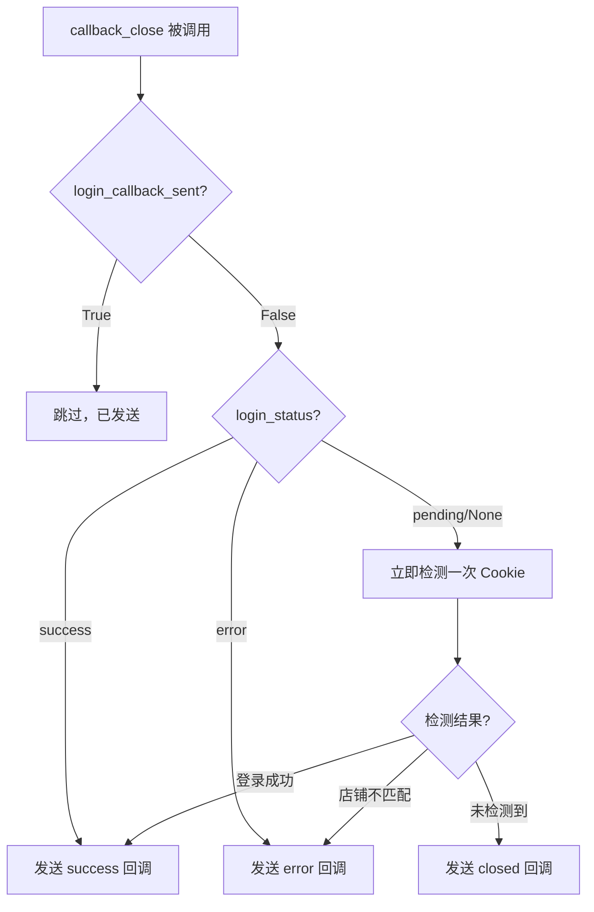

# 完善 callback_close 的回调优先级逻辑（TikTok + Shopee）

## 完整回调优先级



## 修改内容

### 1. [app/services/login_monitor.py](app/services/login_monitor.py) - `_run` 方法（Shopee）

在设置 `login_status` 的同时设置 `login_reason` 和 `login_shop_id`，确保关闭时能获取完整信息。

### 2. [app/services/login_monitor.py](app/services/login_monitor.py) - `_run_tiktok` 方法（TikTok）

同样在设置 `login_status` 的同时设置 `login_reason` 和 `login_shop_id`。

### 3. [app/services/login_monitor.py](app/services/login_monitor.py) - `callback_close` 方法

完整逻辑：

```python
async def callback_close(self, session: Session, reason: str = "closed") -> None:
    # 1. 已发送过回调，跳过
    if session.login_callback_sent:
        logger.info("Session 已发送过登录回调，跳过关闭回调: %s", session.session_id)
        return

    # 2. 登录成功，发送 success
    if session.login_status == "success":
        logger.info("触发登录成功回调（用户提前关闭）: %s", session.session_id)
        await self._callback_backend(session, "success", "", session.login_shop_id)
        return
    
    # 3. 登录失败，发送 error
    if session.login_status == "error":
        logger.info("触发登录失败回调（用户提前关闭）: %s", session.session_id)
        await self._callback_backend(session, "error", 
                                     session.login_reason or "unknown",
                                     session.login_shop_id)
        return

    # 4. 登录未完成，立即检测一次
    check_result = await self._quick_check_login(session)
    if check_result:
        status = check_result.get("status")
        if status == "success":
            await self._callback_backend(session, "success", "", session.validate_id)
            return
        elif status == "error":
            await self._callback_backend(session, "error", "shop_mismatch", 
                                         check_result.get("shop_id"))
            return

    # 5. 未检测到登录，发送 closed
    logger.info("触发关闭回调: session_id=%s, reason=%s", session.session_id, reason)
    await self._callback_backend(session, "closed", reason, None)
```

### 4. [app/services/login_monitor.py](app/services/login_monitor.py) - 新增 `_quick_check_login` 方法

立即检测一次 Cookie/登录状态（毫秒级），不阻塞：

```python
async def _quick_check_login(self, session: Session) -> Optional[Dict]:
    """快速检测一次登录状态，用于关闭时的最后检查"""
    media = session.media.lower()
    if media == "tiktok":
        return await asyncio.to_thread(self._check_tiktok_cookie_once, session)
    elif media == "shopee":
        # Shopee 基于网络请求监听，无法快速检测，返回 None
        return None
    return None

def _check_tiktok_cookie_once(self, session: Session) -> Optional[Dict]:
    """单次检测 TikTok Cookie"""
    try:
        tab = session.drissionpage_tab
        if not tab:
            return None
        cookies = tab.cookies()
        for cookie in cookies:
            if cookie.get("name") == self.TIKTOK_COOKIE_KEY:
                value = cookie.get("value", "")
                if value:
                    validate_id = str(session.validate_id)
                    if validate_id in value:
                        return {"status": "success"}
                    else:
                        return {"status": "error", "shop_id": value}
    except Exception:
        pass
    return None
```

## 覆盖场景

| 场景 | login_status | login_callback_sent | 处理 |

|------|-------------|---------------------|------|

| 正常登录成功 | success | True | 跳过 |

| 正常登录失败 | error | True | 跳过 |

| 登录成功，用户立刻关闭 | success | False | 发送 success |

| 登录失败，用户立刻关闭 | error | False | 发送 error |

| 用户扫码后立刻关闭（极端） | pending | False | 快速检测后发送对应回调 |

| 用户未登录就关闭 | pending/None | False | 发送 closed |