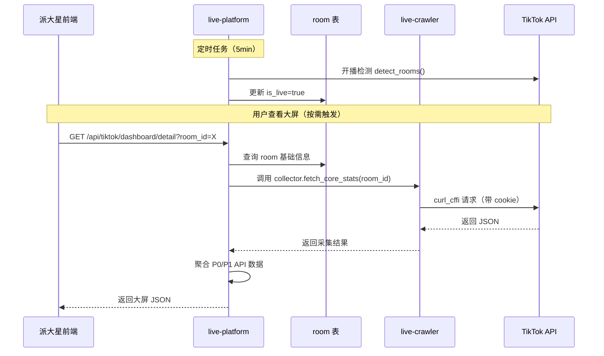

# TikTok 直播大屏采集开发摘要

> **文档版本**：v1.0 | **生成时间**：2026-06-11 | **目标**：派大星"直播运营中心-实时监控-直播大屏"功能技术实现方案

---

## 📋 执行摘要

**核心结论**：现有 TikTok HTTP 采集器（`services/live-crawler/crawlers/http/tiktok/collector.py`）**已覆盖核心数据需求**，通过轻量扩展即可实现直播大屏查询能力。

**关键发现**：
- ✅ **5 个业务接口**（6 对样本，含两套 `user/portrait` 参数）覆盖：GMV、流量、转化、观众画像、趋势对比、**商品列表**
- ✅ **商品列表 API 已补充**（2026-06-11）：包含单品 GMV/销量/库存/转化率等 17 个指标
- ✅ **架构极简**：按需拉取 + 轻量缓存，无需后台轮询
- ⚠️ **3 个风险点**：登录态过期、room_id 归属校验、TikTok 限流（暂不实现兜底，仅文档记录）

---

## 1. 需求背景

### 1.1 业务目标

派大星系统在"直播运营中心-实时监控"模块下新增"直播大屏"菜单，实现：

- **统一查看**：各国家团队可在派大星内按国家、账号、日期等维度筛选，一站式查看所有管理账号的直播大屏（账号状态=已登录），无需逐个登录 TikTok 直播后台
- **实时监控与复盘**：支持查看"正在直播"的实时大屏（用于实时监控与问题干预）和"直播结束"的历史大屏（用于复盘分析与优化建议）

### 1.2 技术约束

- **数据源**：TikTok 商家后台 `shop.tiktok.com/workbench/live/overview?room_id=XXX`（需登录态）
- **登录态管理**：cookie 存储在 AdsPower 浏览器环境，`account_credentials` 表维护 HTTP 凭据
- **采集能力**：`live-crawler` 已实现 TikTok HTTP 采集链路（`fetch_live_list`、`fetch_core_stats` 等）
- **开播检测**：`live-platform` 的 `scheduler.detect_rooms()` 每 5 分钟扫描

---

## 2. API 调研结果

详见 [`API-inventory.md`](./API-inventory.md)，核心发现：

| API | 业务含义 | 覆盖度 | 优先级 |
|-----|---------|-------|-------|
| **core/stats** | GMV、销量、流量、转化、粉丝、广告 ROI + 历史趋势对比 | ✅ 完整 | **P0** |
| **product/list** | 商品列表（单品 GMV/销量/库存/转化率/加购数） | ✅ 完整 | **P0** |
| **trend/chart** | 性能趋势曲线（Viewers + GMV 的 5 分钟粒度时间序列） | ✅ 完整 | **P1** |
| **source/new** | 流量来源分析（一级/二级来源 + 各来源 GMV/转化） | ✅ 完整 | **P1** |
| **user/portrait**（粉丝分层） | 观众画像-粉丝维度（新粉/老粉/非粉 + 各层 GMV/订单/客单价），`stats_types=[92,93,95,81,86]` | ✅ 完整 | **P1** |
| **user/portrait**（人群画像） | 观众画像-人群维度（性别/年龄/地区分布），`stats_types=[85,86,87,88,89]` | ✅ 完整 | **P1** |

**结论**：P0 API（`core/stats` + `product/list`）可支撑 MVP 上线，覆盖核心指标与商品明细。

> **注意**：`user/portrait` 是同一个接口，靠 `stats_types` 参数区分两套画像维度——粉丝分层（⑥）与性别/年龄/地区人群画像（⑦），下游需分两次调用。

### 2.1 大屏页面区域 ↔ API 对照（供下游对数）

以 `shop.tiktok.com/workbench/live/overview?room_id=X` 页面为基准，各可视区域对应的采集 API 如下：

| 页面区域（截图圈选） | 关键展示字段 | 对应 API | 响应字段映射 |
|---------------------|------------|---------|------------|
| **① Performance trends**（左上，趋势图） | Viewers + Attributed GMV 的 5 分钟粒度时间曲线 | `08: trend/chart`<br>`/api/v1/insights/workbench/live/detail/trend/chart` | `trend_data[]`：`stats_type=20`(Viewers) + `stats_type=3`(GMV)，每条含 `data[]`（key=时间戳/value 或 amount）；`granularity=5`(分钟) |
| **② 核心指标卡片**（中央大红框） | Attributed GMV `8,802,156`、Attributed items sold `146`、Current viewers `8`、Ads Cost、Views、Impressions per hour、Avg. viewing duration、Follow rate、Tap-through rate、LIVE CTR | `06: core/stats`<br>`/api/v1/insights/workbench/live/detail/core/stats` | `gmv_local` / `sales` / `current_visitor_cnt` / `ads_cost_local` / `watch_pv` / `show_pv_per_hour` / `avg_view_duration` / `click_through_rate` / `live_ctr` |
| **③ Traffic source**（左中） | Channel / Attributed GMV / Impressions / Views（Search、For You feed、LIVE preview、Video profile taps 等多级来源） | `03: source/new`<br>`/api/v3/insights/workbench/live/detail/source/new` | `data.stats.all_traffic_distribution[]`：`main_source` + `detail_source[]` + 各来源 `gmv_local` / `watch_pv` / `ctr` |
| **④ Product List**（中下） | 商品表格：Product / Attributed GMV / Product Impressions / CTR / Added to cart（含 Pinned 置顶标记、商品 ID） | `05: product/list`<br>`/api/v1/insights/workbench/live/detail/product/list` | `segments[].stats[]`：`id` / `name` / `gmv_local` / `exposure_cnt` / `click_through_rate` / `add_shop_cart_cnt` / `is_pinned` |
| **⑤ Follower analytics**（左下） | New followers / Existing followers / Non-followers 占比（Followers `16.87%` vs Non-followers `83.13%`） | `04: user/portrait`<br>`/api/v1/insights/workbench/live/detail/user/portrait`<br>**`stats_types=[92,93,95,81,86]`** | `all_fan_distribution[]`（按 `type` 10/11/12/13 区分粉丝层级）+ `follower_gmv_local_distribution[]` / `follower_sku_order_distribution[]` / `follower_main_aov_local_distribution[]` |
| **⑥ User profile**（右下） | Gender（Male `7.89%` / Female `92.11%`）、Age、Region 用户画像 | `04b: user/portrait`<br>`/api/v1/insights/workbench/live/detail/user/portrait`<br>**`stats_types=[85,86,87,88,89]`** | `paid_gender_distribution[]`（性别 type 20/21/22）+ `paid_age_distribution[]`（年龄 type 3/4/5）+ `paid_state_distribution[]`（地区 key=省份/value=占比） |

> **补数说明**：
> - **⑤ Follower analytics** 与 **⑥ User profile** 共用 `user/portrait` 接口，靠 `stats_types` 区分：⑤用 `[92,93,95,81,86]` 返回粉丝分层（API 编号 04），⑥用 `[85,86,87,88,89]` 返回性别/年龄/地区（API 编号 04b）。下游需**分两次调用**，样本分别见 `raw/04-user-portrait.*` 和 `raw/04b-user-portrait.*`。
> - **① Performance trends** 对应 `trend/chart` 接口（API 编号 08，样本已落盘 `raw/08-trend-chart.*`，请求体 `stats_types=[20,3]`，响应为 22 个 5 分钟粒度数据点）。

---

## 3. 技术架构

### 3.1 数据流图



### 3.2 核心组件

| 组件 | 路径 | 职责 |
|------|------|------|
| **DashboardCollector** | `live-platform/services/dashboard_collector.py` | 编排 P0/P1 TikTok API 调用，聚合成大屏数据包 |
| **API Routes** | `live-platform/api/tiktok_dashboard.py` | 对外暴露查询接口 |
| **轻量缓存** | Redis (可选) | 缓存 3-5min，避免短时间重复请求同一 room_id |
| **开播检测** | `live-platform/orchestrator/scheduler.py` | 现有能力，维护 `room.is_live` 字段 |

### 3.3 存储设计

**room 表增量字段**（若未有）：

```sql
ALTER TABLE room ADD COLUMN is_live BOOLEAN DEFAULT FALSE;
ALTER TABLE room ADD COLUMN last_live_start DATETIME;
ALTER TABLE room ADD COLUMN last_live_end DATETIME;
```

---

## 4. 派大星 API 规格

### 4.1 直播间列表

```http
GET /api/tiktok/dashboard/rooms
```

**Query 参数**：
- `is_live` (可选)：`true` 只返回正在直播，`false` 只返回已结束，不传返回全部
- `country` (可选)：国家代码（VN/TH/MY 等）
- `start_date` / `end_date` (可选)：按最后直播时间筛选

**响应示例**：

```json
{
  "code": 0,
  "msg": "success",
  "data": {
    "rooms": [
      {
        "room_id": "7649951805363391253",
        "account_id": "tiktok_vn_001",
        "is_live": true,
        "country": "VN",
        "last_live_start": "2026-06-11T10:30:00Z",
        "gmv_snapshot": 12500.50,
        "viewers_snapshot": 328
      }
    ],
    "total": 1
  }
}
```

### 4.2 大屏详情

```http
GET /api/tiktok/dashboard/detail?room_id=7649951805363391253
```

**响应示例**（聚合 P0/P1 API）：

```json
{
  "code": 0,
  "msg": "success",
  "data": {
    "room_id": "7649951805363391253",
    "account_id": "tiktok_vn_001",
    "is_live": true,
    "core_stats": {
      "gmv_local": 12500.50,
      "sales": 245,
      "current_visitor_cnt": 328,
      "watch_uv": 5420,
      "click_through_rate": 0.15,
      "main_aov_local": 51.02,
      "accumulated_new_follower_cnt": 89
    },
    "traffic_source": [
      {"main_source": "foru", "gmv_local": 8200, "watch_pv": 3200},
      {"main_source": "search", "gmv_local": 3100, "watch_pv": 1800}
    ],
    "user_portrait": {
      "all_fan_distribution": [
        {"type": 10, "count": 1200},
        {"type": 11, "count": 800}
      ]
    },
    "dataSource": "live_crawler_tiktok_http"
  }
}
```

---

## 5. 实施计划

### Phase 1: MVP (P0 — 核心指标 + 商品列表)

| 任务 | 估时 | 产出 |
|------|------|------|
| 1.1 在 live-platform 新增 `DashboardCollector` 类 | 1.5d | 封装 `fetch_core_stats` + `fetch_product_list` 两个 P0 API |
| 1.2 新增 API routes `/api/tiktok/dashboard/*` | 0.5d | 实现列表 + 详情两个接口 |
| 1.3 room 表增量字段迁移 | 0.5d | 添加 `is_live` / `last_live_start` / `last_live_end` |
| 1.4 前端对接（派大星） | 2.5d | Vue 页面 + 图表渲染（Echarts）+ **商品列表表格** |
| **总计** | **5d** | **MVP 可上线，覆盖核心数据需求** |

### Phase 2: 优化 (P1 — 趋势图 + 流量分析 + 观众画像)

| 任务 | 估时 | 产出 |
|------|------|------|
| 2.1 补充 `fetch_trend_chart` + `fetch_source` + `fetch_user_portrait` | 0.5d | 趋势图 + 流量来源饼图 + 观众画像表格 |
| 2.2 Redis 缓存层 | 0.5d | 3min TTL，减少重复请求 |
| ~~2.3 补充抓包商品列表 API~~ | ~~1d~~ | ✅ **已完成**（2026-06-11） |
| **总计** | **1d** | **完整大屏能力** |

---

## 6. 风险与依赖

### 6.1 风险清单（MVP 阶段暂不实现兜底，仅文档记录）

| 风险 | 影响 | 解决方案（未来优化） |
|------|------|---------------------|
| **登录态过期** | `account_credentials` 表的 cookie 失效，fetch 时抛异常 | 捕获 `LoginRequired` 异常 → 返回 `{code: 401, msg: "登录态失效"}` → 前端提示重新登录 |
| **room_id 归属校验缺失** | 派大星传错 room_id（属于其他账号），TikTok API 返回 403 | 在 `fetch_live_list` 同步时记录每个账号拥有的 room_id 清单，API 层先校验归属 |
| **并发请求 TikTok 限流** | 10 个运营同时查不同 room，瞬间发 10 个 TikTok 请求触发限流 | 用信号量（`asyncio.Semaphore(3)`）限制同时请求 TikTok 并发数 ≤ 3 |

### 6.2 依赖项

| 依赖 | 状态 | 备注 |
|------|------|------|
| `account_credentials` 表有活跃凭据 | ✅ 已有 | 由 `tiktok_refresher` 维护 |
| `live-crawler` TikTok HTTP 采集器 | ✅ 已有 | `collector.py` 已实现核心 API |
| AdsPower 浏览器环境 | ✅ 已有 | 登录态来源 |
| Redis (可选) | ⚠️ 待确认 | 若无 Redis，降级为无缓存直接拉取 |

---

## 7. 下一步行动

### 立即可执行（本周）

1. ~~**补充抓包商品列表 API**~~ ✅ **已完成**（2026-06-11）
   - ~~在 TikTok 大屏"商品"Tab 操作时，用 Chrome DevTools Network 筛选 XHR 含 `product` 关键词~~
   - ~~记录 request body + response 结构，补充到 `docs/research/tiktok-live-dashboard-apis/raw/` 目录~~

2. **创建 DashboardCollector 类**
   - 在 `live-platform/services/dashboard_collector.py` 封装 `collect_dashboard_data(account_id, room_id)` 方法
   - 聚合 `fetch_core_stats` + `fetch_product_list` 两个 P0 API

3. **API 路由开发**
   - 在 `live-platform/api/tiktok_dashboard.py` 实现 `/rooms` 和 `/detail` 两个接口
   - 响应格式遵循现有约定（`code`/`msg`/`data`，`dataSource` 字段标记 `live_crawler_tiktok_http`）

### 中期规划（下周）

4. **前端对接**
   - 派大星前端调用 live-platform API
   - Echarts 渲染 GMV/流量趋势图

5. **Redis 缓存层**（可选，若无 Redis 可跳过）
   - 3min TTL，key 格式：`dashboard:room:{room_id}`

---

## 附录

- **API 样本文件**：`docs/research/tiktok-live-dashboard-apis/raw/`
- **API 分析文档**：`docs/research/tiktok-live-dashboard-apis/API-inventory.md`
- **本摘要文档**：`docs/research/tiktok-live-dashboard-apis/summary.md`
- **现有采集器代码**：`services/live-crawler/crawlers/http/tiktok/collector.py`
