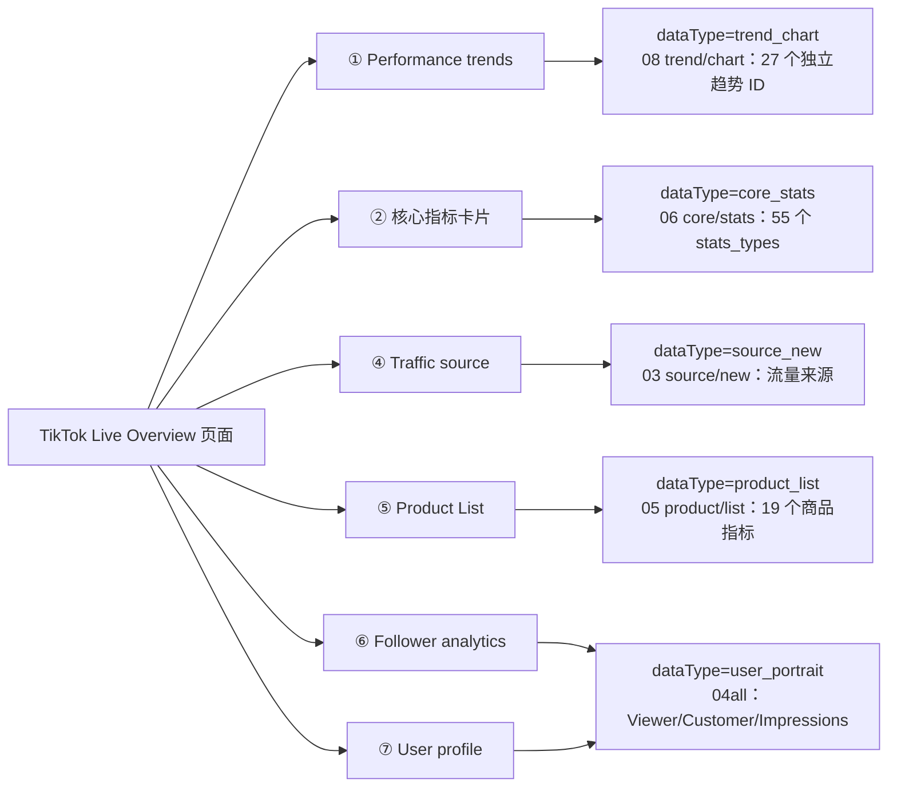
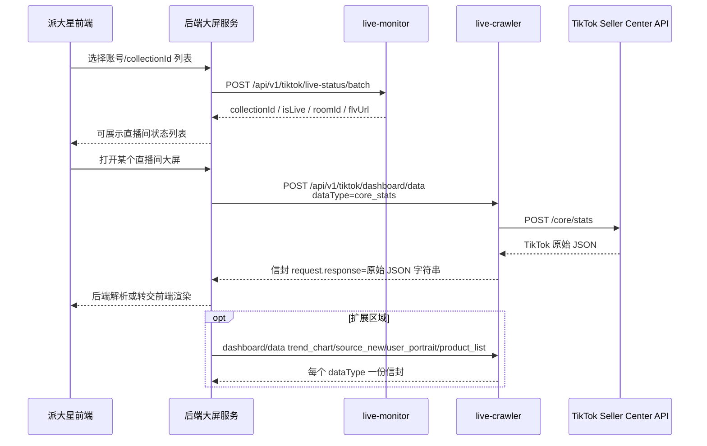
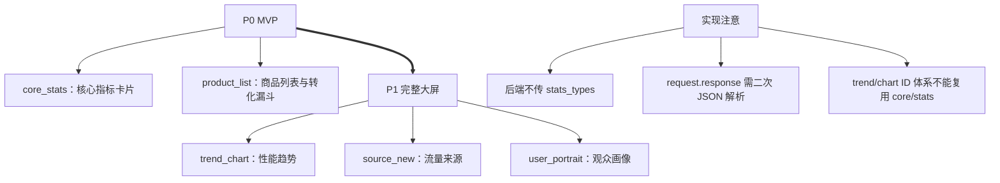

<!--
source_wiki: https://biu6ihvvco.feishu.cn/wiki/RGaJwSewGiR6XbkBhHJcz1EVnHe
source_docx: https://biu6ihvvco.feishu.cn/docx/CaR2dyRvroPj94xblpicdJsQnDh
source_revision_id: 21
synced_at: 2026-06-16 00:00:00 +08:00
raw_appendix: embedded-full-response
-->
<title>TikTok 直播大屏 API 对接文档（2026-06-16 同步版）</title>

<callout emoji="✅">
**同步结论：**本版按当前 `docs/specs/tiktok-live-dashboard-downstream-api.md` 与 `docs/research/tiktok-live-dashboard-apis/API-inventory.md` 同步。当前对接分为 **2 个下游端点**：先查开播状态与 `roomId`，再按 `dataType` 拉取 TikTok 大屏原始响应信封。
**上游样本：**当前保留 **6 对 request-response 样本 / 6 个业务接口**，覆盖核心指标、趋势、流量来源、观众画像、商品列表与房间信息；`user/portrait` 已收敛为 `04all-user-portrait` 一次返回三类画像。
**本文范围：**仅覆盖当前 2 个下游端点、6 个 `dataType`、字段映射表与完整 raw response 附录。
</callout>

# 1. 对接总览

<grid>
<column width-ratio="0.333333">
### 下游端点
**2 个**：状态查询 + 数据拉取
</column>
<column width-ratio="0.333333">
### dataType
**6 种**，一类数据一次调用
</column>
<column width-ratio="0.333333">
### 响应原则
TikTok 原始响应字符串透传
</column>
</grid>

本对接文档只描述当前 TikTok 直播大屏方案：后端先通过 `live-monitor` 查询 `collectionId` 对应的开播状态和 `roomId`，再通过 `live-crawler` 的统一 `dashboard/data` 端点按 `dataType` 拉取完整上游数据。

| 当前事实 | 说明 |
|-|-|
| 下游端点 | `POST /api/v1/tiktok/live-status/batch`、`POST /api/v1/tiktok/dashboard/data` |
| dataType | `core_stats`、`trend_chart`、`source_new`、`user_portrait`、`product_list`、`room_info` |
| 上游样本 | `03-source-new`、`04all-user-portrait`、`05-product-list`、`06-core-stats`、`08-trend-chart`、`09-room-info` |
| 数据职责 | API 层按原始网页/抓包参数完整请求并透传完整响应；前端按页面展示需要过滤字段 |
| raw 附录 | 本文附完整 response；request 参数在第 5 节逐 dataType 展开 |

## 1.1 后端调用链

```text
① 后端/派大星服务
   ── POST /api/v1/tiktok/live-status/batch
   ── body: { "collectionIds": [...] }
   ──▶ live-monitor 读 Redis 状态
   ◀── [{ collectionId, isLive, roomId, flvUrl }]

② 后端拿到 roomId + collectionId
   ── POST /api/v1/tiktok/dashboard/data
   ── body: { dataType, roomId, collectionId }
   ──▶ live-crawler 调 TikTok Seller Center API
   ◀── 信封，内含 request.response 原始响应字符串
```

## 1.2 接口归属

| 能力 | 归属服务 | 数据源 | 面向调用方的职责 |
|-|-|-|-|
| 开播状态批量查询 | `live-monitor` | Redis（种子来自 Holo） | 告诉后端某批 `collectionId` 是否开播，以及当前 `roomId` |
| 大屏数据拉取 | `live-crawler` | TikTok Seller Center 大屏 API | 按 `dataType` 拉取上游响应，并包装为现有采集信封 |

---

# 2. 图表视图

## 2.1 页面区域 ↔ dataType ↔ 上游 API



## 2.2 前后端联调用数据流



## 2.3 对接优先级



---

# 3. 下游接口一：开播状态批量查询 @ live-monitor

## 3.1 端点

```http
POST /api/v1/tiktok/live-status/batch
```

使用 POST 传数组，避免 `collectionId` 数量较多时 GET URL 过长。

## 3.2 入参

```json
{
  "collectionIds": ["coll_1001", "coll_1002", "coll_1003"]
}
```

| 参数 | 类型 | 必填 | 说明 |
|-|-|-|-|
| `collectionIds` | string[] | 是 | 一个或多个 `collection_id`；本层据此读取 Redis 状态 |

## 3.3 出参

成功响应按请求中的 `collectionIds` 逐项返回：

```json
{
  "code": 200,
  "message": "success",
  "data": [
    {
      "collectionId": "coll_1001",
      "isLive": true,
      "roomId": "7544720840995162887",
      "flvUrl": "https://pull-flv-.../stream.flv"
    },
    {
      "collectionId": "coll_1002",
      "isLive": false,
      "roomId": "",
      "flvUrl": ""
    }
  ]
}
```

| 字段 | 类型 | 说明 |
|-|-|-|
| `collectionId` | string | 回显请求中的 `collection_id` |
| `isLive` | bool | 是否开播；由 `flvUrl` 非空且非 `"error"` 推导 |
| `roomId` | string | 当前直播间号；未开播为空字符串 |
| `flvUrl` | string | 直播流地址；未开播为空字符串 |

## 3.4 约定与错误码

- 后端传入的 `collectionId` 视为有效，Redis 中应存在对应记录；未开播不是错误。
- 返回列表顺序与请求 `collectionIds` 一一对应，不省略任何项。
- `isLive=false` 时，前端可展示未开播态；后端不应继续调用大屏数据接口。
- 业务码沿用 live-monitor 口径：`200` 表示成功；`5099` 表示内部异常（如 Redis 不可用），此时 `data` 为 null。

---

# 4. 下游接口二：大屏数据 @ live-crawler

## 4.1 端点

```http
POST /api/v1/tiktok/dashboard/data
```

单一统一端点，通过 `dataType` 区分 6 个大屏业务接口。

## 4.2 入参

```json
{
  "dataType": "core_stats",
  "roomId": "7544720840995162887",
  "collectionId": "coll_1001"
}
```

| 参数 | 类型 | 必填 | 说明 |
|-|-|-|-|
| `dataType` | string | 是 | 6 种之一，见 4.3 |
| `roomId` | string | 是 | 来自开播状态接口 |
| `collectionId` | string | 是 | 采集任务标识；本层据此定位账号会话，内部映射到信封 `socketUserId` |
| `timeRange` | string | 否 | 时间范围，仅 `trend_chart` 时生效。枚举：`full`(默认，Full LIVE 完整直播)、`last_5m`(Last 5m 近5分钟)、`last_30m`(Last 30m 近30分钟)。本层按枚举计算上游 `start_time` |

上游细节（`stats_types`、`creator_id`、`country`、排序、分页、`start_time`）由本层按 `dataType` 固定填充，不暴露给后端或前端。

## 4.3 dataType 枚举

| dataType | 上游样本 | 上游路径 | 页面区域 | 内部固定参数 |
|-|-|-|-|-|
| `core_stats` | `06-core-stats` | `/api/v1/insights/workbench/live/detail/core/stats` | ② 核心指标卡片 | `room_filter.room_id`、`is_content_type=1`、`creator_id`、`country`、55 个 `stats_types`（43 正向 + 12 负数 benchmark） |
| `trend_chart` | `08-trend-chart` | `/api/v1/insights/workbench/live/detail/trend/chart` | ① Performance trends | `room_filter.room_id`、`is_content_type=1`、`TREND_CHART_FULL` 27 个合法 ID；按 `timeRange` 计算 `start_time`(full→不传,last_5m→now-300,last_30m→now-1800) |
| `source_new` | `03-source-new` | `/api/v3/insights/workbench/live/detail/source/new` | ④ Traffic source | `room_id`、`is_content_type`、`stats_types=[100]`、`version=3`；2026-06-11 旧批样本，本次未重采 |
| `user_portrait` | `04all-user-portrait` | `/api/v1/insights/workbench/live/detail/user/portrait` | ⑥ Follower analytics + ⑦ User profile | `room_filter.room_id`、`is_content_type=1`、`stats_types=[80,81,82,83,90,85,86,87,88,350,351,352,353]` |
| `product_list` | `05-product-list` | `/api/v1/insights/workbench/live/detail/product/list` | ⑤ Product List | `room_filter.room_id`、`is_content_type=1`、`sorting_type=1`、19 个有效商品指标 ID |
| `room_info` | `09-room-info` | `/api/v1/insights/workbench/live/detail/room/info` | 大屏头部 | `room_filter.room_id`、`is_content_type=1`；**无 stats_types**，返回房间与主播完整信息 |

## 4.4 成功出参：采集信封

成功时沿用 live-crawler `_format_message` 风格，并在接口层补充 `dataType` 与 `roomId` 两个判别字段：

```json
{
  "params": "",
  "cookies": "[{...}]",
  "fromUrl": "https://shop.tiktok.com/api/v1/insights/workbench/live/detail/core/stats?...",
  "extra": "{\"request\":{\"room_filter\":{\"room_id\":\"7544720840995162887\",\"is_content_type\":1},\"stats_types\":[...]}}",
  "sign": "xxx",
  "userType": 6.0,
  "dataSource": "live_crawler_tiktok_http",
  "dataType": "core_stats",
  "roomId": "7544720840995162887",
  "updateTime": 1781149500000,
  "socketUserId": "browser_abc",
  "request": {
    "response": "{\"code\":0,\"message\":\"success\",\"data\":{\"stats\":{...}}}",
    "url": "https://shop.tiktok.com/api/v1/insights/workbench/live/detail/core/stats?..."
  }
}
```

| 字段 | 类型 | 说明 |
|-|-|-|
| `params` | string | 保留字段；当前为空字符串 |
| `cookies` | string(JSON) | Cookie 列表的 JSON 字符串 |
| `fromUrl` | string | 上游完整请求 URL |
| `extra` | string\|null | 上游请求体；无请求体时为 null |
| `sign` | string | 数据签名 |
| `userType` | float | 固定 `6.0` |
| `dataSource` | string | 目标口径为 `live_crawler_tiktok_http` |
| `dataType` | string | 判别字段，标识本次返回的 6 类数据之一 |
| `roomId` | string | 回显请求 `roomId` |
| `updateTime` | int | 消息时间戳（毫秒） |
| `socketUserId` | string | 账号会话标识；由 `collectionId` 内部映射 |
| `request.response` | string | TikTok 原始响应 JSON 字符串，不在本层解析 |
| `request.url` | string | 上游请求 URL |

### 4.4.1 后端解析约定

- 后端 / 数仓需要对 `request.response` 再做一次 JSON 反序列化，才能读取 `code`、`message`、`data`。
- 上游业务异常（例如 TikTok 返回 `code != 0`、room 不存在、未开播）也进入 `request.response` 原样返回；API 层不把它改写成聚合字段。
- 对后端入参叫 `collectionId`，对采集信封仍保留既有字段 `socketUserId`，避免破坏数仓消费格式。

## 4.5 API 层自身失败

登录态失效、上游超时、会话不存在、内部异常等不属于上游业务响应时，返回独立错误对象：

```json
{
  "code": 5001,
  "message": "上游请求失败",
  "dataType": "core_stats",
  "roomId": "7544720840995162887",
  "error": {
    "reason": "login_required",
    "detail": "..."
  }
}
```

| code | 含义 |
|-|-|
| `5001` | 上游请求失败（超时 / 网络错误） |
| `5099` | 采集内部异常（兜底） |
| `4041` | 会话 / 账号不存在 |

`error.reason` 当前建议枚举：`login_required`、`upstream_timeout`、`session_not_found`、`internal_error`。

---

# 5. 上游 API 手册

<callout emoji="📌">
本节面向后端实现和前端对数。`dashboard/data` 内部按 `dataType` 使用原始网页抓包确认的完整请求参数集合，不按前端勾选项或图表列裁剪；`request.response` 保留 TikTok 原始完整响应。前端只负责按页面区域、图表、表格列过滤展示字段。
</callout>

## 5.1 统一请求与响应约定

| 约定 | 说明 |
|-|-|
| 完整请求参数 | 每个 `dataType` 固定使用本节列出的原始网页/抓包请求体，包含完整 `stats_types` 或接口级参数。 |
| 完整响应 | `request.response` 原样保留 TikTok 返回 JSON，不在 API 层裁字段、不重命名字段、不聚合为业务对象。 |
| 前端过滤 | 前端按展示区域自行选择字段，如核心卡片只读 `gmv_local/sales/current_visitor_cnt`，商品表只读需要展示的列。 |
| 后端职责 | 后端可以解析 `request.response` 做聚合接口，但服务间契约仍以完整原始响应为准。 |
| 对数方式 | 字段含义、网页显示名、响应字段名以本节映射表和第 9 节 raw response 为准。 |

## 5.2 dataType 总表

| dataType | 上游样本 | 上游路径 | 完整请求参数摘要 | 完整响应入口 |
|-|-|-|-|-|
| `core_stats` | `06-core-stats` | `/api/v1/insights/workbench/live/detail/core/stats` | `room_filter.room_id`、`room_filter.is_content_type=1`、55 个 `stats_types` | `data.stats`、`data.stats_benchmark_data` |
| `trend_chart` | `08-trend-chart` | `/api/v1/insights/workbench/live/detail/trend/chart` | `room_filter.room_id`、`room_filter.is_content_type=1`、27 个独立趋势 ID | `data.trend_data[]`、`data.granularity`、`data.timezone` |
| `source_new` | `03-source-new` | `/api/v3/insights/workbench/live/detail/source/new` | `stats_types=[100]`、`room_filter`、`version=3` | `data.stats.all_traffic_distribution[]` |
| `user_portrait` | `04all-user-portrait` | `/api/v1/insights/workbench/live/detail/user/portrait` | `room_filter`、13 个画像 ID | `data.stats` |
| `product_list` | `05-product-list` | `/api/v1/insights/workbench/live/detail/product/list` | `room_filter`、`sorting_type=1`、19 个商品指标 ID | `data.segments[0].stats[]`、`data.sold_product` |
| `room_info` | `09-room-info` | `/api/v1/insights/workbench/live/detail/room/info` | `room_filter.room_id`、`room_filter.is_content_type=1`；无 `stats_types` | `data.room_id`、`data.owner_*`、`data.status`、`data.room_title`、`data.room_cover_url` |

## 5.3 core_stats 字段映射

### 5.3.1 完整请求参数

```json
{"request":{"room_filter":{"room_id":"7651420995556182804","is_content_type":1},"stats_types":[15,27,7,344,50,346,348,71,10,20,330,29,70,11,39,43,343,23,310,325,130,30,332,323,349,62,61,60,331,312,313,314,315,241,283,3,2,5,18,17,290,291,292,-3,-2,-7,-344,-23,-20,-18,-39,-10,-11,-70,-71]}}
```

> `core_stats` 请求使用完整 55 个 `stats_types`。前端展示核心卡片时只过滤需要字段，不要求 API 层减少请求项。

### 5.3.2 参数/指标 ID → 网页显示名 → 响应字段名

| 分组 | 参数/指标 ID | 网页显示名 | 响应字段名 | 响应路径/说明 |
|-|-|-|-|-|
| Transaction | `15` | AOV | `main_aov_local` | `data.stats.main_aov_local` |
| Transaction | `27` | Customers | `paid_user_cnt` | `data.stats.paid_user_cnt` |
| Transaction | `7` | Attributed SKU orders | `paid_order_cnt` | `data.stats.paid_order_cnt` |
| Transaction | `344` | Attributed orders | `main_order_cnt` | `data.stats.main_order_cnt` |
| Transaction | `50` | Payment Rate | `payment_success_rate` | `data.stats.payment_success_rate` |
| Transaction | `346` | Est. GMV | `est_gmv_local` | `data.stats.est_gmv_local` |
| Transaction | `348` | GMV with subsidies | `with_subsidy_gmv_local` | `data.stats.with_subsidy_gmv_local` |
| Traffic Efficiency | `71` | Product clicks | `product_reach_cnt` | `data.stats.product_reach_cnt` |
| Traffic Efficiency | `10` | LIVE CTR | `click_through_rate` | `data.stats.click_through_rate` |
| Traffic Efficiency | `20` | Views | `watch_pv` | `data.stats.watch_pv` |
| Traffic Efficiency | `330` | Tap-through rate | `enter_room_rate` | `data.stats.enter_room_rate` |
| Traffic Efficiency | `29` | Avg. viewing duration | `avg_view_duration` | `data.stats.avg_view_duration` |
| Traffic Efficiency | `70` | Product Impressions | `product_view_cnt` | `data.stats.product_view_cnt` |
| Traffic Efficiency | `11` | CTOR (SKU orders) | `click_order_rate` | `data.stats.click_order_rate` |
| Traffic Efficiency | `39` | Show GPM | `live_show_gpm_local` | `data.stats.live_show_gpm_local` |
| Traffic Efficiency | `43` | Watch GPM | `watch_gpm_local` | `data.stats.watch_gpm_local` |
| Traffic Efficiency | `343` | CTOR | `click_order_rate_main` | `data.stats.click_order_rate_main` |
| Traffic Efficiency | `23` | Impressions | `client_show_cnt` | `data.stats.client_show_cnt` |
| Traffic Efficiency | `310` | Impressions per hour | `show_pv_per_hour` | `data.stats.show_pv_per_hour` |
| Traffic Efficiency | `325` | GMV per hour | `gmv_local_per_hour` | `data.stats.gmv_local_per_hour` |
| Traffic Efficiency | `130` | CTR | `product_click_through_rate` | `data.stats.product_click_through_rate` |
| Traffic Efficiency | `30` | Avg. viewing duration per view | `avg_watching_time` | `data.stats.avg_watching_time` |
| Traffic Efficiency | `332` | Tap-through rate (via LIVE preview) | `enter_room_rate_live_preview` | `data.stats.enter_room_rate_live_preview` |
| Traffic Efficiency | `323` | Order rate (SKU orders) | `sku_order_rate` | `data.stats.sku_order_rate` |
| Traffic Efficiency | `349` | > 1 min. views | `watch_pv_one_min_plus` | `data.stats.watch_pv_one_min_plus` |
| Interactions | `62` | New followers | `accumulated_new_follower_cnt` | `data.stats.accumulated_new_follower_cnt` |
| Interactions | `61` | Shares | `accumulated_sharing_cnt` | `data.stats.accumulated_sharing_cnt` |
| Interactions | `60` | Comments | `accumulated_comment_cnt` | `data.stats.accumulated_comment_cnt` |
| Interactions | `331` | Likes | `likes` | `data.stats.likes` |
| Interactions | `312` | Comment rate | `live_comment_rate` | `data.stats.live_comment_rate` |
| Interactions | `313` | Follow rate | `live_follow_rate` | `data.stats.live_follow_rate` |
| Interactions | `314` | Like rate | `live_like_rate` | `data.stats.live_like_rate` |
| Interactions | `315` | Share rate | `live_share_rate` | `data.stats.live_share_rate` |
| Ads | `241` | Ads Cost | `ads_cost_local` | `data.stats.ads_cost_local` |
| Ads | `283` | GMV Max ROI | `ads_gmv_max_roi` | `data.stats.ads_gmv_max_roi` |
| Fixed KPI | `3` | Attributed GMV | `gmv_local` | `data.stats.gmv_local` |
| Fixed KPI | `2` | Attributed items sold | `sales` | `data.stats.sales` |
| Fixed KPI | `5` | Current viewers | `current_visitor_cnt` | `data.stats.current_visitor_cnt` |
| Fixed KPI | `18` | Viewers | `watch_uv` | `data.stats.watch_uv` |
| Fixed KPI | `17` | AOV (SKU) | `sku_aov_local` | `data.stats.sku_aov_local` |
| Ads helper | `290` | ROI2 enabled | `is_ads_roi2` | `data.stats.is_ads_roi2` |
| Ads helper | `291` | ROI2 effective time | `ads_roi2_effective_time` | `data.stats.ads_roi2_effective_time` |
| Ads helper | `292` | has ROI1 | `has_ads_roi1` | 合法 ID，单独请求可能不返回字段 |
| Benchmark | `-3/-2/-7/-344/-23/-20/-18/-39/-10/-11/-70/-71` | 行业基准对比 | `market_cmp_data[]` | `data.stats_benchmark_data.market_cmp_data[]`，负数 ID 对应正数指标 |

## 5.4 trend_chart 字段映射

### 5.4.1 完整请求参数

```json
{"request":{"room_filter":{"room_id":"7651420995556182804","is_content_type":1},"stats_types":[3,52,82,41,344,20,11,50,14,84,51,92,23,13,12,16,312,313,314,315,401,15,91,343,350,81,323]}}
```

> `trend_chart` 使用独立 ID 体系，不能复用 `core_stats` 的 ID。`granularity` 不在请求体里，由服务端在响应中返回；当前样本为 `15`。

### 5.4.2 参数/指标 ID → 网页显示名 → 响应字段名

| 分组 | 参数/指标 ID | 网页显示名 | 响应字段名 | 响应路径/说明 |
|-|-|-|-|-|
| Transaction | `3` | Attributed GMV | `amount` | `data.trend_data[].data[].amount` |
| Transaction | `52` | Attributed items sold | `amount` | `data.trend_data[].data[].amount` |
| Transaction | `82` | Customers | `value` | `data.trend_data[].data[].value` |
| Transaction | `41` | Attributed SKU orders | `amount` | `data.trend_data[].data[].amount` |
| Transaction | `344` | Attributed orders | `amount` | `data.trend_data[].data[].amount` |
| Traffic Efficiency | `20` | Viewers | `value` | `data.trend_data[].data[].value` |
| Traffic Efficiency | `11` | Views | `value` | `data.trend_data[].data[].value` |
| Traffic Efficiency | `50` | Product Impressions | `value` | `data.trend_data[].data[].value` |
| Traffic Efficiency | `14` | LIVE CTR | `value` | `data.trend_data[].data[].value` |
| Traffic Efficiency | `84` | Tap-through rate | `value` | `data.trend_data[].data[].value` |
| Traffic Efficiency | `51` | Product Clicks | `value` | `data.trend_data[].data[].value` |
| Traffic Efficiency | `92` | Impressions | `value` | `data.trend_data[].data[].value` |
| Interactions | `23` | New followers | `value` | `data.trend_data[].data[].value` |
| Interactions | `13` | Shares | `value` | `data.trend_data[].data[].value` |
| Interactions | `12` | Comments | `value` | `data.trend_data[].data[].value` |
| Interactions | `16` | Likes | `value` | `data.trend_data[].data[].value` |
| Interactions | `312` | Comment rate | `value` | `data.trend_data[].data[].value` |
| Interactions | `313` | Follow rate | `value` | `data.trend_data[].data[].value` |
| Interactions | `314` | Like rate | `value` | `data.trend_data[].data[].value` |
| Interactions | `315` | Share rate | `value` | `data.trend_data[].data[].value` |
| Conversion | `401` | AOV | `value` | `data.trend_data[].data[].value` |
| Conversion | `15` | CTOR (SKU orders) | `value` | `data.trend_data[].data[].value` |
| Conversion | `91` | Watch GPM | `value` | `data.trend_data[].data[].value` |
| Conversion | `343` | CTOR | `value` | `data.trend_data[].data[].value` |
| Conversion | `350` | Payment Rate | `value` | `data.trend_data[].data[].value` |
| Conversion | `81` | Show GPM | `amount` | `data.trend_data[].data[].amount` |
| Conversion | `323` | Order rate (SKU orders) | `value` | `data.trend_data[].data[].value` |

### 5.4.3 时间范围参数

trend_chart 支持通过可选参数 `start_time` 控制时间窗口,下游接口通过 `timeRange` 枚举暴露三种时间范围:

| 时间范围 | 术语 | 下游 `timeRange` | 上游 `start_time` | 计算方式 |
|-|-|-|-|-|
| **完整直播** | Full LIVE | `full`(默认) | 不传 | 从开播到当前全程 |
| **近 5 分钟** | Last 5m | `last_5m` | `now - 300` | 当前时间减 300 秒 |
| **近 30 分钟** | Last 30m | `last_30m` | `now - 1800` | 当前时间减 1800 秒 |

**请求示例**(Last 5m):
```json
{"request":{"room_filter":{"room_id":"7654451471329741576","is_content_type":1},"stats_types":[20,3],"start_time":1782211225}}
```

**响应差异**:
- Full LIVE 返回完整时间序列(粒度由服务端决定,样本 15min)
- Last 5m / Last 30m 返回窗口内序列(点数取决于粒度和窗口)

## 5.5 source_new 字段映射

### 5.5.1 完整请求参数

```json
{"request":{"stats_types":[100],"room_filter":{"room_id":"7651420995556182804","is_content_type":1}},"version":3}
```

> `source_new` 当前为 2026-06-11 旧批样本，本次未重采。`stats_types=[100]` 返回完整流量来源分布，前端按表格列过滤展示。

### 5.5.2 参数/指标 ID → 网页显示名 → 响应字段名

| 参数/指标 ID | 网页显示名 | 响应字段名 | 响应路径/说明 |
|-|-|-|-|
| `100` | Channel | `main_source` | `data.stats.all_traffic_distribution[].main_source` |
| `100` | Sub-channel | `detail_source[]` | `data.stats.all_traffic_distribution[].detail_source[]` |
| `100` | Attributed GMV | `gmv_local` / `gmv_usd` | 主来源和子来源对象均可能包含 |
| `100` | Impressions | `client_show_cnt` | 主来源和子来源对象均可能包含 |
| `100` | Views | `watch_pv` | 主来源和子来源对象均可能包含 |
| `100` | CTR | `ctr` | 主来源和子来源对象均可能包含 |
| `100` | CO | `co` | 主来源和子来源对象均可能包含 |
| `100` | Enter room rate | `enter_room_rate` | 主来源和子来源对象均可能包含 |
| `100` | Show GPM | `show_gpm_local` / `show_gpm_usd` | 主来源和子来源对象均可能包含 |

## 5.6 user_portrait 字段映射

### 5.6.1 完整请求参数

```json
{"request":{"room_filter":{"room_id":"7649951805363391253","is_content_type":1},"stats_types":[80,81,82,83,90,85,86,87,88,350,351,352,353,92,93,95]}}
```

> 默认请求 13 个画像 ID，一次返回 Viewer / Customer / Impressions 三类画像。`92/93/95` 是粉丝 GMV 贡献维度，可后续作为扩展请求并入，不属于当前默认 13 ID。

### 5.6.2 参数/指标 ID → 网页显示名 → 响应字段名

| 分组 | 参数/指标 ID | 网页显示名 | 响应字段名 | 响应路径/说明 |
|-|-|-|-|-|
| Viewer profile | `80` | Gender | `all_gender_distribution` | `data.stats.all_gender_distribution` |
| Viewer profile | `81` | Fan level | `all_fan_distribution` | `data.stats.all_fan_distribution` |
| Viewer profile | `82` | Age | `all_age_distribution` | `data.stats.all_age_distribution` |
| Viewer profile | `83` | Region | `all_state_distribution` | `data.stats.all_state_distribution` |
| Viewer profile | `90` | Country | `country_distribution` | `data.stats.country_distribution` |
| Customer profile | `85` | Gender | `paid_gender_distribution` | `data.stats.paid_gender_distribution` |
| Customer profile | `86` | Fan level | `paid_fan_distribution` | `data.stats.paid_fan_distribution` |
| Customer profile | `87` | Age | `paid_age_distribution` | `data.stats.paid_age_distribution` |
| Customer profile | `88` | Region | `paid_state_distribution` | `data.stats.paid_state_distribution` |
| Impressions profile | `350` | Gender | `impressions_gender_distribution` | `data.stats.impressions_gender_distribution` |
| Impressions profile | `351` | Country | `impressions_country_distribution` | `data.stats.impressions_country_distribution` |
| Impressions profile | `352` | Age | `impressions_age_distribution` | `data.stats.impressions_age_distribution` |
| Impressions profile | `353` | Region | `impressions_state_distribution` | `data.stats.impressions_state_distribution` |
| Optional fan contribution | `92` | Follower GMV | `follower_gmv_local_distribution` | data.stats.follower_gmv_local_distribution |
| Optional fan contribution | `93` | Follower SKU orders | `follower_sku_order_distribution` | data.stats.follower_sku_order_distribution |
| Optional fan contribution | `95` | Follower AOV | `follower_main_aov_local_distribution` | data.stats.follower_main_aov_local_distribution |

## 5.7 product_list 字段映射

### 5.7.1 完整请求参数

```json
{"request":{"room_filter":{"room_id":"7651420995556182804","is_content_type":1},"sorting_type":1,"stats_types":[4, 5, 6, 7, 10, 15, 17, 18, 21, 30, 35, 41, 48, 51, 55, 64, 120, 301, 345]}}
```

> 默认请求 19 个有效商品指标 ID。`1/2/3/37/350` 虽合法但单传不新增字段，不作为默认请求参数。

### 5.7.2 参数/指标 ID → 网页显示名 → 响应字段名

| 参数/指标 ID | 网页显示名 | 响应字段名 | 响应路径/说明 |
|-|-|-|-|
| 恒定返回 | Product ID | `id` | `data.segments[0].stats[].id` |
| 恒定返回 | Product | `name` | `data.segments[0].stats[].name` |
| 恒定返回 | Cover | `cover_url` | `data.segments[0].stats[].cover_url` |
| 恒定返回 | Pinned | `is_pinned` | `data.segments[0].stats[].is_pinned` |
| `4` | Live status | `is_live` | `data.segments[0].stats[].is_live` |
| `5` | Platform type | `platform_type` | `data.segments[0].stats[].platform_type` |
| `6` | Sellable country | `sellable_country` | `data.segments[0].stats[].sellable_country` |
| `7` | Source | `source` | `data.segments[0].stats[].source` |
| `10` | Product Impressions | `exposure_cnt` | `data.segments[0].stats[].exposure_cnt` |
| `15` | CTR | `click_through_rate` | `data.segments[0].stats[].click_through_rate` |
| `17` | Attributed orders | `paid_order_cnt` | `data.segments[0].stats[].paid_order_cnt` |
| `18` | Attributed SKU orders | `paid_main_order_cnt` | `data.segments[0].stats[].paid_main_order_cnt` |
| `21` | Attributed GMV | `gmv_local` | `data.segments[0].stats[].gmv_local` |
| `30` | Product clicks | `total_click_cnt` | `data.segments[0].stats[].total_click_cnt` |
| `35` | CTOR | `click_order_rate` | `data.segments[0].stats[].click_order_rate` |
| `41` | Customers | `paid_user_cnt` | `data.segments[0].stats[].paid_user_cnt` |
| `48` | Watch GPM | `watch_gpm_local` | `data.segments[0].stats[].watch_gpm_local` |
| `51` | Available stock | `inventory_left_cnt` | `data.segments[0].stats[].inventory_left_cnt` |
| `55` | Payment rate | `payment_success_rate` | `data.segments[0].stats[].payment_success_rate` |
| `64` | Sellable countries | `sellable_countries` | `data.segments[0].stats[].sellable_countries` |
| `120` | Added to cart | `add_shop_cart_cnt` | `data.segments[0].stats[].add_shop_cart_cnt` |
| `301` | AOV | `main_aov_local` | `data.segments[0].stats[].main_aov_local` |
| `345` | Items sold | `sales` | `data.segments[0].stats[].sales` |
| 汇总 | Sold products | `sold_product` | `data.sold_product` |

## 5.8 room_info 字段映射

### 5.8.1 完整请求参数

```json
{"request":{"room_filter":{"room_id":"7654451471329741576","is_content_type":1}}}
```

> **无 `stats_types` 参数**，响应直接返回房间与主播完整信息。

### 5.8.2 响应字段映射

| 分组 | 字段名 | 类型 | 响应路径 | 说明 |
|-|-|-|-|-|
| **基础信息** | `room_id` | string | `data.room_id` | 直播间 ID |
| | `room_title` | string | `data.room_title` | 直播标题 |
| | `room_cover_url` | string | `data.room_cover_url` | 直播封面 URL(480x640) |
| **主播信息** | `owner_tiktok_id` | string | `data.owner_tiktok_id` | 主播 TikTok UID |
| | `owner_name` | string | `data.owner_name` | 主播显示名称 |
| | `owner_avatar_url` | string | `data.owner_avatar_url` | 主播头像 URL(168x168) |
| | `owner_handle` | string | `data.owner_handle` | 主播唯一句柄(@用户名) |
| | `owner_region` | string | `data.owner_region` | 主播所属地区 |
| | `owner_oec_id` | string | `data.owner_oec_id` | 主播商家 ID |
| **时间信息** | `timezone_offset` | int | `data.timezone_offset` | 时区偏移(秒) |
| | `created_at` | int | `data.created_at` | 房间创建时间(Unix 秒) |
| | `started_at` | int | `data.started_at` | 开播时间(Unix 秒) |
| **直播状态** | `status.status` | int | `data.status.status` | 直播状态(1=进行中,0=已结束) |
| | `status.duration` | int | `data.status.duration` | 已直播时长(秒) |
| | `status.live_stream_url` | string | `data.status.live_stream_url` | FLV 直播流地址 |
| **其他** | `has_auction_products` | bool | `data.has_auction_products` | 是否有拍卖商品 |

### 5.8.3 与 live-monitor 状态接口的职责区分

| 接口 | 归属 | 调用频率 | 返回字段 | 用途 |
|-|-|-|-|-|
| `room/status` | live-monitor | 轮询(每5min) | `{collectionId, isLive, roomId, flvUrl}` | 批量状态查询 |
| `room_info` | live-crawler | 按需拉取 | 完整房间与主播信息(见上表) | 大屏头部展示 |

---

# 6. 前端与后端对接注意事项

## 6.1 后端视角

- 后端对外可以自行封装聚合接口，但与 `live-monitor` / `live-crawler` 的服务间契约以本文第 3、4 节为准。
- 后端不要向 `dashboard/data` 透传任意 `stats_types`，避免把前端 UI 选择状态耦合到采集层。
- API 层对每个 `dataType` 使用第 5 节的完整请求参数集合，请求完整原始网页数据。
- 如果需要一次渲染完整大屏，后端应分别调用 6 次 `dashboard/data`，按 `dataType` 归并结果。
- 对 `request.response` 的 TikTok 原始响应做解析时，先判断外层 API 是否为错误对象，再解析信封里的字符串。

## 6.2 前端视角

- 列表页先消费开播状态：`isLive=false` 展示未开播，不请求大屏数据。
- 详情页加载可以按 P0/P1 分批：先请求 `core_stats` + `product_list`，再并发补 `trend_chart`、`source_new`、`user_portrait`。
- 每个 `dataType` 都可能独立失败；页面应允许局部区域展示错误，不阻断已成功区域。
- 前端看到的金额字段多为 TikTok 原始金额对象，通常包含 `amount` 与 `amount_formatted`；不要假设所有金额都是浮点数。
- 前端按展示区域过滤字段，不要求后端/API 层为不同卡片、图表、表格列裁剪请求参数或响应字段。

## 6.3 实现待定项

以下是实现阶段仍需落地的细节，不影响本接口文档的契约表达：

- Redis key 结构：`collection_id` 到 `isLive/roomId/flvUrl` 的存储结构和写入链路。
- Holo 种子映射：种子表到 `collection_id` 的映射关系。
- collector 补齐：当前实现已存在 `fetch_core_stats` 与 `fetch_trend_chart`，`source_new`、`user_portrait`、`product_list` 的 `fetch_*` 仍需补齐。
- `creator_id` / `country` 来源：`core_stats` 所需字段由本层内部解析，具体来源实现阶段确定。
- `dataSource` 常量：目标契约为 `live_crawler_tiktok_http`，当前代码常量仍需按实现计划对齐。

---

# 7. 风险与依赖

| 风险 | 影响 | 建议 |
|-|-|-|
| 登录态过期 | `dashboard/data` 返回 API 层错误 | 使用 `error.reason=login_required`，前端提示重新登录或切换账号 |
| TikTok 上游超时/限流 | 单个区域数据失败 | 后端限制并发并做短 TTL 防抖；前端按区域展示失败态 |
| `roomId` 与账号不匹配 | TikTok 可能返回业务错误或空数据 | API 层用 `collectionId` 定位账号会话，必要时做归属校验 |
| 旧批 `source_new` 未重采 | 流量来源字段可能晚于其它样本 | 不阻塞 P0；上线前如业务强依赖来源分析，可对同一房间重抓 |
| 诊断/事件类接口未纳入 | 评论、事件流、诊断项暂不可对接 | 等业务明确需要时重新抓包，不纳入本版 MVP |

---

# 8. 原始样本索引

<callout emoji="📝">
第 9 节写入完整 response 代码块；request 参数见第 5 节。所有原始内容均来自当前目录下 `raw/` 文件。
</callout>

| 编号 | 当前本地样本文件 | 对应 dataType |
|-|-|-|
| 03 | `raw/03-source-new.request.network-request`<br/>`raw/03-source-new.response.network-response` | `source_new` |
| 04all | `raw/04all-user-portrait.request.network-request`<br/>`raw/04all-user-portrait.response.network-response` | `user_portrait` |
| 05 | `raw/05-product-list.request.network-request`<br/>`raw/05-product-list.response.network-response` | `product_list` |
| 06 | `raw/06-core-stats.request.network-request`<br/>`raw/06-core-stats.response.network-response` | `core_stats` |
| 08 | `raw/08-trend-chart.request.network-request`<br/>`raw/08-trend-chart.response.network-response` | `trend_chart` |
| 09 | `raw/09-room-info.request.network-request`<br/>`raw/09-room-info.response.network-response` | `room_info` |

## 8.1 样本上下文

- `04all`、`05`、`06`、`08`：2026-06-15 重采，`collection_id=k19f2q44`，越南团队 TikTok 账号 `bagsmart_official.vn`，`room_id=7651420995556182804`，region=VN，creator_id=`7158775580024210437`。
- `03-source-new`：2026-06-11 旧批样本，本次未重采。
- `09-room-info`：2026-06-23 chrome-devtools 实时抓包，`room_id=7654451471329741576`。
- 认证方式：完整登录 Cookie（如 `sessionid` / `sid_tt`），无额外签名 header。
- 金额：样本金额统一为 VND，TikTok 原始响应通常以金额对象表达。

---

# 9. 完整 Raw Response 附录

## 9.1 source_new / 03-source-new.response.network-response

- dataType：`source_new`
- 用途：Traffic source 流量来源表
- source file：`raw/03-source-new.response.network-response`

```json
{"code":0,"message":"success","data":{"stats":{"all_traffic_distribution":[{"main_source":{"source_name":"foru","watch_pv":1838,"ctr":"0.0528","co":"0.0290","show_pv":76943,"gmv_usd":{"amount_formatted":"$284.05","amount_delimited":"284.05","amount":"284.05","currency_code":"USD","currency_symbol":"$"},"gmv_local":{"amount_formatted":"7.473.280₫","amount_delimited":"7.473.280","amount":"7473280","currency_code":"VND","currency_symbol":"₫"},"enter_room_rate":"0.0239","show_gpm_usd":{"amount_formatted":"$3.69","amount_delimited":"3.69","amount":"3.69","currency_code":"USD","currency_symbol":"$"},"show_gpm_local":{"amount_formatted":"97.127₫","amount_delimited":"97.127","amount":"97127","currency_code":"VND","currency_symbol":"₫"}},"detail_source":[{"source_name":"live_cell_draw","watch_pv":670,"ctr":"0.0389","co":"0.0000","show_pv":712,"gmv_usd":{"amount_formatted":"$0.00","amount_delimited":"0.00","amount":"0","currency_code":"USD","currency_symbol":"$"},"gmv_local":{"amount_formatted":"0₫","amount_delimited":"0","amount":"0","currency_code":"VND","currency_symbol":"₫"},"enter_room_rate":"0.9410","show_gpm_usd":{"amount_formatted":"$0.00","amount_delimited":"0.00","amount":"0","currency_code":"USD","currency_symbol":"$"},"show_gpm_local":{"amount_formatted":"0₫","amount_delimited":"0","amount":"0","currency_code":"VND","currency_symbol":"₫"}},{"source_name":"live_cell_click","watch_pv":640,"ctr":"0.0499","co":"0.0259","show_pv":24585,"gmv_usd":{"amount_formatted":"$145.20","amount_delimited":"145.20","amount":"145.2","currency_code":"USD","currency_symbol":"$"},"gmv_local":{"amount_formatted":"3.820.240₫","amount_delimited":"3.820.240","amount":"3820240","currency_code":"VND","currency_symbol":"₫"},"enter_room_rate":"0.0260","show_gpm_usd":{"amount_formatted":"$5.91","amount_delimited":"5.91","amount":"5.91","currency_code":"USD","currency_symbol":"$"},"show_gpm_local":{"amount_formatted":"155.389₫","amount_delimited":"155.389","amount":"155389","currency_code":"VND","currency_symbol":"₫"}},{"source_name":"video_head_click","watch_pv":428,"ctr":"0.0650","co":"0.0413","show_pv":51538,"gmv_usd":{"amount_formatted":"$138.85","amount_delimited":"138.85","amount":"138.85","currency_code":"USD","currency_symbol":"$"},"gmv_local":{"amount_formatted":"3.653.040₫","amount_delimited":"3.653.040","amount":"3653040","currency_code":"VND","currency_symbol":"₫"},"enter_room_rate":"0.0083","show_gpm_usd":{"amount_formatted":"$2.69","amount_delimited":"2.69","amount":"2.69","currency_code":"USD","currency_symbol":"$"},"show_gpm_local":{"amount_formatted":"70.881₫","amount_delimited":"70.881","amount":"70881","currency_code":"VND","currency_symbol":"₫"}},{"source_name":"video_head_draw","watch_pv":100,"ctr":"0.0385","co":"0.0000","show_pv":108,"gmv_usd":{"amount_formatted":"$0.00","amount_delimited":"0.00","amount":"0","currency_code":"USD","currency_symbol":"$"},"gmv_local":{"amount_formatted":"0₫","amount_delimited":"0","amount":"0","currency_code":"VND","currency_symbol":"₫"},"enter_room_rate":"0.9259","show_gpm_usd":{"amount_formatted":"$0.00","amount_delimited":"0.00","amount":"0","currency_code":"USD","currency_symbol":"$"},"show_gpm_local":{"amount_formatted":"0₫","amount_delimited":"0","amount":"0","currency_code":"VND","currency_symbol":"₫"}}]},{"main_source":{"source_name":"search","watch_pv":1644,"ctr":"0.0424","co":"0.0288","show_pv":10850,"gmv_usd":{"amount_formatted":"$96.23","amount_delimited":"96.23","amount":"96.23","currency_code":"USD","currency_symbol":"$"},"gmv_local":{"amount_formatted":"2.531.930₫","amount_delimited":"2.531.930","amount":"2531930","currency_code":"VND","currency_symbol":"₫"},"enter_room_rate":"0.1515","show_gpm_usd":{"amount_formatted":"$8.87","amount_delimited":"8.87","amount":"8.87","currency_code":"USD","currency_symbol":"$"},"show_gpm_local":{"amount_formatted":"233.358₫","amount_delimited":"233.358","amount":"233358","currency_code":"VND","currency_symbol":"₫"}}},{"main_source":{"source_name":"others","watch_pv":376,"ctr":"0.0395","co":"0.0398","show_pv":7759,"gmv_usd":{"amount_formatted":"$155.84","amount_delimited":"155.84","amount":"155.84","currency_code":"USD","currency_symbol":"$"},"gmv_local":{"amount_formatted":"4.100.220₫","amount_delimited":"4.100.220","amount":"4100220","currency_code":"VND","currency_symbol":"₫"},"enter_room_rate":"0.0485","show_gpm_usd":{"amount_formatted":"$20.09","amount_delimited":"20.09","amount":"20.09","currency_code":"USD","currency_symbol":"$"},"show_gpm_local":{"amount_formatted":"528.447₫","amount_delimited":"528.447","amount":"528447","currency_code":"VND","currency_symbol":"₫"}}},{"main_source":{"source_name":"square","watch_pv":184,"ctr":"0.0085","co":"0.0000","show_pv":967,"gmv_usd":{"amount_formatted":"$0.00","amount_delimited":"0.00","amount":"0","currency_code":"USD","currency_symbol":"$"},"gmv_local":{"amount_formatted":"0₫","amount_delimited":"0","amount":"0","currency_code":"VND","currency_symbol":"₫"},"enter_room_rate":"0.1903","show_gpm_usd":{"amount_formatted":"$0.00","amount_delimited":"0.00","amount":"0","currency_code":"USD","currency_symbol":"$"},"show_gpm_local":{"amount_formatted":"0₫","amount_delimited":"0","amount":"0","currency_code":"VND","currency_symbol":"₫"}}},{"main_source":{"source_name":"message","watch_pv":128,"ctr":"0.0843","co":"0.0000","show_pv":50650,"gmv_usd":{"amount_formatted":"$0.00","amount_delimited":"0.00","amount":"0","currency_code":"USD","currency_symbol":"$"},"gmv_local":{"amount_formatted":"0₫","amount_delimited":"0","amount":"0","currency_code":"VND","currency_symbol":"₫"},"enter_room_rate":"0.0025","show_gpm_usd":{"amount_formatted":"$0.00","amount_delimited":"0.00","amount":"0","currency_code":"USD","currency_symbol":"$"},"show_gpm_local":{"amount_formatted":"0₫","amount_delimited":"0","amount":"0","currency_code":"VND","currency_symbol":"₫"}}},{"main_source":{"source_name":"mall","watch_pv":90,"ctr":"0.0848","co":"0.0703","show_pv":3912,"gmv_usd":{"amount_formatted":"$87.65","amount_delimited":"87.65","amount":"87.65","currency_code":"USD","currency_symbol":"$"},"gmv_local":{"amount_formatted":"2.306.020₫","amount_delimited":"2.306.020","amount":"2306020","currency_code":"VND","currency_symbol":"₫"},"enter_room_rate":"0.0230","show_gpm_usd":{"amount_formatted":"$22.40","amount_delimited":"22.40","amount":"22.4","currency_code":"USD","currency_symbol":"$"},"show_gpm_local":{"amount_formatted":"589.473₫","amount_delimited":"589.473","amount":"589473","currency_code":"VND","currency_symbol":"₫"}},"detail_source":[{"source_name":"live_cell_click","watch_pv":86,"ctr":"0.0738","co":"0.0825","show_pv":3907,"gmv_usd":{"amount_formatted":"$73.66","amount_delimited":"73.66","amount":"73.66","currency_code":"USD","currency_symbol":"$"},"gmv_local":{"amount_formatted":"1.938.020₫","amount_delimited":"1.938.020","amount":"1938020","currency_code":"VND","currency_symbol":"₫"},"enter_room_rate":"0.0220","show_gpm_usd":{"amount_formatted":"$18.85","amount_delimited":"18.85","amount":"18.85","currency_code":"USD","currency_symbol":"$"},"show_gpm_local":{"amount_formatted":"496.038₫","amount_delimited":"496.038","amount":"496038","currency_code":"VND","currency_symbol":"₫"}},{"source_name":"live_cell_draw","watch_pv":4,"ctr":"0.1582","co":"0.0323","show_pv":5,"gmv_usd":{"amount_formatted":"$13.99","amount_delimited":"13.99","amount":"13.99","currency_code":"USD","currency_symbol":"$"},"gmv_local":{"amount_formatted":"368.000₫","amount_delimited":"368.000","amount":"368000","currency_code":"VND","currency_symbol":"₫"},"enter_room_rate":"0.8000","show_gpm_usd":{"amount_formatted":"$2,797.42","amount_delimited":"2,797.42","amount":"2797.42","currency_code":"USD","currency_symbol":"$"},"show_gpm_local":{"amount_formatted":"73.599.999₫","amount_delimited":"73.599.999","amount":"73599999","currency_code":"VND","currency_symbol":"₫"}}]},{"main_source":{"source_name":"follow","watch_pv":39,"ctr":"0.0444","co":"0.0000","show_pv":3662,"gmv_usd":{"amount_formatted":"$0.00","amount_delimited":"0.00","amount":"0","currency_code":"USD","currency_symbol":"$"},"gmv_local":{"amount_formatted":"0₫","amount_delimited":"0","amount":"0","currency_code":"VND","currency_symbol":"₫"},"enter_room_rate":"0.0106","show_gpm_usd":{"amount_formatted":"$0.00","amount_delimited":"0.00","amount":"0","currency_code":"USD","currency_symbol":"$"},"show_gpm_local":{"amount_formatted":"0₫","amount_delimited":"0","amount":"0","currency_code":"VND","currency_symbol":"₫"}},"detail_source":[{"source_name":"live_cell","watch_pv":22,"ctr":"0.0816","co":"0.0000","show_pv":189,"gmv_usd":{"amount_formatted":"$0.00","amount_delimited":"0.00","amount":"0","currency_code":"USD","currency_symbol":"$"},"gmv_local":{"amount_formatted":"0₫","amount_delimited":"0","amount":"0","currency_code":"VND","currency_symbol":"₫"},"enter_room_rate":"0.1164","show_gpm_usd":{"amount_formatted":"$0.00","amount_delimited":"0.00","amount":"0","currency_code":"USD","currency_symbol":"$"},"show_gpm_local":{"amount_formatted":"0₫","amount_delimited":"0","amount":"0","currency_code":"VND","currency_symbol":"₫"}},{"source_name":"live_top","watch_pv":16,"ctr":"0.0000","show_pv":3038,"gmv_usd":{"amount_formatted":"$0.00","amount_delimited":"0.00","amount":"0","currency_code":"USD","currency_symbol":"$"},"gmv_local":{"amount_formatted":"0₫","amount_delimited":"0","amount":"0","currency_code":"VND","currency_symbol":"₫"},"enter_room_rate":"0.0053","show_gpm_usd":{"amount_formatted":"$0.00","amount_delimited":"0.00","amount":"0","currency_code":"USD","currency_symbol":"$"},"show_gpm_local":{"amount_formatted":"0₫","amount_delimited":"0","amount":"0","currency_code":"VND","currency_symbol":"₫"}},{"source_name":"video_head","watch_pv":1,"ctr":"0.0000","show_pv":435,"gmv_usd":{"amount_formatted":"$0.00","amount_delimited":"0.00","amount":"0","currency_code":"USD","currency_symbol":"$"},"gmv_local":{"amount_formatted":"0₫","amount_delimited":"0","amount":"0","currency_code":"VND","currency_symbol":"₫"},"enter_room_rate":"0.0023","show_gpm_usd":{"amount_formatted":"$0.00","amount_delimited":"0.00","amount":"0","currency_code":"USD","currency_symbol":"$"},"show_gpm_local":{"amount_formatted":"0₫","amount_delimited":"0","amount":"0","currency_code":"VND","currency_symbol":"₫"}}]}]}}}
```

## 9.2 user_portrait / 04all-user-portrait.response.network-response

- dataType：`user_portrait`
- 用途：Follower analytics + User profile 三类画像
- source file：`raw/04all-user-portrait.response.network-response`

```json
{"code":0,"message":"success","data":{"stats":{"all_gender_distribution":[{"type":20,"cnt":730},{"type":21,"cnt":539},{"type":22,"cnt":1543}],"all_fan_distribution":[{"type":10,"cnt":418},{"type":11,"cnt":2389},{"type":12,"cnt":415},{"type":13,"cnt":3}],"all_age_distribution":[{"type":3,"cnt":394},{"type":4,"cnt":1512},{"type":5,"cnt":507}],"all_state_distribution":[{"key":"Ho Chi Minh","value":"0.236396"},{"key":"Ha Noi","value":"0.112793"},{"key":"Dong Nai","value":"0.047207"},{"key":"Binh Duong","value":"0.043964"},{"key":"An Giang","value":"0.024505"}],"paid_gender_distribution":[{"type":20,"cnt":9},{"type":21,"cnt":10},{"type":22,"cnt":17}],"paid_fan_distribution":[{"type":10,"cnt":12},{"type":11,"cnt":25},{"type":12,"cnt":11},{"type":13,"cnt":1}],"paid_age_distribution":[{"type":3,"cnt":2},{"type":4,"cnt":26},{"type":5,"cnt":5}],"paid_state_distribution":[{"key":"Ho Chi Minh","value":"0.166667"},{"key":"Kien Giang","value":"0.083333"},{"key":"Bac Giang","value":"0.055556"},{"key":"Ca Mau","value":"0.055556"},{"key":"Khanh Hoa","value":"0.055556"}],"impressions_gender_distribution":[{"type":20,"cnt":10181},{"type":21,"cnt":13738},{"type":22,"cnt":23078}],"impressions_country_distribution":[{"key":"VN","value":"1.000000"},{"key":"SG","value":"0.000000"},{"key":"HK","value":"0.000000"},{"key":"AU","value":"0.000000"},{"key":"PH","value":"0.000000"}],"impressions_age_distribution":[{"type":3,"cnt":6638},{"type":4,"cnt":28105},{"type":5,"cnt":7538}],"impressions_state_distribution":[{"key":"Ho Chi Minh","value":"0.236103"},{"key":"Ha Noi","value":"0.147181"},{"key":"Binh Duong","value":"0.049748"},{"key":"Dong Nai","value":"0.041388"},{"key":"Da Nang","value":"0.023473"}],"country_distribution":[{"key":"VN","value":"1.000000"},{"key":"PH","value":"0.000000"},{"key":"TH","value":"0.000000"},{"key":"MY","value":"0.000000"},{"key":"SG","value":"0.000000"}]}}}
```

## 9.3 product_list / 05-product-list.response.network-response

- dataType：`product_list`
- 用途：Product List 商品表格与商品转化漏斗
- source file：`raw/05-product-list.response.network-response`

```json
{"code":0,"message":"success","data":{"segments":[{"stats":[{"id":"1730320487389563826","name":"BAGSMART Túi Trống Du Lịch, BAGSMART, Túi Tập Gym Thể Dục Cho Nữ, Có Túi Ướt, Mang Theo, Túi Cuối Tuần Cho Nữ, Chống Nước, Túi Tập Luyện Luyện, Thích Hợp Cho Thể Thao Và Tập Gym, Màu Be","cover_url":"https://p16-oec-sg.ibyteimg.com/tos-alisg-i-aphluv4xwc-sg/8303ed04f045410d9d7a986e27d418ba~tplv-aphluv4xwc-resize-jpeg:800:800.jpeg?dr=15584\u0026t=555f072d\u0026ps=933b5bde\u0026shp=2408c917\u0026shcp=d01f3899\u0026idc=my\u0026from=604555543","is_live":false,"platform_type":5,"sellable_country":"VN","source":"TikTok","exposure_cnt":7262,"click_through_rate":"0.042688","paid_order_cnt":9,"paid_main_order_cnt":9,"gmv_local":{"amount_formatted":"4.260.860₫","amount_delimited":"4.260.860","amount":"4260860","currency_code":"VND","currency_symbol":"₫"},"total_click_cnt":310,"click_order_rate":"0.029032","paid_user_cnt":9,"watch_gpm_local":{"amount_formatted":"586.734₫","amount_delimited":"586.734","amount":"586734","currency_code":"VND","currency_symbol":"₫"},"inventory_left_cnt":4659,"payment_success_rate":"1.000000","sellable_countries":["PH","TH","VN","MY"],"add_shop_cart_cnt":25,"main_aov_local":{"amount_formatted":"473.429₫","amount_delimited":"473.429","amount":"473429","currency_code":"VND","currency_symbol":"₫"},"sales":9,"is_pinned":true},{"id":"1731755004964014002","name":"BAGSMART Ba Lô Laptop, BAGSMART, Thiết Kế Nhiều Tầng 14 Inch, Ngăn Đựng Lớn, Túi Đi Học Thường Ngày Chần Bông, Ba Lô Du Lịch, Dành Cho Nam Và Nữ, Ba Lô Thời Trang","cover_url":"https://p16-oec-sg.ibyteimg.com/tos-alisg-i-aphluv4xwc-sg/f4815aa7d679428db43d54f8e972df87~tplv-aphluv4xwc-resize-jpeg:800:800.jpeg?dr=15584\u0026t=555f072d\u0026ps=933b5bde\u0026shp=2408c917\u0026shcp=d01f3899\u0026idc=my\u0026from=604555543","is_live":false,"platform_type":5,"sellable_country":"VN","source":"TikTok","exposure_cnt":3773,"click_through_rate":"0.076067","paid_order_cnt":6,"paid_main_order_cnt":6,"gmv_local":{"amount_formatted":"2.920.000₫","amount_delimited":"2.920.000","amount":"2920000","currency_code":"VND","currency_symbol":"₫"},"total_click_cnt":287,"click_order_rate":"0.020906","paid_user_cnt":6,"watch_gpm_local":{"amount_formatted":"773.920₫","amount_delimited":"773.920","amount":"773920","currency_code":"VND","currency_symbol":"₫"},"inventory_left_cnt":2919,"payment_success_rate":"1.000000","sellable_countries":["VN","MY","PH","TH"],"add_shop_cart_cnt":15,"main_aov_local":{"amount_formatted":"486.667₫","amount_delimited":"486.667","amount":"486667","currency_code":"VND","currency_symbol":"₫"},"sales":6,"is_pinned":true},{"id":"1731057746804968370","name":"BAGSMART Ba Lô Du Lịch, Túi Chống Nước Dễ Phối Đồ Bagsmart, Truy cập nhanh, Dung Tích 28l 38l, Thích Hợp Sử Dụng Trong Kinh Doanh Và Ngoài Trời, Thích Hợp Cho Nam Và Nữ.","cover_url":"https://p16-oec-sg.ibyteimg.com/tos-alisg-i-aphluv4xwc-sg/1ee94886c9754d3cbe8392a7f9e6730f~tplv-aphluv4xwc-resize-jpeg:800:800.jpeg?dr=15584\u0026t=555f072d\u0026ps=933b5bde\u0026shp=2408c917\u0026shcp=d01f3899\u0026idc=my\u0026from=604555543","is_live":false,"platform_type":5,"sellable_country":"VN","source":"TikTok","exposure_cnt":2384,"click_through_rate":"0.023490","paid_order_cnt":0,"paid_main_order_cnt":0,"gmv_local":{"amount_formatted":"0₫","amount_delimited":"0","amount":"0","currency_code":"VND","currency_symbol":"₫"},"total_click_cnt":56,"click_order_rate":"0.000000","paid_user_cnt":0,"watch_gpm_local":{"amount_formatted":"0₫","amount_delimited":"0","amount":"0","currency_code":"VND","currency_symbol":"₫"},"inventory_left_cnt":3359,"payment_success_rate":"0.000000","sellable_countries":["MY","PH","TH","VN"],"add_shop_cart_cnt":1,"main_aov_local":{"amount_formatted":"0₫","amount_delimited":"0","amount":"0","currency_code":"VND","currency_symbol":"₫"},"sales":0,"is_pinned":true},{"id":"1734729581974161330","name":"BAGSMART Chiếc túi đeo vai thời trang này có thiết kế dây đeo thắt nơ, nhiều ngăn và có thể được sử dụng như túi xách tay, ba lô hoặc túi hàng ngày. Túi có ngăn chính rộng rãi và nhiều túi nhỏ, rất phù hợp cho du lịch và đi lại hàng ngày.","cover_url":"https://p16-oec-sg.ibyteimg.com/tos-alisg-i-aphluv4xwc-sg/36ffc7a705604ccb929fbe860509bf7a~tplv-aphluv4xwc-resize-jpeg:800:800.jpeg?dr=15584\u0026t=555f072d\u0026ps=933b5bde\u0026shp=2408c917\u0026shcp=d01f3899\u0026idc=my\u0026from=604555543","is_live":false,"platform_type":5,"sellable_country":"VN","source":"TikTok","exposure_cnt":2443,"click_through_rate":"0.045436","paid_order_cnt":2,"paid_main_order_cnt":2,"gmv_local":{"amount_formatted":"751.160₫","amount_delimited":"751.160","amount":"751160","currency_code":"VND","currency_symbol":"₫"},"total_click_cnt":111,"click_order_rate":"0.018018","paid_user_cnt":2,"watch_gpm_local":{"amount_formatted":"307.474₫","amount_delimited":"307.474","amount":"307474","currency_code":"VND","currency_symbol":"₫"},"inventory_left_cnt":933,"payment_success_rate":"1.000000","sellable_countries":["VN"],"add_shop_cart_cnt":5,"main_aov_local":{"amount_formatted":"375.580₫","amount_delimited":"375.580","amount":"375580","currency_code":"VND","currency_symbol":"₫"},"sales":2,"is_pinned":true},{"id":"1730408667811449778","name":"BAGSMART Túi tote cho nữ, BAGSMART, Nhẹ và phồng, Thích hợp cho du lịch, công việc, bãi biển, phòng Tập Gym thể dục và mua sắm.","cover_url":"https://p16-oec-sg.ibyteimg.com/tos-alisg-i-aphluv4xwc-sg/52e176b549f443a585043997df0e6a20~tplv-aphluv4xwc-resize-jpeg:800:800.jpeg?dr=15584\u0026t=555f072d\u0026ps=933b5bde\u0026shp=2408c917\u0026shcp=d01f3899\u0026idc=my\u0026from=604555543","is_live":false,"platform_type":5,"sellable_country":"VN","source":"TikTok","exposure_cnt":2137,"click_through_rate":"0.032756","paid_order_cnt":3,"paid_main_order_cnt":3,"gmv_local":{"amount_formatted":"1.261.140₫","amount_delimited":"1.261.140","amount":"1261140","currency_code":"VND","currency_symbol":"₫"},"total_click_cnt":70,"click_order_rate":"0.042857","paid_user_cnt":3,"watch_gpm_local":{"amount_formatted":"590.145₫","amount_delimited":"590.145","amount":"590145","currency_code":"VND","currency_symbol":"₫"},"inventory_left_cnt":11144,"payment_success_rate":"1.000000","sellable_countries":["PH","TH","VN","MY"],"add_shop_cart_cnt":3,"main_aov_local":{"amount_formatted":"420.380₫","amount_delimited":"420.380","amount":"420380","currency_code":"VND","currency_symbol":"₫"},"sales":3,"is_pinned":true},{"id":"1729544044006968242","name":"BAGSMART Túi Đựng Đồ Vệ Sinh Cá Nhân, BAGSMART, Dành Cho Nữ, Du Lịch Ngoài Trời Đa Chức Năng, Túi Đựng Mỹ Phẩm, Không Thấm Nước, Lưu Trữ, Hộp Sắp Xếp Đồ Trang Điểm, Thích Hợp Cho Phụ，Chỉ dành cho phụ","cover_url":"https://p16-oec-sg.ibyteimg.com/tos-alisg-i-aphluv4xwc-sg/dff80078424d4d3393308eb2efe95af2~tplv-aphluv4xwc-resize-jpeg:800:800.jpeg?dr=15584\u0026t=555f072d\u0026ps=933b5bde\u0026shp=2408c917\u0026shcp=d01f3899\u0026idc=my2\u0026from=604555543","is_live":false,"platform_type":5,"sellable_country":"VN","source":"TikTok","exposure_cnt":1027,"click_through_rate":"0.048685","paid_order_cnt":2,"paid_main_order_cnt":2,"gmv_local":{"amount_formatted":"658.720₫","amount_delimited":"658.720","amount":"658720","currency_code":"VND","currency_symbol":"₫"},"total_click_cnt":50,"click_order_rate":"0.040000","paid_user_cnt":2,"watch_gpm_local":{"amount_formatted":"641.402₫","amount_delimited":"641.402","amount":"641402","currency_code":"VND","currency_symbol":"₫"},"inventory_left_cnt":3501,"payment_success_rate":"1.000000","sellable_countries":["TH","VN","SG","MY","PH"],"add_shop_cart_cnt":0,"main_aov_local":{"amount_formatted":"329.360₫","amount_delimited":"329.360","amount":"329360","currency_code":"VND","currency_symbol":"₫"},"sales":2,"is_pinned":true},{"id":"1731097924469754802","name":"BAGSMART Ba Lô Laptop, BAGSMART, 15,6 Inch, Không Thấm Nước, Ngăn Đựng Lớn, Túi Đi Học Thường Ngày Chần Bông, Màu Hồng, Thích Hợp Cho Phụ Nữ Và Nam Giới, Ba Lô Du Lịch","cover_url":"https://p16-oec-sg.ibyteimg.com/tos-alisg-i-aphluv4xwc-sg/d254241be1f9415ebd418099950b7cda~tplv-aphluv4xwc-resize-jpeg:800:800.jpeg?dr=15584\u0026t=555f072d\u0026ps=933b5bde\u0026shp=2408c917\u0026shcp=d01f3899\u0026idc=my\u0026from=604555543","is_live":true,"platform_type":5,"sellable_country":"VN","source":"TikTok","exposure_cnt":5556,"click_through_rate":"0.055976","paid_order_cnt":5,"paid_main_order_cnt":5,"gmv_local":{"amount_formatted":"2.621.500₫","amount_delimited":"2.621.500","amount":"2621500","currency_code":"VND","currency_symbol":"₫"},"total_click_cnt":311,"click_order_rate":"0.016077","paid_user_cnt":5,"watch_gpm_local":{"amount_formatted":"471.832₫","amount_delimited":"471.832","amount":"471832","currency_code":"VND","currency_symbol":"₫"},"inventory_left_cnt":2506,"payment_success_rate":"1.000000","sellable_countries":["VN"],"add_shop_cart_cnt":16,"main_aov_local":{"amount_formatted":"524.300₫","amount_delimited":"524.300","amount":"524300","currency_code":"VND","currency_symbol":"₫"},"sales":5,"is_pinned":true},{"id":"1732269613026871218","name":"BAGSMART Túi Đeo Chéo Nữ, Túi Đeo Vai, Ngăn Chính Lớn, Nhiều Túi, Thích Hợp Đi Chơi Và Du Lịch, Đi Lại Hàng Ngày, Bagsmart","cover_url":"https://p16-oec-sg.ibyteimg.com/tos-alisg-i-aphluv4xwc-sg/db332bdc6fcd472eae6902c1daa17286~tplv-aphluv4xwc-resize-jpeg:800:800.jpeg?dr=15584\u0026t=555f072d\u0026ps=933b5bde\u0026shp=2408c917\u0026shcp=d01f3899\u0026idc=my\u0026from=604555543","is_live":false,"platform_type":5,"sellable_country":"VN","source":"TikTok","exposure_cnt":945,"click_through_rate":"0.039153","paid_order_cnt":1,"paid_main_order_cnt":1,"gmv_local":{"amount_formatted":"368.000₫","amount_delimited":"368.000","amount":"368000","currency_code":"VND","currency_symbol":"₫"},"total_click_cnt":37,"click_order_rate":"0.027027","paid_user_cnt":1,"watch_gpm_local":{"amount_formatted":"389.418₫","amount_delimited":"389.418","amount":"389418","currency_code":"VND","currency_symbol":"₫"},"inventory_left_cnt":4518,"payment_success_rate":"1.000000","sellable_countries":["TH","VN","MY","PH"],"add_shop_cart_cnt":1,"main_aov_local":{"amount_formatted":"368.000₫","amount_delimited":"368.000","amount":"368000","currency_code":"VND","currency_symbol":"₫"},"sales":1,"is_pinned":true},{"id":"1731463476325746610","name":"BAGSMART Ba lô tote có thể chuyển đổi, BAGSMART, Thích hợp cho máy tính xách tay có đệm 15,6 \", Thiết kế phồng với dung lượng lớn, Nhiều thành phần, Hoàn hảo cho Commutecom hàng ngày và giải trí cuối tuần","cover_url":"https://p16-oec-sg.ibyteimg.com/tos-alisg-i-aphluv4xwc-sg/6890ae2565854761863142d11d6f9390~tplv-aphluv4xwc-resize-jpeg:800:800.jpeg?dr=15584\u0026t=555f072d\u0026ps=933b5bde\u0026shp=2408c917\u0026shcp=d01f3899\u0026idc=my\u0026from=604555543","is_live":false,"platform_type":5,"sellable_country":"VN","source":"TikTok","exposure_cnt":1100,"click_through_rate":"0.020909","paid_order_cnt":0,"paid_main_order_cnt":0,"gmv_local":{"amount_formatted":"0₫","amount_delimited":"0","amount":"0","currency_code":"VND","currency_symbol":"₫"},"total_click_cnt":23,"click_order_rate":"0.000000","paid_user_cnt":0,"watch_gpm_local":{"amount_formatted":"0₫","amount_delimited":"0","amount":"0","currency_code":"VND","currency_symbol":"₫"},"inventory_left_cnt":1147,"payment_success_rate":"0.000000","sellable_countries":["PH","TH","VN","MY"],"add_shop_cart_cnt":1,"main_aov_local":{"amount_formatted":"0₫","amount_delimited":"0","amount":"0","currency_code":"VND","currency_symbol":"₫"},"sales":0,"is_pinned":true},{"id":"1732907971826911154","name":"BAGSMART Túi Messenger Đa Chức Năng, Túi Đeo Chéo, Thiết Kế Dây Đeo Vai Có Thể Điều Chỉnh, Nhẹ Và Sức Chứa Rộng Rãi, Thích Hợp Cho Đi Chơi, Du Lịch, Cuộc Sống Trong Khuôn Viên Trường, Thể Dục, Túi Đeo Chéo Hàng Ngày","cover_url":"https://p16-oec-sg.ibyteimg.com/tos-alisg-i-aphluv4xwc-sg/f2f515374e584b1bb2820bc73a667320~tplv-aphluv4xwc-resize-jpeg:800:800.jpeg?dr=15584\u0026t=555f072d\u0026ps=933b5bde\u0026shp=2408c917\u0026shcp=d01f3899\u0026idc=my\u0026from=604555543","is_live":false,"platform_type":5,"sellable_country":"VN","source":"TikTok","exposure_cnt":777,"click_through_rate":"0.060489","paid_order_cnt":6,"paid_main_order_cnt":6,"gmv_local":{"amount_formatted":"1.466.560₫","amount_delimited":"1.466.560","amount":"1466560","currency_code":"VND","currency_symbol":"₫"},"total_click_cnt":47,"click_order_rate":"0.127660","paid_user_cnt":5,"watch_gpm_local":{"amount_formatted":"1.887.465₫","amount_delimited":"1.887.465","amount":"1887465","currency_code":"VND","currency_symbol":"₫"},"inventory_left_cnt":3358,"payment_success_rate":"1.000000","sellable_countries":["PH","TH","VN","MY"],"add_shop_cart_cnt":2,"main_aov_local":{"amount_formatted":"244.427₫","amount_delimited":"244.427","amount":"244427","currency_code":"VND","currency_symbol":"₫"},"sales":6,"is_pinned":true},{"id":"1731382905947655090","name":"BAGSMART Ba Lô Mini Dễ Thương, BAGSMART, Túi Đi Học Thường Ngày Chần Bông, Thích Hợp Cho Đại Học, Văn Phòng Và Du Lịch","cover_url":"https://p16-oec-sg.ibyteimg.com/tos-alisg-i-aphluv4xwc-sg/edff36952c7c47f6be7c2da3a3acb550~tplv-aphluv4xwc-resize-jpeg:800:800.jpeg?dr=15584\u0026t=555f072d\u0026ps=933b5bde\u0026shp=2408c917\u0026shcp=d01f3899\u0026idc=my\u0026from=604555543","is_live":false,"platform_type":5,"sellable_country":"VN","source":"TikTok","exposure_cnt":1016,"click_through_rate":"0.073819","paid_order_cnt":0,"paid_main_order_cnt":0,"gmv_local":{"amount_formatted":"0₫","amount_delimited":"0","amount":"0","currency_code":"VND","currency_symbol":"₫"},"total_click_cnt":75,"click_order_rate":"0.000000","paid_user_cnt":0,"watch_gpm_local":{"amount_formatted":"0₫","amount_delimited":"0","amount":"0","currency_code":"VND","currency_symbol":"₫"},"inventory_left_cnt":1278,"payment_success_rate":"0.000000","sellable_countries":["VN","MY","PH","TH"],"add_shop_cart_cnt":3,"main_aov_local":{"amount_formatted":"0₫","amount_delimited":"0","amount":"0","currency_code":"VND","currency_symbol":"₫"},"sales":0,"is_pinned":true},{"id":"1733221783753820082","name":"BAGSMART Túi Đeo Vai Đa Năng, Túi Đeo Vai Hàng Ngày, Túi Đi Học, Túi Hàng Ngày, Ngăn Chính Lớn, Nhiều Túi, Thích Hợp Cho Du Lịch Và Đi Lại Hàng Ngày, Túi Đeo Vai Thông Minh, [Đặc Biệt]","cover_url":"https://p16-oec-sg.ibyteimg.com/tos-alisg-i-aphluv4xwc-sg/6e4e6650842f4d809f55133ae6d599dd~tplv-aphluv4xwc-resize-jpeg:800:800.jpeg?dr=15584\u0026t=555f072d\u0026ps=933b5bde\u0026shp=2408c917\u0026shcp=d01f3899\u0026idc=my\u0026from=604555543","is_live":false,"platform_type":5,"sellable_country":"VN","source":"TikTok","exposure_cnt":1272,"click_through_rate":"0.041667","paid_order_cnt":0,"paid_main_order_cnt":0,"gmv_local":{"amount_formatted":"0₫","amount_delimited":"0","amount":"0","currency_code":"VND","currency_symbol":"₫"},"total_click_cnt":53,"click_order_rate":"0.000000","paid_user_cnt":0,"watch_gpm_local":{"amount_formatted":"0₫","amount_delimited":"0","amount":"0","currency_code":"VND","currency_symbol":"₫"},"inventory_left_cnt":3497,"payment_success_rate":"0.000000","sellable_countries":["VN"],"add_shop_cart_cnt":2,"main_aov_local":{"amount_formatted":"0₫","amount_delimited":"0","amount":"0","currency_code":"VND","currency_symbol":"₫"},"sales":0,"is_pinned":true},{"id":"1734708951574939570","name":"BAGSMART Chiếc túi đeo chéo đa năng này có trọng lượng nhẹ và dung tích lớn, phù hợp cho các chuyến đi chơi, du lịch, sinh hoạt học đường và sử dụng hàng ngày.","cover_url":"https://p16-oec-sg.ibyteimg.com/tos-alisg-i-aphluv4xwc-sg/c0d0b52dbac64068bb6d21eceb37dc46~tplv-aphluv4xwc-resize-jpeg:800:800.jpeg?dr=15584\u0026t=555f072d\u0026ps=933b5bde\u0026shp=2408c917\u0026shcp=d01f3899\u0026idc=my\u0026from=604555543","is_live":false,"platform_type":5,"sellable_country":"VN","source":"TikTok","exposure_cnt":831,"click_through_rate":"0.027677","paid_order_cnt":0,"paid_main_order_cnt":0,"gmv_local":{"amount_formatted":"0₫","amount_delimited":"0","amount":"0","currency_code":"VND","currency_symbol":"₫"},"total_click_cnt":23,"click_order_rate":"0.000000","paid_user_cnt":0,"watch_gpm_local":{"amount_formatted":"0₫","amount_delimited":"0","amount":"0","currency_code":"VND","currency_symbol":"₫"},"inventory_left_cnt":206,"payment_success_rate":"0.000000","sellable_countries":["VN"],"add_shop_cart_cnt":0,"main_aov_local":{"amount_formatted":"0₫","amount_delimited":"0","amount":"0","currency_code":"VND","currency_symbol":"₫"},"sales":0,"is_pinned":false},{"id":"1731663765368047538","name":"BAGSMART Túi Trang Điểm, BAGSMART, Túi Đựng Mỹ Phẩm Du Lịch, Đệm Bồng Bềnh Dành Cho Phụ Nữ, Hộp Sắp Xếp Đồ Trang Điểm, Ví Túi Mở Rộng, Thiết Yếu Du Lịch, Phụ Kiện Đồ Vệ Sinh Cá Nhân Cọ, I-Camel, A-M","cover_url":"https://p16-oec-sg.ibyteimg.com/tos-alisg-i-aphluv4xwc-sg/ea92abb055fd4c7cac4a9bea199a1bf1~tplv-aphluv4xwc-resize-jpeg:800:800.jpeg?dr=15584\u0026t=555f072d\u0026ps=933b5bde\u0026shp=2408c917\u0026shcp=d01f3899\u0026idc=my\u0026from=604555543","is_live":false,"platform_type":5,"sellable_country":"VN","source":"TikTok","exposure_cnt":848,"click_through_rate":"0.064858","paid_order_cnt":4,"paid_main_order_cnt":4,"gmv_local":{"amount_formatted":"930.580₫","amount_delimited":"930.580","amount":"930580","currency_code":"VND","currency_symbol":"₫"},"total_click_cnt":55,"click_order_rate":"0.072727","paid_user_cnt":4,"watch_gpm_local":{"amount_formatted":"1.097.382₫","amount_delimited":"1.097.382","amount":"1097382","currency_code":"VND","currency_symbol":"₫"},"inventory_left_cnt":12723,"payment_success_rate":"1.000000","sellable_countries":["MY","PH","TH","VN"],"add_shop_cart_cnt":2,"main_aov_local":{"amount_formatted":"232.645₫","amount_delimited":"232.645","amount":"232645","currency_code":"VND","currency_symbol":"₫"},"sales":4,"is_pinned":true},{"id":"1731870292079249330","name":"BAGSMART Túi Đi Học Thường Ngày Chần Bông, BAGSMART, Ba Lô Du Lịch Cho Nam Và Nữ, Ba Lô Thời Trang, Túi Đi Học Học Sinh, Thiết Kế Nhiều Ngăn, Thoáng Khí","cover_url":"https://p16-oec-sg.ibyteimg.com/tos-alisg-i-aphluv4xwc-sg/6868caac891e47a481fec76ef460bc11~tplv-aphluv4xwc-resize-jpeg:800:800.jpeg?dr=15584\u0026t=555f072d\u0026ps=933b5bde\u0026shp=2408c917\u0026shcp=d01f3899\u0026idc=my\u0026from=604555543","is_live":false,"platform_type":5,"sellable_country":"VN","source":"TikTok","exposure_cnt":1630,"click_through_rate":"0.106748","paid_order_cnt":5,"paid_main_order_cnt":5,"gmv_local":{"amount_formatted":"1.900.700₫","amount_delimited":"1.900.700","amount":"1900700","currency_code":"VND","currency_symbol":"₫"},"total_click_cnt":174,"click_order_rate":"0.028736","paid_user_cnt":3,"watch_gpm_local":{"amount_formatted":"1.166.074₫","amount_delimited":"1.166.074","amount":"1166074","currency_code":"VND","currency_symbol":"₫"},"inventory_left_cnt":1321,"payment_success_rate":"0.833333","sellable_countries":["PH","TH","VN","MY"],"add_shop_cart_cnt":7,"main_aov_local":{"amount_formatted":"380.140₫","amount_delimited":"380.140","amount":"380140","currency_code":"VND","currency_symbol":"₫"},"sales":5,"is_pinned":true},{"id":"1729799816635780018","name":"BAGSMART Túi Đựng Đồ Vệ Sinh Cá Nhân Du Lịch, Nhẹ, Cỡ Lớn, Mở Rộng, Dành Cho Phụ Nữ, Túi Trang Điểm Mỹ Phẩm Phồng, Có Tay Cầm, Thích Hợp Cho Phụ Kiện, Thiết Yếu, Đồ Vệ Sinh Cá Nhân","cover_url":"https://p16-oec-sg.ibyteimg.com/tos-alisg-i-aphluv4xwc-sg/c18e6ed9e7354dab8799fe56c9613f5d~tplv-aphluv4xwc-resize-jpeg:800:800.jpeg?dr=15584\u0026t=555f072d\u0026ps=933b5bde\u0026shp=2408c917\u0026shcp=d01f3899\u0026idc=my\u0026from=604555543","is_live":false,"platform_type":5,"sellable_country":"VN","source":"TikTok","exposure_cnt":1443,"click_through_rate":"0.048510","paid_order_cnt":1,"paid_main_order_cnt":1,"gmv_local":{"amount_formatted":"390.000₫","amount_delimited":"390.000","amount":"390000","currency_code":"VND","currency_symbol":"₫"},"total_click_cnt":70,"click_order_rate":"0.014286","paid_user_cnt":1,"watch_gpm_local":{"amount_formatted":"270.270₫","amount_delimited":"270.270","amount":"270270","currency_code":"VND","currency_symbol":"₫"},"inventory_left_cnt":3754,"payment_success_rate":"1.000000","sellable_countries":["PH","TH","VN","SG","MY"],"add_shop_cart_cnt":0,"main_aov_local":{"amount_formatted":"390.000₫","amount_delimited":"390.000","amount":"390000","currency_code":"VND","currency_symbol":"₫"},"sales":1,"is_pinned":true},{"id":"1733135098116736946","name":"BAGSMART Túi \u0026 Phụ Kiện Nơ Dễ Thương, BAGSMART, Màu Hồng / Đen, Chất Lượng Cao \u0026 Hợp Xu hướng, Đồ Trang Trí Treo Túi","cover_url":"https://p16-oec-sg.ibyteimg.com/tos-alisg-i-aphluv4xwc-sg/61702024d9714c488681d8fdede35a89~tplv-aphluv4xwc-resize-jpeg:800:800.jpeg?dr=15584\u0026t=555f072d\u0026ps=933b5bde\u0026shp=2408c917\u0026shcp=d01f3899\u0026idc=my\u0026from=604555543","is_live":false,"platform_type":5,"sellable_country":"VN","source":"TikTok","exposure_cnt":639,"click_through_rate":"0.014085","paid_order_cnt":11,"paid_main_order_cnt":10,"gmv_local":{"amount_formatted":"103.200₫","amount_delimited":"103.200","amount":"103200","currency_code":"VND","currency_symbol":"₫"},"total_click_cnt":9,"click_order_rate":"1.000000","paid_user_cnt":9,"watch_gpm_local":{"amount_formatted":"161.502₫","amount_delimited":"161.502","amount":"161502","currency_code":"VND","currency_symbol":"₫"},"inventory_left_cnt":1118,"payment_success_rate":"1.000000","sellable_countries":["PH","TH","VN","MY"],"add_shop_cart_cnt":1,"main_aov_local":{"amount_formatted":"10.320₫","amount_delimited":"10.320","amount":"10320","currency_code":"VND","currency_symbol":"₫"},"sales":11,"is_pinned":false},{"id":"1730545081110596530","name":"BAGSMART Ba Lô Nhiều Ngăn Có Sức Chứa Lớn, BAGSMART, Thích Hợp Cho Máy Tính Xách Tay 15.6inch, Cặp Sách Thường Ngày Cho Phụ Nữ Và Nam Giới","cover_url":"https://p16-oec-sg.ibyteimg.com/tos-alisg-i-aphluv4xwc-sg/c17e6ffce21f4e998f49f4f587348352~tplv-aphluv4xwc-resize-jpeg:800:800.jpeg?dr=15584\u0026t=555f072d\u0026ps=933b5bde\u0026shp=2408c917\u0026shcp=d01f3899\u0026idc=my\u0026from=604555543","is_live":false,"platform_type":5,"sellable_country":"VN","source":"TikTok","exposure_cnt":84,"click_through_rate":"0.035714","paid_order_cnt":0,"paid_main_order_cnt":0,"gmv_local":{"amount_formatted":"0₫","amount_delimited":"0","amount":"0","currency_code":"VND","currency_symbol":"₫"},"total_click_cnt":3,"click_order_rate":"0.000000","paid_user_cnt":0,"watch_gpm_local":{"amount_formatted":"0₫","amount_delimited":"0","amount":"0","currency_code":"VND","currency_symbol":"₫"},"inventory_left_cnt":436,"payment_success_rate":"0.000000","sellable_countries":["PH","TH","VN","MY"],"add_shop_cart_cnt":0,"main_aov_local":{"amount_formatted":"0₫","amount_delimited":"0","amount":"0","currency_code":"VND","currency_symbol":"₫"},"sales":0,"is_pinned":true},{"id":"1731064922433096626","name":"BAGSMART Túi du lịch buộc nơ, BAGSMART, túi tập thể dục cho phụ nữ, với túi ướt, mang theo, túi cuối tuần cho du lịch, Nhẹ, không thấm nước, rộng rãi","cover_url":"https://p16-oec-sg.ibyteimg.com/tos-alisg-i-aphluv4xwc-sg/54e9f708452946cbba09ad75de2a56ad~tplv-aphluv4xwc-resize-jpeg:800:800.jpeg?dr=15584\u0026t=555f072d\u0026ps=933b5bde\u0026shp=2408c917\u0026shcp=d01f3899\u0026idc=my\u0026from=604555543","is_live":false,"platform_type":5,"sellable_country":"VN","source":"TikTok","exposure_cnt":626,"click_through_rate":"0.086262","paid_order_cnt":0,"paid_main_order_cnt":0,"gmv_local":{"amount_formatted":"0₫","amount_delimited":"0","amount":"0","currency_code":"VND","currency_symbol":"₫"},"total_click_cnt":54,"click_order_rate":"0.000000","paid_user_cnt":0,"watch_gpm_local":{"amount_formatted":"0₫","amount_delimited":"0","amount":"0","currency_code":"VND","currency_symbol":"₫"},"inventory_left_cnt":955,"payment_success_rate":"0.000000","sellable_countries":["TH","VN","MY","PH"],"add_shop_cart_cnt":2,"main_aov_local":{"amount_formatted":"0₫","amount_delimited":"0","amount":"0","currency_code":"VND","currency_symbol":"₫"},"sales":0,"is_pinned":true},{"id":"1731728540548697010","name":"BAGSMART Hộp đựng tai nghe Bluetooth mini, BAGSMART, thiết kế dễ thương, có Móc Chìa Khóa Ba Lô mini","cover_url":"https://p16-oec-sg.ibyteimg.com/tos-alisg-i-aphluv4xwc-sg/8fe87db5d44d4c1e81ab686951f9f2c1~tplv-aphluv4xwc-resize-jpeg:800:800.jpeg?dr=15584\u0026t=555f072d\u0026ps=933b5bde\u0026shp=2408c917\u0026shcp=d01f3899\u0026idc=my\u0026from=604555543","is_live":false,"platform_type":5,"sellable_country":"VN","source":"TikTok","exposure_cnt":575,"click_through_rate":"0.029565","paid_order_cnt":5,"paid_main_order_cnt":5,"gmv_local":{"amount_formatted":"0₫","amount_delimited":"0","amount":"0","currency_code":"VND","currency_symbol":"₫"},"total_click_cnt":17,"click_order_rate":"0.294118","paid_user_cnt":5,"watch_gpm_local":{"amount_formatted":"0₫","amount_delimited":"0","amount":"0","currency_code":"VND","currency_symbol":"₫"},"inventory_left_cnt":1549,"payment_success_rate":"1.000000","sellable_countries":["PH","TH","VN","MY"],"add_shop_cart_cnt":1,"main_aov_local":{"amount_formatted":"0₫","amount_delimited":"0","amount":"0","currency_code":"VND","currency_symbol":"₫"},"sales":5,"is_pinned":false},{"id":"1735263305041348530","name":"BAGSMART  Bùa và phụ kiện túi anh đào dễ thương, thời trang cao cấp, bùa túi","cover_url":"https://p16-oec-sg.ibyteimg.com/tos-alisg-i-aphluv4xwc-sg/6551923dfac14ec6a16575341c039b20~tplv-aphluv4xwc-resize-jpeg:800:800.jpeg?dr=15584\u0026t=555f072d\u0026ps=933b5bde\u0026shp=2408c917\u0026shcp=d01f3899\u0026idc=my\u0026from=604555543","is_live":false,"platform_type":5,"sellable_country":"VN","source":"TikTok","exposure_cnt":659,"click_through_rate":"0.003035","paid_order_cnt":9,"paid_main_order_cnt":9,"gmv_local":{"amount_formatted":"129.000₫","amount_delimited":"129.000","amount":"129000","currency_code":"VND","currency_symbol":"₫"},"total_click_cnt":2,"click_order_rate":"1.000000","paid_user_cnt":8,"watch_gpm_local":{"amount_formatted":"195.751₫","amount_delimited":"195.751","amount":"195751","currency_code":"VND","currency_symbol":"₫"},"inventory_left_cnt":541,"payment_success_rate":"1.000000","sellable_countries":["VN"],"add_shop_cart_cnt":1,"main_aov_local":{"amount_formatted":"14.333₫","amount_delimited":"14.333","amount":"14333","currency_code":"VND","currency_symbol":"₫"},"sales":9,"is_pinned":false},{"id":"1732133423667513266","name":"BAGSMART Phụ Kiện Túi Nơ Thời Trang, BAGSMART, Chất Lượng Cao, Phụ Kiện Túi Thời Trang","cover_url":"https://p16-oec-sg.ibyteimg.com/tos-alisg-i-aphluv4xwc-sg/8f87a70210af49418a0c57e4db019ee1~tplv-aphluv4xwc-resize-jpeg:800:800.jpeg?dr=15584\u0026t=555f072d\u0026ps=933b5bde\u0026shp=2408c917\u0026shcp=d01f3899\u0026idc=my\u0026from=604555543","is_live":false,"platform_type":5,"sellable_country":"VN","source":"TikTok","exposure_cnt":594,"click_through_rate":"0.011785","paid_order_cnt":0,"paid_main_order_cnt":0,"gmv_local":{"amount_formatted":"0₫","amount_delimited":"0","amount":"0","currency_code":"VND","currency_symbol":"₫"},"total_click_cnt":7,"click_order_rate":"0.000000","paid_user_cnt":0,"watch_gpm_local":{"amount_formatted":"0₫","amount_delimited":"0","amount":"0","currency_code":"VND","currency_symbol":"₫"},"inventory_left_cnt":884,"payment_success_rate":"0.000000","sellable_countries":["PH","TH","VN","MY"],"add_shop_cart_cnt":1,"main_aov_local":{"amount_formatted":"0₫","amount_delimited":"0","amount":"0","currency_code":"VND","currency_symbol":"₫"},"sales":0,"is_pinned":false}]}],"sold_product":13}}
```

## 9.4 core_stats / 06-core-stats.response.network-response

- dataType：`core_stats`
- 用途：核心指标卡片与 benchmark 对比
- source file：`raw/06-core-stats.response.network-response`

```json
{"code":0,"message":"success","data":{"stats":{"gmv_local":{"amount_formatted":"17.761.420₫","amount_delimited":"17.761.420","amount":"17761420","currency_code":"VND","currency_symbol":"₫"},"sales":71,"current_visitor_cnt":6,"paid_order_cnt":71,"click_through_rate":"0.426512","click_order_rate":"0.039335","main_aov_local":{"amount_formatted":"377.903₫","amount_delimited":"377.903","amount":"377903","currency_code":"VND","currency_symbol":"₫"},"sku_aov_local":{"amount_formatted":"259.838₫","amount_delimited":"259.838","amount":"259838","currency_code":"VND","currency_symbol":"₫"},"watch_uv":2826,"watch_pv":4232,"client_show_cnt":145806,"watch_pv_one_min_plus":334,"paid_user_cnt":36,"avg_view_duration":"48.092628","avg_watching_time":72,"live_show_gpm_local":{"amount_formatted":"121.815₫","amount_delimited":"121.815","amount":"121815","currency_code":"VND","currency_symbol":"₫"},"watch_gpm_local":{"amount_formatted":"4.196.933₫","amount_delimited":"4.196.933","amount":"4196933","currency_code":"VND","currency_symbol":"₫"},"payment_success_rate":"1.000000","accumulated_comment_cnt":273,"accumulated_sharing_cnt":3,"accumulated_new_follower_cnt":19,"product_view_cnt":36756,"product_reach_cnt":1805,"product_click_through_rate":"0.049108","ads_cost_local":{"amount_formatted":"3.324.532₫","amount_delimited":"3.324.532","amount":"3324532","currency_code":"VND","currency_symbol":"₫"},"ads_gmv_max_roi":"6.232261000316556","is_ads_roi2":true,"ads_roi2_effective_time":1781524800,"show_pv_per_hour":12139,"live_comment_rate":"0.065526","live_follow_rate":"0.004577","live_like_rate":"0.369309","live_share_rate":"0.000723","sku_order_rate":"0.016777","gmv_local_per_hour":{"amount_formatted":"1.478.715₫","amount_delimited":"1.478.715","amount":"1478715","currency_code":"VND","currency_symbol":"₫"},"enter_room_rate":"0.029025","likes":1534,"enter_room_rate_live_preview":"0.025841","click_order_rate_main":"0.026039","main_order_cnt":47,"est_gmv_local":{"amount_formatted":"14.810.780₫","amount_delimited":"14.810.780","amount":"14810780","currency_code":"VND","currency_symbol":"₫"},"with_subsidy_gmv_local":{"amount_formatted":"22.159.251₫","amount_delimited":"22.159.251","amount":"22159251","currency_code":"VND","currency_symbol":"₫"}},"stats_benchmark_data":{"market_cmp_data":[{"stats_type":315,"cmp":"-0.800944"}]}}}
```

## 9.5 trend_chart / 08-trend-chart.response.network-response

- dataType：`trend_chart`
- 用途：Performance trends 多指标时间序列
- source file：`raw/08-trend-chart.response.network-response`

```json
{"code":0,"message":"success","data":{"trend_data":[{"stats_type":3,"data":[{"key":"1781485260","amount":{"amount_formatted":"0₫","amount_delimited":"0","amount":"0","currency_code":"VND","currency_symbol":"₫"}},{"key":"1781486160","amount":{"amount_formatted":"1.418.000₫","amount_delimited":"1.418.000","amount":"1418000","currency_code":"VND","currency_symbol":"₫"}},{"key":"1781487060","amount":{"amount_formatted":"496.340₫","amount_delimited":"496.340","amount":"496340","currency_code":"VND","currency_symbol":"₫"}},{"key":"1781487960","amount":{"amount_formatted":"497.640₫","amount_delimited":"497.640","amount":"497640","currency_code":"VND","currency_symbol":"₫"}},{"key":"1781488860","amount":{"amount_formatted":"0₫","amount_delimited":"0","amount":"0","currency_code":"VND","currency_symbol":"₫"}},{"key":"1781489760","amount":{"amount_formatted":"0₫","amount_delimited":"0","amount":"0","currency_code":"VND","currency_symbol":"₫"}},{"key":"1781490660","amount":{"amount_formatted":"0₫","amount_delimited":"0","amount":"0","currency_code":"VND","currency_symbol":"₫"}},{"key":"1781491560","amount":{"amount_formatted":"0₫","amount_delimited":"0","amount":"0","currency_code":"VND","currency_symbol":"₫"}},{"key":"1781492460","amount":{"amount_formatted":"0₫","amount_delimited":"0","amount":"0","currency_code":"VND","currency_symbol":"₫"}},{"key":"1781493360","amount":{"amount_formatted":"548.000₫","amount_delimited":"548.000","amount":"548000","currency_code":"VND","currency_symbol":"₫"}},{"key":"1781494260","amount":{"amount_formatted":"630.400₫","amount_delimited":"630.400","amount":"630400","currency_code":"VND","currency_symbol":"₫"}},{"key":"1781495160","amount":{"amount_formatted":"0₫","amount_delimited":"0","amount":"0","currency_code":"VND","currency_symbol":"₫"}},{"key":"1781496060","amount":{"amount_formatted":"1.367.320₫","amount_delimited":"1.367.320","amount":"1367320","currency_code":"VND","currency_symbol":"₫"}},{"key":"1781496960","amount":{"amount_formatted":"897.160₫","amount_delimited":"897.160","amount":"897160","currency_code":"VND","currency_symbol":"₫"}},{"key":"1781497860","amount":{"amount_formatted":"692.480₫","amount_delimited":"692.480","amount":"692480","currency_code":"VND","currency_symbol":"₫"}},{"key":"1781498760","amount":{"amount_formatted":"0₫","amount_delimited":"0","amount":"0","currency_code":"VND","currency_symbol":"₫"}},{"key":"1781499660","amount":{"amount_formatted":"366.400₫","amount_delimited":"366.400","amount":"366400","currency_code":"VND","currency_symbol":"₫"}},{"key":"1781500560","amount":{"amount_formatted":"1.126.800₫","amount_delimited":"1.126.800","amount":"1126800","currency_code":"VND","currency_symbol":"₫"}},{"key":"1781501460","amount":{"amount_formatted":"257.890₫","amount_delimited":"257.890","amount":"257890","currency_code":"VND","currency_symbol":"₫"}},{"key":"1781502360","amount":{"amount_formatted":"542.300₫","amount_delimited":"542.300","amount":"542300","currency_code":"VND","currency_symbol":"₫"}},{"key":"1781503260","amount":{"amount_formatted":"248.000₫","amount_delimited":"248.000","amount":"248000","currency_code":"VND","currency_symbol":"₫"}},{"key":"1781504160","amount":{"amount_formatted":"855.400₫","amount_delimited":"855.400","amount":"855400","currency_code":"VND","currency_symbol":"₫"}},{"key":"1781505060","amount":{"amount_formatted":"489.580₫","amount_delimited":"489.580","amount":"489580","currency_code":"VND","currency_symbol":"₫"}},{"key":"1781505960","amount":{"amount_formatted":"0₫","amount_delimited":"0","amount":"0","currency_code":"VND","currency_symbol":"₫"}},{"key":"1781506860","amount":{"amount_formatted":"0₫","amount_delimited":"0","amount":"0","currency_code":"VND","currency_symbol":"₫"}},{"key":"1781507760","amount":{"amount_formatted":"390.000₫","amount_delimited":"390.000","amount":"390000","currency_code":"VND","currency_symbol":"₫"}},{"key":"1781508660","amount":{"amount_formatted":"478.400₫","amount_delimited":"478.400","amount":"478400","currency_code":"VND","currency_symbol":"₫"}},{"key":"1781509560","amount":{"amount_formatted":"1.339.440₫","amount_delimited":"1.339.440","amount":"1339440","currency_code":"VND","currency_symbol":"₫"}},{"key":"1781510460","amount":{"amount_formatted":"217.490₫","amount_delimited":"217.490","amount":"217490","currency_code":"VND","currency_symbol":"₫"}},{"key":"1781511360","amount":{"amount_formatted":"538.000₫","amount_delimited":"538.000","amount":"538000","currency_code":"VND","currency_symbol":"₫"}},{"key":"1781512260","amount":{"amount_formatted":"523.160₫","amount_delimited":"523.160","amount":"523160","currency_code":"VND","currency_symbol":"₫"}},{"key":"1781513160","amount":{"amount_formatted":"0₫","amount_delimited":"0","amount":"0","currency_code":"VND","currency_symbol":"₫"}},{"key":"1781514060","amount":{"amount_formatted":"191.200₫","amount_delimited":"191.200","amount":"191200","currency_code":"VND","currency_symbol":"₫"}},{"key":"1781514960","amount":{"amount_formatted":"538.000₫","amount_delimited":"538.000","amount":"538000","currency_code":"VND","currency_symbol":"₫"}},{"key":"1781515860","amount":{"amount_formatted":"0₫","amount_delimited":"0","amount":"0","currency_code":"VND","currency_symbol":"₫"}},{"key":"1781516760","amount":{"amount_formatted":"0₫","amount_delimited":"0","amount":"0","currency_code":"VND","currency_symbol":"₫"}},{"key":"1781517660","amount":{"amount_formatted":"384.720₫","amount_delimited":"384.720","amount":"384720","currency_code":"VND","currency_symbol":"₫"}},{"key":"1781518560","amount":{"amount_formatted":"0₫","amount_delimited":"0","amount":"0","currency_code":"VND","currency_symbol":"₫"}},{"key":"1781519460","amount":{"amount_formatted":"0₫","amount_delimited":"0","amount":"0","currency_code":"VND","currency_symbol":"₫"}},{"key":"1781520360","amount":{"amount_formatted":"0₫","amount_delimited":"0","amount":"0","currency_code":"VND","currency_symbol":"₫"}},{"key":"1781521260","amount":{"amount_formatted":"836.140₫","amount_delimited":"836.140","amount":"836140","currency_code":"VND","currency_symbol":"₫"}},{"key":"1781522160","amount":{"amount_formatted":"0₫","amount_delimited":"0","amount":"0","currency_code":"VND","currency_symbol":"₫"}},{"key":"1781523060","amount":{"amount_formatted":"368.000₫","amount_delimited":"368.000","amount":"368000","currency_code":"VND","currency_symbol":"₫"}},{"key":"1781523960","amount":{"amount_formatted":"0₫","amount_delimited":"0","amount":"0","currency_code":"VND","currency_symbol":"₫"}},{"key":"1781524860","amount":{"amount_formatted":"658.720₫","amount_delimited":"658.720","amount":"658720","currency_code":"VND","currency_symbol":"₫"}},{"key":"1781525760","amount":{"amount_formatted":"498.000₫","amount_delimited":"498.000","amount":"498000","currency_code":"VND","currency_symbol":"₫"}},{"key":"1781526660","amount":{"amount_formatted":"0₫","amount_delimited":"0","amount":"0","currency_code":"VND","currency_symbol":"₫"}},{"key":"1781527560","amount":{"amount_formatted":"366.440₫","amount_delimited":"366.440","amount":"366440","currency_code":"VND","currency_symbol":"₫"}},{"key":"1781528460","amount":{"amount_formatted":"634.270₫","amount_delimited":"634.270","amount":"634270","currency_code":"VND","currency_symbol":"₫"}},{"key":"1781529360","amount":{"amount_formatted":"0₫","amount_delimited":"0","amount":"0","currency_code":"VND","currency_symbol":"₫"}}]},{"stats_type":52,"data":[{"key":"1781485260","value":"0"},{"key":"1781486160","value":"6"},{"key":"1781487060","value":"1"},{"key":"1781487960","value":"3"},{"key":"1781488860","value":"0"},{"key":"1781489760","value":"0"},{"key":"1781490660","value":"0"},{"key":"1781491560","value":"0"},{"key":"1781492460","value":"0"},{"key":"1781493360","value":"2"},{"key":"1781494260","value":"2"},{"key":"1781495160","value":"0"},{"key":"1781496060","value":"8"},{"key":"1781496960","value":"4"},{"key":"1781497860","value":"3"},{"key":"1781498760","value":"0"},{"key":"1781499660","value":"1"},{"key":"1781500560","value":"5"},{"key":"1781501460","value":"1"},{"key":"1781502360","value":"2"},{"key":"1781503260","value":"1"},{"key":"1781504160","value":"4"},{"key":"1781505060","value":"2"},{"key":"1781505960","value":"0"},{"key":"1781506860","value":"0"},{"key":"1781507760","value":"1"},{"key":"1781508660","value":"2"},{"key":"1781509560","value":"4"},{"key":"1781510460","value":"1"},{"key":"1781511360","value":"2"},{"key":"1781512260","value":"2"},{"key":"1781513160","value":"0"},{"key":"1781514060","value":"1"},{"key":"1781514960","value":"2"},{"key":"1781515860","value":"0"},{"key":"1781516760","value":"0"},{"key":"1781517660","value":"1"},{"key":"1781518560","value":"1"},{"key":"1781519460","value":"0"},{"key":"1781520360","value":"0"},{"key":"1781521260","value":"3"},{"key":"1781522160","value":"0"},{"key":"1781523060","value":"1"},{"key":"1781523960","value":"0"},{"key":"1781524860","value":"2"},{"key":"1781525760","value":"1"},{"key":"1781526660","value":"0"},{"key":"1781527560","value":"2"},{"key":"1781528460","value":"2"},{"key":"1781529360","value":"0"}]},{"stats_type":82,"data":[{"key":"1781485260","value":"0"},{"key":"1781486160","value":"2"},{"key":"1781487060","value":"1"},{"key":"1781487960","value":"1"},{"key":"1781488860","value":"0"},{"key":"1781489760","value":"0"},{"key":"1781490660","value":"0"},{"key":"1781491560","value":"0"},{"key":"1781492460","value":"0"},{"key":"1781493360","value":"1"},{"key":"1781494260","value":"2"},{"key":"1781495160","value":"0"},{"key":"1781496060","value":"5"},{"key":"1781496960","value":"3"},{"key":"1781497860","value":"2"},{"key":"1781498760","value":"0"},{"key":"1781499660","value":"1"},{"key":"1781500560","value":"3"},{"key":"1781501460","value":"1"},{"key":"1781502360","value":"1"},{"key":"1781503260","value":"1"},{"key":"1781504160","value":"2"},{"key":"1781505060","value":"1"},{"key":"1781505960","value":"0"},{"key":"1781506860","value":"0"},{"key":"1781507760","value":"1"},{"key":"1781508660","value":"2"},{"key":"1781509560","value":"3"},{"key":"1781510460","value":"1"},{"key":"1781511360","value":"1"},{"key":"1781512260","value":"1"},{"key":"1781513160","value":"0"},{"key":"1781514060","value":"1"},{"key":"1781514960","value":"1"},{"key":"1781515860","value":"0"},{"key":"1781516760","value":"0"},{"key":"1781517660","value":"1"},{"key":"1781518560","value":"1"},{"key":"1781519460","value":"0"},{"key":"1781520360","value":"0"},{"key":"1781521260","value":"2"},{"key":"1781522160","value":"0"},{"key":"1781523060","value":"1"},{"key":"1781523960","value":"0"},{"key":"1781524860","value":"2"},{"key":"1781525760","value":"1"},{"key":"1781526660","value":"0"},{"key":"1781527560","value":"1"},{"key":"1781528460","value":"2"},{"key":"1781529360","value":"0"}]},{"stats_type":41,"data":[{"key":"1781485260","value":"0"},{"key":"1781486160","value":"6"},{"key":"1781487060","value":"1"},{"key":"1781487960","value":"3"},{"key":"1781488860","value":"0"},{"key":"1781489760","value":"0"},{"key":"1781490660","value":"0"},{"key":"1781491560","value":"0"},{"key":"1781492460","value":"0"},{"key":"1781493360","value":"2"},{"key":"1781494260","value":"2"},{"key":"1781495160","value":"0"},{"key":"1781496060","value":"8"},{"key":"1781496960","value":"4"},{"key":"1781497860","value":"3"},{"key":"1781498760","value":"0"},{"key":"1781499660","value":"1"},{"key":"1781500560","value":"5"},{"key":"1781501460","value":"1"},{"key":"1781502360","value":"2"},{"key":"1781503260","value":"1"},{"key":"1781504160","value":"4"},{"key":"1781505060","value":"2"},{"key":"1781505960","value":"0"},{"key":"1781506860","value":"0"},{"key":"1781507760","value":"1"},{"key":"1781508660","value":"2"},{"key":"1781509560","value":"4"},{"key":"1781510460","value":"1"},{"key":"1781511360","value":"2"},{"key":"1781512260","value":"2"},{"key":"1781513160","value":"0"},{"key":"1781514060","value":"1"},{"key":"1781514960","value":"2"},{"key":"1781515860","value":"0"},{"key":"1781516760","value":"0"},{"key":"1781517660","value":"1"},{"key":"1781518560","value":"1"},{"key":"1781519460","value":"0"},{"key":"1781520360","value":"0"},{"key":"1781521260","value":"3"},{"key":"1781522160","value":"0"},{"key":"1781523060","value":"1"},{"key":"1781523960","value":"0"},{"key":"1781524860","value":"2"},{"key":"1781525760","value":"1"},{"key":"1781526660","value":"0"},{"key":"1781527560","value":"2"},{"key":"1781528460","value":"2"},{"key":"1781529360","value":"0"}]},{"stats_type":344,"data":[{"key":"1781485260","value":"0"},{"key":"1781486160","value":"2"},{"key":"1781487060","value":"1"},{"key":"1781487960","value":"1"},{"key":"1781488860","value":"0"},{"key":"1781489760","value":"0"},{"key":"1781490660","value":"0"},{"key":"1781491560","value":"0"},{"key":"1781492460","value":"0"},{"key":"1781493360","value":"1"},{"key":"1781494260","value":"2"},{"key":"1781495160","value":"0"},{"key":"1781496060","value":"5"},{"key":"1781496960","value":"3"},{"key":"1781497860","value":"2"},{"key":"1781498760","value":"0"},{"key":"1781499660","value":"1"},{"key":"1781500560","value":"3"},{"key":"1781501460","value":"1"},{"key":"1781502360","value":"1"},{"key":"1781503260","value":"1"},{"key":"1781504160","value":"2"},{"key":"1781505060","value":"1"},{"key":"1781505960","value":"0"},{"key":"1781506860","value":"0"},{"key":"1781507760","value":"1"},{"key":"1781508660","value":"2"},{"key":"1781509560","value":"3"},{"key":"1781510460","value":"1"},{"key":"1781511360","value":"1"},{"key":"1781512260","value":"1"},{"key":"1781513160","value":"0"},{"key":"1781514060","value":"1"},{"key":"1781514960","value":"1"},{"key":"1781515860","value":"0"},{"key":"1781516760","value":"0"},{"key":"1781517660","value":"1"},{"key":"1781518560","value":"1"},{"key":"1781519460","value":"0"},{"key":"1781520360","value":"0"},{"key":"1781521260","value":"2"},{"key":"1781522160","value":"0"},{"key":"1781523060","value":"1"},{"key":"1781523960","value":"0"},{"key":"1781524860","value":"2"},{"key":"1781525760","value":"1"},{"key":"1781526660","value":"0"},{"key":"1781527560","value":"1"},{"key":"1781528460","value":"2"},{"key":"1781529360","value":"0"}]},{"stats_type":20,"data":[{"key":"1781485260","value":"12"},{"key":"1781486160","value":"12"},{"key":"1781487060","value":"13"},{"key":"1781487960","value":"11"},{"key":"1781488860","value":"10"},{"key":"1781489760","value":"11"},{"key":"1781490660","value":"13"},{"key":"1781491560","value":"10"},{"key":"1781492460","value":"15"},{"key":"1781493360","value":"16"},{"key":"1781494260","value":"18"},{"key":"1781495160","value":"14"},{"key":"1781496060","value":"15"},{"key":"1781496960","value":"18"},{"key":"1781497860","value":"15"},{"key":"1781498760","value":"14"},{"key":"1781499660","value":"10"},{"key":"1781500560","value":"10"},{"key":"1781501460","value":"10"},{"key":"1781502360","value":"10"},{"key":"1781503260","value":"11"},{"key":"1781504160","value":"9"},{"key":"1781505060","value":"12"},{"key":"1781505960","value":"10"},{"key":"1781506860","value":"10"},{"key":"1781507760","value":"10"},{"key":"1781508660","value":"10"},{"key":"1781509560","value":"12"},{"key":"1781510460","value":"11"},{"key":"1781511360","value":"11"},{"key":"1781512260","value":"16"},{"key":"1781513160","value":"13"},{"key":"1781514060","value":"15"},{"key":"1781514960","value":"13"},{"key":"1781515860","value":"11"},{"key":"1781516760","value":"10"},{"key":"1781517660","value":"8"},{"key":"1781518560","value":"14"},{"key":"1781519460","value":"11"},{"key":"1781520360","value":"9"},{"key":"1781521260","value":"10"},{"key":"1781522160","value":"11"},{"key":"1781523060","value":"12"},{"key":"1781523960","value":"15"},{"key":"1781524860","value":"11"},{"key":"1781525760","value":"9"},{"key":"1781526660","value":"7"},{"key":"1781527560","value":"11"},{"key":"1781528460","value":"9"},{"key":"1781529360","value":"0"}]},{"stats_type":11,"data":[{"key":"1781485260","value":"102"},{"key":"1781486160","value":"142"},{"key":"1781487060","value":"64"},{"key":"1781487960","value":"46"},{"key":"1781488860","value":"54"},{"key":"1781489760","value":"59"},{"key":"1781490660","value":"78"},{"key":"1781491560","value":"90"},{"key":"1781492460","value":"96"},{"key":"1781493360","value":"98"},{"key":"1781494260","value":"128"},{"key":"1781495160","value":"115"},{"key":"1781496060","value":"111"},{"key":"1781496960","value":"125"},{"key":"1781497860","value":"114"},{"key":"1781498760","value":"127"},{"key":"1781499660","value":"135"},{"key":"1781500560","value":"108"},{"key":"1781501460","value":"104"},{"key":"1781502360","value":"77"},{"key":"1781503260","value":"103"},{"key":"1781504160","value":"101"},{"key":"1781505060","value":"107"},{"key":"1781505960","value":"87"},{"key":"1781506860","value":"77"},{"key":"1781507760","value":"54"},{"key":"1781508660","value":"66"},{"key":"1781509560","value":"70"},{"key":"1781510460","value":"68"},{"key":"1781511360","value":"78"},{"key":"1781512260","value":"100"},{"key":"1781513160","value":"73"},{"key":"1781514060","value":"92"},{"key":"1781514960","value":"98"},{"key":"1781515860","value":"81"},{"key":"1781516760","value":"64"},{"key":"1781517660","value":"66"},{"key":"1781518560","value":"102"},{"key":"1781519460","value":"65"},{"key":"1781520360","value":"89"},{"key":"1781521260","value":"79"},{"key":"1781522160","value":"71"},{"key":"1781523060","value":"74"},{"key":"1781523960","value":"112"},{"key":"1781524860","value":"72"},{"key":"1781525760","value":"66"},{"key":"1781526660","value":"57"},{"key":"1781527560","value":"87"},{"key":"1781528460","value":"83"},{"key":"1781529360","value":"5"}]},{"stats_type":50,"data":[{"key":"1781485260","value":"464"},{"key":"1781486160","value":"547"},{"key":"1781487060","value":"561"},{"key":"1781487960","value":"455"},{"key":"1781488860","value":"418"},{"key":"1781489760","value":"502"},{"key":"1781490660","value":"729"},{"key":"1781491560","value":"811"},{"key":"1781492460","value":"655"},{"key":"1781493360","value":"802"},{"key":"1781494260","value":"1323"},{"key":"1781495160","value":"729"},{"key":"1781496060","value":"798"},{"key":"1781496960","value":"1100"},{"key":"1781497860","value":"1057"},{"key":"1781498760","value":"1017"},{"key":"1781499660","value":"1044"},{"key":"1781500560","value":"856"},{"key":"1781501460","value":"934"},{"key":"1781502360","value":"972"},{"key":"1781503260","value":"880"},{"key":"1781504160","value":"852"},{"key":"1781505060","value":"1045"},{"key":"1781505960","value":"656"},{"key":"1781506860","value":"636"},{"key":"1781507760","value":"655"},{"key":"1781508660","value":"627"},{"key":"1781509560","value":"885"},{"key":"1781510460","value":"611"},{"key":"1781511360","value":"705"},{"key":"1781512260","value":"786"},{"key":"1781513160","value":"889"},{"key":"1781514060","value":"954"},{"key":"1781514960","value":"675"},{"key":"1781515860","value":"656"},{"key":"1781516760","value":"690"},{"key":"1781517660","value":"495"},{"key":"1781518560","value":"799"},{"key":"1781519460","value":"759"},{"key":"1781520360","value":"748"},{"key":"1781521260","value":"728"},{"key":"1781522160","value":"643"},{"key":"1781523060","value":"874"},{"key":"1781523960","value":"1015"},{"key":"1781524860","value":"747"},{"key":"1781525760","value":"665"},{"key":"1781526660","value":"559"},{"key":"1781527560","value":"746"},{"key":"1781528460","value":"949"},{"key":"1781529360","value":"6"}]},{"stats_type":14,"data":[{"key":"1781485260","value":"0.243155"},{"key":"1781486160","value":"0.178141"},{"key":"1781487060","value":"0.460000"},{"key":"1781487960","value":"0.548889"},{"key":"1781488860","value":"0.325238"},{"key":"1781489760","value":"0.085185"},{"key":"1781490660","value":"0.545397"},{"key":"1781491560","value":"0.371905"},{"key":"1781492460","value":"0.394500"},{"key":"1781493360","value":"0.552636"},{"key":"1781494260","value":"0.509839"},{"key":"1781495160","value":"0.321246"},{"key":"1781496060","value":"0.434873"},{"key":"1781496960","value":"0.746237"},{"key":"1781497860","value":"0.823069"},{"key":"1781498760","value":"0.489471"},{"key":"1781499660","value":"0.292907"},{"key":"1781500560","value":"0.405224"},{"key":"1781501460","value":"0.407689"},{"key":"1781502360","value":"0.545079"},{"key":"1781503260","value":"0.478139"},{"key":"1781504160","value":"0.554815"},{"key":"1781505060","value":"0.635776"},{"key":"1781505960","value":"0.502593"},{"key":"1781506860","value":"0.520185"},{"key":"1781507760","value":"0.774074"},{"key":"1781508660","value":"0.754603"},{"key":"1781509560","value":"0.809033"},{"key":"1781510460","value":"0.577778"},{"key":"1781511360","value":"0.341111"},{"key":"1781512260","value":"0.514560"},{"key":"1781513160","value":"0.473254"},{"key":"1781514060","value":"0.559418"},{"key":"1781514960","value":"0.372864"},{"key":"1781515860","value":"0.348677"},{"key":"1781516760","value":"0.523333"},{"key":"1781517660","value":"0.216825"},{"key":"1781518560","value":"0.264392"},{"key":"1781519460","value":"0.524444"},{"key":"1781520360","value":"0.320278"},{"key":"1781521260","value":"0.424286"},{"key":"1781522160","value":"0.773889"},{"key":"1781523060","value":"0.705317"},{"key":"1781523960","value":"0.553052"},{"key":"1781524860","value":"0.553889"},{"key":"1781525760","value":"0.522011"},{"key":"1781526660","value":"0.607460"},{"key":"1781527560","value":"0.436667"},{"key":"1781528460","value":"0.658254"},{"key":"1781529360","value":"0.000000"}]},{"stats_type":84,"data":[{"key":"1781485260","value":"0.055670"},{"key":"1781486160","value":"0.057181"},{"key":"1781487060","value":"0.022216"},{"key":"1781487960","value":"0.015572"},{"key":"1781488860","value":"0.021896"},{"key":"1781489760","value":"0.020822"},{"key":"1781490660","value":"0.023692"},{"key":"1781491560","value":"0.024545"},{"key":"1781492460","value":"0.026605"},{"key":"1781493360","value":"0.026664"},{"key":"1781494260","value":"0.031117"},{"key":"1781495160","value":"0.029541"},{"key":"1781496060","value":"0.027117"},{"key":"1781496960","value":"0.031169"},{"key":"1781497860","value":"0.028680"},{"key":"1781498760","value":"0.028603"},{"key":"1781499660","value":"0.028939"},{"key":"1781500560","value":"0.024270"},{"key":"1781501460","value":"0.026637"},{"key":"1781502360","value":"0.024196"},{"key":"1781503260","value":"0.033382"},{"key":"1781504160","value":"0.037080"},{"key":"1781505060","value":"0.040682"},{"key":"1781505960","value":"0.035264"},{"key":"1781506860","value":"0.032406"},{"key":"1781507760","value":"0.023610"},{"key":"1781508660","value":"0.029456"},{"key":"1781509560","value":"0.028969"},{"key":"1781510460","value":"0.027093"},{"key":"1781511360","value":"0.030832"},{"key":"1781512260","value":"0.038358"},{"key":"1781513160","value":"0.025908"},{"key":"1781514060","value":"0.029698"},{"key":"1781514960","value":"0.034460"},{"key":"1781515860","value":"0.027481"},{"key":"1781516760","value":"0.022930"},{"key":"1781517660","value":"0.021858"},{"key":"1781518560","value":"0.031388"},{"key":"1781519460","value":"0.021561"},{"key":"1781520360","value":"0.030465"},{"key":"1781521260","value":"0.025224"},{"key":"1781522160","value":"0.023594"},{"key":"1781523060","value":"0.026578"},{"key":"1781523960","value":"0.033783"},{"key":"1781524860","value":"0.022118"},{"key":"1781525760","value":"0.020992"},{"key":"1781526660","value":"0.018531"},{"key":"1781527560","value":"0.028041"},{"key":"1781528460","value":"0.026798"},{"key":"1781529360","value":"0.053763"}]},{"stats_type":51,"data":[{"key":"1781485260","value":"20"},{"key":"1781486160","value":"23"},{"key":"1781487060","value":"29"},{"key":"1781487960","value":"24"},{"key":"1781488860","value":"19"},{"key":"1781489760","value":"5"},{"key":"1781490660","value":"33"},{"key":"1781491560","value":"26"},{"key":"1781492460","value":"35"},{"key":"1781493360","value":"55"},{"key":"1781494260","value":"57"},{"key":"1781495160","value":"31"},{"key":"1781496060","value":"50"},{"key":"1781496960","value":"90"},{"key":"1781497860","value":"67"},{"key":"1781498760","value":"53"},{"key":"1781499660","value":"39"},{"key":"1781500560","value":"40"},{"key":"1781501460","value":"44"},{"key":"1781502360","value":"37"},{"key":"1781503260","value":"42"},{"key":"1781504160","value":"57"},{"key":"1781505060","value":"73"},{"key":"1781505960","value":"31"},{"key":"1781506860","value":"35"},{"key":"1781507760","value":"37"},{"key":"1781508660","value":"43"},{"key":"1781509560","value":"49"},{"key":"1781510460","value":"31"},{"key":"1781511360","value":"25"},{"key":"1781512260","value":"40"},{"key":"1781513160","value":"28"},{"key":"1781514060","value":"46"},{"key":"1781514960","value":"36"},{"key":"1781515860","value":"25"},{"key":"1781516760","value":"34"},{"key":"1781517660","value":"14"},{"key":"1781518560","value":"30"},{"key":"1781519460","value":"27"},{"key":"1781520360","value":"22"},{"key":"1781521260","value":"33"},{"key":"1781522160","value":"51"},{"key":"1781523060","value":"41"},{"key":"1781523960","value":"56"},{"key":"1781524860","value":"33"},{"key":"1781525760","value":"25"},{"key":"1781526660","value":"28"},{"key":"1781527560","value":"35"},{"key":"1781528460","value":"45"},{"key":"1781529360","value":"0"}]},{"stats_type":92,"data":[{"key":"1781485260","value":"1894"},{"key":"1781486160","value":"2504"},{"key":"1781487060","value":"2932"},{"key":"1781487960","value":"2889"},{"key":"1781488860","value":"2478"},{"key":"1781489760","value":"2760"},{"key":"1781490660","value":"3339"},{"key":"1781491560","value":"3626"},{"key":"1781492460","value":"3527"},{"key":"1781493360","value":"3672"},{"key":"1781494260","value":"4105"},{"key":"1781495160","value":"3865"},{"key":"1781496060","value":"4054"},{"key":"1781496960","value":"4030"},{"key":"1781497860","value":"4008"},{"key":"1781498760","value":"4464"},{"key":"1781499660","value":"4641"},{"key":"1781500560","value":"4468"},{"key":"1781501460","value":"3953"},{"key":"1781502360","value":"3233"},{"key":"1781503260","value":"3030"},{"key":"1781504160","value":"2746"},{"key":"1781505060","value":"2589"},{"key":"1781505960","value":"2464"},{"key":"1781506860","value":"2394"},{"key":"1781507760","value":"2331"},{"key":"1781508660","value":"2263"},{"key":"1781509560","value":"2402"},{"key":"1781510460","value":"2586"},{"key":"1781511360","value":"2521"},{"key":"1781512260","value":"2597"},{"key":"1781513160","value":"2771"},{"key":"1781514060","value":"3120"},{"key":"1781514960","value":"2818"},{"key":"1781515860","value":"2970"},{"key":"1781516760","value":"2840"},{"key":"1781517660","value":"3014"},{"key":"1781518560","value":"3224"},{"key":"1781519460","value":"2990"},{"key":"1781520360","value":"2953"},{"key":"1781521260","value":"3144"},{"key":"1781522160","value":"3017"},{"key":"1781523060","value":"2779"},{"key":"1781523960","value":"3342"},{"key":"1781524860","value":"3305"},{"key":"1781525760","value":"3127"},{"key":"1781526660","value":"3064"},{"key":"1781527560","value":"3093"},{"key":"1781528460","value":"3088"},{"key":"1781529360","value":"93"}]},{"stats_type":23,"data":[{"key":"1781485260","value":"2"},{"key":"1781486160","value":"0"},{"key":"1781487060","value":"1"},{"key":"1781487960","value":"0"},{"key":"1781488860","value":"0"},{"key":"1781489760","value":"0"},{"key":"1781490660","value":"1"},{"key":"1781491560","value":"1"},{"key":"1781492460","value":"0"},{"key":"1781493360","value":"1"},{"key":"1781494260","value":"1"},{"key":"1781495160","value":"0"},{"key":"1781496060","value":"1"},{"key":"1781496960","value":"0"},{"key":"1781497860","value":"1"},{"key":"1781498760","value":"0"},{"key":"1781499660","value":"1"},{"key":"1781500560","value":"0"},{"key":"1781501460","value":"0"},{"key":"1781502360","value":"0"},{"key":"1781503260","value":"0"},{"key":"1781504160","value":"0"},{"key":"1781505060","value":"0"},{"key":"1781505960","value":"0"},{"key":"1781506860","value":"0"},{"key":"1781507760","value":"0"},{"key":"1781508660","value":"1"},{"key":"1781509560","value":"0"},{"key":"1781510460","value":"0"},{"key":"1781511360","value":"0"},{"key":"1781512260","value":"1"},{"key":"1781513160","value":"0"},{"key":"1781514060","value":"0"},{"key":"1781514960","value":"1"},{"key":"1781515860","value":"0"},{"key":"1781516760","value":"0"},{"key":"1781517660","value":"0"},{"key":"1781518560","value":"0"},{"key":"1781519460","value":"2"},{"key":"1781520360","value":"0"},{"key":"1781521260","value":"0"},{"key":"1781522160","value":"0"},{"key":"1781523060","value":"1"},{"key":"1781523960","value":"1"},{"key":"1781524860","value":"0"},{"key":"1781525760","value":"0"},{"key":"1781526660","value":"0"},{"key":"1781527560","value":"2"},{"key":"1781528460","value":"0"},{"key":"1781529360","value":"0"}]},{"stats_type":13,"data":[{"key":"1781485260","value":"0"},{"key":"1781486160","value":"0"},{"key":"1781487060","value":"0"},{"key":"1781487960","value":"0"},{"key":"1781488860","value":"0"},{"key":"1781489760","value":"0"},{"key":"1781490660","value":"0"},{"key":"1781491560","value":"0"},{"key":"1781492460","value":"1"},{"key":"1781493360","value":"0"},{"key":"1781494260","value":"0"},{"key":"1781495160","value":"0"},{"key":"1781496060","value":"0"},{"key":"1781496960","value":"1"},{"key":"1781497860","value":"0"},{"key":"1781498760","value":"0"},{"key":"1781499660","value":"0"},{"key":"1781500560","value":"0"},{"key":"1781501460","value":"0"},{"key":"1781502360","value":"0"},{"key":"1781503260","value":"0"},{"key":"1781504160","value":"0"},{"key":"1781505060","value":"1"},{"key":"1781505960","value":"0"},{"key":"1781506860","value":"0"},{"key":"1781507760","value":"0"},{"key":"1781508660","value":"0"},{"key":"1781509560","value":"0"},{"key":"1781510460","value":"0"},{"key":"1781511360","value":"0"},{"key":"1781512260","value":"0"},{"key":"1781513160","value":"0"},{"key":"1781514060","value":"0"},{"key":"1781514960","value":"0"},{"key":"1781515860","value":"0"},{"key":"1781516760","value":"0"},{"key":"1781517660","value":"0"},{"key":"1781518560","value":"0"},{"key":"1781519460","value":"0"},{"key":"1781520360","value":"0"},{"key":"1781521260","value":"0"},{"key":"1781522160","value":"0"},{"key":"1781523060","value":"0"},{"key":"1781523960","value":"0"},{"key":"1781524860","value":"0"},{"key":"1781525760","value":"0"},{"key":"1781526660","value":"0"},{"key":"1781527560","value":"0"},{"key":"1781528460","value":"0"},{"key":"1781529360","value":"0"}]},{"stats_type":12,"data":[{"key":"1781485260","value":"7"},{"key":"1781486160","value":"2"},{"key":"1781487060","value":"2"},{"key":"1781487960","value":"0"},{"key":"1781488860","value":"3"},{"key":"1781489760","value":"0"},{"key":"1781490660","value":"4"},{"key":"1781491560","value":"0"},{"key":"1781492460","value":"5"},{"key":"1781493360","value":"19"},{"key":"1781494260","value":"5"},{"key":"1781495160","value":"2"},{"key":"1781496060","value":"3"},{"key":"1781496960","value":"12"},{"key":"1781497860","value":"6"},{"key":"1781498760","value":"1"},{"key":"1781499660","value":"7"},{"key":"1781500560","value":"11"},{"key":"1781501460","value":"8"},{"key":"1781502360","value":"7"},{"key":"1781503260","value":"13"},{"key":"1781504160","value":"8"},{"key":"1781505060","value":"8"},{"key":"1781505960","value":"5"},{"key":"1781506860","value":"1"},{"key":"1781507760","value":"3"},{"key":"1781508660","value":"2"},{"key":"1781509560","value":"10"},{"key":"1781510460","value":"3"},{"key":"1781511360","value":"6"},{"key":"1781512260","value":"8"},{"key":"1781513160","value":"6"},{"key":"1781514060","value":"7"},{"key":"1781514960","value":"7"},{"key":"1781515860","value":"2"},{"key":"1781516760","value":"4"},{"key":"1781517660","value":"0"},{"key":"1781518560","value":"6"},{"key":"1781519460","value":"8"},{"key":"1781520360","value":"2"},{"key":"1781521260","value":"4"},{"key":"1781522160","value":"5"},{"key":"1781523060","value":"12"},{"key":"1781523960","value":"8"},{"key":"1781524860","value":"12"},{"key":"1781525760","value":"10"},{"key":"1781526660","value":"6"},{"key":"1781527560","value":"3"},{"key":"1781528460","value":"7"},{"key":"1781529360","value":"0"}]},{"stats_type":16,"data":[{"key":"1781485260","value":"20"},{"key":"1781486160","value":"403"},{"key":"1781487060","value":"665"},{"key":"1781487960","value":"7"},{"key":"1781488860","value":"15"},{"key":"1781489760","value":"0"},{"key":"1781490660","value":"0"},{"key":"1781491560","value":"0"},{"key":"1781492460","value":"0"},{"key":"1781493360","value":"2"},{"key":"1781494260","value":"0"},{"key":"1781495160","value":"34"},{"key":"1781496060","value":"9"},{"key":"1781496960","value":"0"},{"key":"1781497860","value":"7"},{"key":"1781498760","value":"0"},{"key":"1781499660","value":"0"},{"key":"1781500560","value":"8"},{"key":"1781501460","value":"222"},{"key":"1781502360","value":"3"},{"key":"1781503260","value":"0"},{"key":"1781504160","value":"58"},{"key":"1781505060","value":"9"},{"key":"1781505960","value":"24"},{"key":"1781506860","value":"0"},{"key":"1781507760","value":"0"},{"key":"1781508660","value":"0"},{"key":"1781509560","value":"1"},{"key":"1781510460","value":"1"},{"key":"1781511360","value":"4"},{"key":"1781512260","value":"1"},{"key":"1781513160","value":"1"},{"key":"1781514060","value":"0"},{"key":"1781514960","value":"20"},{"key":"1781515860","value":"0"},{"key":"1781516760","value":"0"},{"key":"1781517660","value":"0"},{"key":"1781518560","value":"0"},{"key":"1781519460","value":"2"},{"key":"1781520360","value":"8"},{"key":"1781521260","value":"0"},{"key":"1781522160","value":"0"},{"key":"1781523060","value":"0"},{"key":"1781523960","value":"0"},{"key":"1781524860","value":"1"},{"key":"1781525760","value":"0"},{"key":"1781526660","value":"4"},{"key":"1781527560","value":"5"},{"key":"1781528460","value":"0"},{"key":"1781529360","value":"0"}]},{"stats_type":312,"data":[{"key":"1781485260","value":"0.061566"},{"key":"1781486160","value":"0.010256"},{"key":"1781487060","value":"0.026667"},{"key":"1781487960","value":"0.000000"},{"key":"1781488860","value":"0.055556"},{"key":"1781489760","value":"0.000000"},{"key":"1781490660","value":"0.042381"},{"key":"1781491560","value":"0.000000"},{"key":"1781492460","value":"0.186111"},{"key":"1781493360","value":"0.206989"},{"key":"1781494260","value":"0.034209"},{"key":"1781495160","value":"0.014815"},{"key":"1781496060","value":"0.035714"},{"key":"1781496960","value":"0.087177"},{"key":"1781497860","value":"0.063492"},{"key":"1781498760","value":"0.011111"},{"key":"1781499660","value":"0.057615"},{"key":"1781500560","value":"0.127489"},{"key":"1781501460","value":"0.088442"},{"key":"1781502360","value":"0.100265"},{"key":"1781503260","value":"0.151050"},{"key":"1781504160","value":"0.075979"},{"key":"1781505060","value":"0.077196"},{"key":"1781505960","value":"0.106190"},{"key":"1781506860","value":"0.013333"},{"key":"1781507760","value":"0.074074"},{"key":"1781508660","value":"0.019444"},{"key":"1781509560","value":"0.138817"},{"key":"1781510460","value":"0.037778"},{"key":"1781511360","value":"0.088889"},{"key":"1781512260","value":"0.099048"},{"key":"1781513160","value":"0.102778"},{"key":"1781514060","value":"0.095741"},{"key":"1781514960","value":"0.086190"},{"key":"1781515860","value":"0.030556"},{"key":"1781516760","value":"0.057778"},{"key":"1781517660","value":"0.000000"},{"key":"1781518560","value":"0.059444"},{"key":"1781519460","value":"0.105556"},{"key":"1781520360","value":"0.008333"},{"key":"1781521260","value":"0.038095"},{"key":"1781522160","value":"0.075000"},{"key":"1781523060","value":"0.258413"},{"key":"1781523960","value":"0.063651"},{"key":"1781524860","value":"0.258889"},{"key":"1781525760","value":"0.196825"},{"key":"1781526660","value":"0.209524"},{"key":"1781527560","value":"0.044444"},{"key":"1781528460","value":"0.126190"},{"key":"1781529360","value":"0.000000"}]},{"stats_type":313,"data":[{"key":"1781485260","value":"0.015584"},{"key":"1781486160","value":"0.000000"},{"key":"1781487060","value":"0.013333"},{"key":"1781487960","value":"0.000000"},{"key":"1781488860","value":"0.000000"},{"key":"1781489760","value":"0.000000"},{"key":"1781490660","value":"0.022222"},{"key":"1781491560","value":"0.008333"},{"key":"1781492460","value":"0.000000"},{"key":"1781493360","value":"0.016667"},{"key":"1781494260","value":"0.008333"},{"key":"1781495160","value":"0.000000"},{"key":"1781496060","value":"0.009524"},{"key":"1781496960","value":"0.000000"},{"key":"1781497860","value":"0.009524"},{"key":"1781498760","value":"0.000000"},{"key":"1781499660","value":"0.011111"},{"key":"1781500560","value":"0.000000"},{"key":"1781501460","value":"0.000000"},{"key":"1781502360","value":"0.000000"},{"key":"1781503260","value":"0.000000"},{"key":"1781504160","value":"0.000000"},{"key":"1781505060","value":"0.000000"},{"key":"1781505960","value":"0.000000"},{"key":"1781506860","value":"0.000000"},{"key":"1781507760","value":"0.000000"},{"key":"1781508660","value":"0.011111"},{"key":"1781509560","value":"0.000000"},{"key":"1781510460","value":"0.000000"},{"key":"1781511360","value":"0.000000"},{"key":"1781512260","value":"0.006061"},{"key":"1781513160","value":"0.000000"},{"key":"1781514060","value":"0.000000"},{"key":"1781514960","value":"0.033333"},{"key":"1781515860","value":"0.000000"},{"key":"1781516760","value":"0.000000"},{"key":"1781517660","value":"0.000000"},{"key":"1781518560","value":"0.000000"},{"key":"1781519460","value":"0.046667"},{"key":"1781520360","value":"0.000000"},{"key":"1781521260","value":"0.000000"},{"key":"1781522160","value":"0.000000"},{"key":"1781523060","value":"0.022222"},{"key":"1781523960","value":"0.009524"},{"key":"1781524860","value":"0.000000"},{"key":"1781525760","value":"0.000000"},{"key":"1781526660","value":"0.000000"},{"key":"1781527560","value":"0.027778"},{"key":"1781528460","value":"0.000000"},{"key":"1781529360","value":"0.000000"}]},{"stats_type":314,"data":[{"key":"1781485260","value":"0.324786"},{"key":"1781486160","value":"1.000000"},{"key":"1781487060","value":"1.000000"},{"key":"1781487960","value":"0.466667"},{"key":"1781488860","value":"0.333333"},{"key":"1781489760","value":"0.000000"},{"key":"1781490660","value":"0.000000"},{"key":"1781491560","value":"0.000000"},{"key":"1781492460","value":"0.000000"},{"key":"1781493360","value":"0.026667"},{"key":"1781494260","value":"0.000000"},{"key":"1781495160","value":"0.471111"},{"key":"1781496060","value":"0.073704"},{"key":"1781496960","value":"0.000000"},{"key":"1781497860","value":"0.074074"},{"key":"1781498760","value":"0.000000"},{"key":"1781499660","value":"0.000000"},{"key":"1781500560","value":"0.090476"},{"key":"1781501460","value":"1.000000"},{"key":"1781502360","value":"0.040000"},{"key":"1781503260","value":"0.000000"},{"key":"1781504160","value":"0.773333"},{"key":"1781505060","value":"0.076190"},{"key":"1781505960","value":"0.720000"},{"key":"1781506860","value":"0.000000"},{"key":"1781507760","value":"0.000000"},{"key":"1781508660","value":"0.000000"},{"key":"1781509560","value":"0.013333"},{"key":"1781510460","value":"0.033333"},{"key":"1781511360","value":"0.031111"},{"key":"1781512260","value":"0.005556"},{"key":"1781513160","value":"0.022222"},{"key":"1781514060","value":"0.000000"},{"key":"1781514960","value":"0.266667"},{"key":"1781515860","value":"0.000000"},{"key":"1781516760","value":"0.000000"},{"key":"1781517660","value":"0.000000"},{"key":"1781518560","value":"0.000000"},{"key":"1781519460","value":"0.026667"},{"key":"1781520360","value":"0.142222"},{"key":"1781521260","value":"0.000000"},{"key":"1781522160","value":"0.000000"},{"key":"1781523060","value":"0.000000"},{"key":"1781523960","value":"0.000000"},{"key":"1781524860","value":"0.013333"},{"key":"1781525760","value":"0.000000"},{"key":"1781526660","value":"0.266667"},{"key":"1781527560","value":"0.055556"},{"key":"1781528460","value":"0.000000"},{"key":"1781529360","value":"0.000000"}]},{"stats_type":315,"data":[{"key":"1781485260","value":"0.000000"},{"key":"1781486160","value":"0.000000"},{"key":"1781487060","value":"0.000000"},{"key":"1781487960","value":"0.000000"},{"key":"1781488860","value":"0.000000"},{"key":"1781489760","value":"0.000000"},{"key":"1781490660","value":"0.000000"},{"key":"1781491560","value":"0.000000"},{"key":"1781492460","value":"0.033333"},{"key":"1781493360","value":"0.000000"},{"key":"1781494260","value":"0.000000"},{"key":"1781495160","value":"0.000000"},{"key":"1781496060","value":"0.000000"},{"key":"1781496960","value":"0.008333"},{"key":"1781497860","value":"0.000000"},{"key":"1781498760","value":"0.000000"},{"key":"1781499660","value":"0.000000"},{"key":"1781500560","value":"0.000000"},{"key":"1781501460","value":"0.000000"},{"key":"1781502360","value":"0.000000"},{"key":"1781503260","value":"0.000000"},{"key":"1781504160","value":"0.000000"},{"key":"1781505060","value":"0.008333"},{"key":"1781505960","value":"0.000000"},{"key":"1781506860","value":"0.000000"},{"key":"1781507760","value":"0.000000"},{"key":"1781508660","value":"0.000000"},{"key":"1781509560","value":"0.000000"},{"key":"1781510460","value":"0.000000"},{"key":"1781511360","value":"0.000000"},{"key":"1781512260","value":"0.000000"},{"key":"1781513160","value":"0.000000"},{"key":"1781514060","value":"0.000000"},{"key":"1781514960","value":"0.000000"},{"key":"1781515860","value":"0.000000"},{"key":"1781516760","value":"0.000000"},{"key":"1781517660","value":"0.000000"},{"key":"1781518560","value":"0.000000"},{"key":"1781519460","value":"0.000000"},{"key":"1781520360","value":"0.000000"},{"key":"1781521260","value":"0.000000"},{"key":"1781522160","value":"0.000000"},{"key":"1781523060","value":"0.000000"},{"key":"1781523960","value":"0.000000"},{"key":"1781524860","value":"0.000000"},{"key":"1781525760","value":"0.000000"},{"key":"1781526660","value":"0.000000"},{"key":"1781527560","value":"0.000000"},{"key":"1781528460","value":"0.000000"},{"key":"1781529360","value":"0.000000"}]},{"stats_type":401,"data":[{"key":"1781485260","amount":{"amount_formatted":"0₫","amount_delimited":"0","amount":"0","currency_code":"VND","currency_symbol":"₫"}},{"key":"1781486160","amount":{"amount_formatted":"94.533₫","amount_delimited":"94.533","amount":"94533","currency_code":"VND","currency_symbol":"₫"}},{"key":"1781487060","amount":{"amount_formatted":"33.089₫","amount_delimited":"33.089","amount":"33089","currency_code":"VND","currency_symbol":"₫"}},{"key":"1781487960","amount":{"amount_formatted":"33.176₫","amount_delimited":"33.176","amount":"33176","currency_code":"VND","currency_symbol":"₫"}},{"key":"1781488860","amount":{"amount_formatted":"0₫","amount_delimited":"0","amount":"0","currency_code":"VND","currency_symbol":"₫"}},{"key":"1781489760","amount":{"amount_formatted":"0₫","amount_delimited":"0","amount":"0","currency_code":"VND","currency_symbol":"₫"}},{"key":"1781490660","amount":{"amount_formatted":"0₫","amount_delimited":"0","amount":"0","currency_code":"VND","currency_symbol":"₫"}},{"key":"1781491560","amount":{"amount_formatted":"0₫","amount_delimited":"0","amount":"0","currency_code":"VND","currency_symbol":"₫"}},{"key":"1781492460","amount":{"amount_formatted":"0₫","amount_delimited":"0","amount":"0","currency_code":"VND","currency_symbol":"₫"}},{"key":"1781493360","amount":{"amount_formatted":"36.533₫","amount_delimited":"36.533","amount":"36533","currency_code":"VND","currency_symbol":"₫"}},{"key":"1781494260","amount":{"amount_formatted":"42.027₫","amount_delimited":"42.027","amount":"42027","currency_code":"VND","currency_symbol":"₫"}},{"key":"1781495160","amount":{"amount_formatted":"0₫","amount_delimited":"0","amount":"0","currency_code":"VND","currency_symbol":"₫"}},{"key":"1781496060","amount":{"amount_formatted":"74.088₫","amount_delimited":"74.088","amount":"74088","currency_code":"VND","currency_symbol":"₫"}},{"key":"1781496960","amount":{"amount_formatted":"59.811₫","amount_delimited":"59.811","amount":"59811","currency_code":"VND","currency_symbol":"₫"}},{"key":"1781497860","amount":{"amount_formatted":"46.165₫","amount_delimited":"46.165","amount":"46165","currency_code":"VND","currency_symbol":"₫"}},{"key":"1781498760","amount":{"amount_formatted":"0₫","amount_delimited":"0","amount":"0","currency_code":"VND","currency_symbol":"₫"}},{"key":"1781499660","amount":{"amount_formatted":"24.427₫","amount_delimited":"24.427","amount":"24427","currency_code":"VND","currency_symbol":"₫"}},{"key":"1781500560","amount":{"amount_formatted":"75.120₫","amount_delimited":"75.120","amount":"75120","currency_code":"VND","currency_symbol":"₫"}},{"key":"1781501460","amount":{"amount_formatted":"17.193₫","amount_delimited":"17.193","amount":"17193","currency_code":"VND","currency_symbol":"₫"}},{"key":"1781502360","amount":{"amount_formatted":"36.153₫","amount_delimited":"36.153","amount":"36153","currency_code":"VND","currency_symbol":"₫"}},{"key":"1781503260","amount":{"amount_formatted":"16.533₫","amount_delimited":"16.533","amount":"16533","currency_code":"VND","currency_symbol":"₫"}},{"key":"1781504160","amount":{"amount_formatted":"57.027₫","amount_delimited":"57.027","amount":"57027","currency_code":"VND","currency_symbol":"₫"}},{"key":"1781505060","amount":{"amount_formatted":"32.639₫","amount_delimited":"32.639","amount":"32639","currency_code":"VND","currency_symbol":"₫"}},{"key":"1781505960","amount":{"amount_formatted":"0₫","amount_delimited":"0","amount":"0","currency_code":"VND","currency_symbol":"₫"}},{"key":"1781506860","amount":{"amount_formatted":"0₫","amount_delimited":"0","amount":"0","currency_code":"VND","currency_symbol":"₫"}},{"key":"1781507760","amount":{"amount_formatted":"26.000₫","amount_delimited":"26.000","amount":"26000","currency_code":"VND","currency_symbol":"₫"}},{"key":"1781508660","amount":{"amount_formatted":"15.947₫","amount_delimited":"15.947","amount":"15947","currency_code":"VND","currency_symbol":"₫"}},{"key":"1781509560","amount":{"amount_formatted":"89.296₫","amount_delimited":"89.296","amount":"89296","currency_code":"VND","currency_symbol":"₫"}},{"key":"1781510460","amount":{"amount_formatted":"14.499₫","amount_delimited":"14.499","amount":"14499","currency_code":"VND","currency_symbol":"₫"}},{"key":"1781511360","amount":{"amount_formatted":"35.867₫","amount_delimited":"35.867","amount":"35867","currency_code":"VND","currency_symbol":"₫"}},{"key":"1781512260","amount":{"amount_formatted":"34.877₫","amount_delimited":"34.877","amount":"34877","currency_code":"VND","currency_symbol":"₫"}},{"key":"1781513160","amount":{"amount_formatted":"0₫","amount_delimited":"0","amount":"0","currency_code":"VND","currency_symbol":"₫"}},{"key":"1781514060","amount":{"amount_formatted":"12.747₫","amount_delimited":"12.747","amount":"12747","currency_code":"VND","currency_symbol":"₫"}},{"key":"1781514960","amount":{"amount_formatted":"35.867₫","amount_delimited":"35.867","amount":"35867","currency_code":"VND","currency_symbol":"₫"}},{"key":"1781515860","amount":{"amount_formatted":"0₫","amount_delimited":"0","amount":"0","currency_code":"VND","currency_symbol":"₫"}},{"key":"1781516760","amount":{"amount_formatted":"0₫","amount_delimited":"0","amount":"0","currency_code":"VND","currency_symbol":"₫"}},{"key":"1781517660","amount":{"amount_formatted":"25.648₫","amount_delimited":"25.648","amount":"25648","currency_code":"VND","currency_symbol":"₫"}},{"key":"1781518560","amount":{"amount_formatted":"0₫","amount_delimited":"0","amount":"0","currency_code":"VND","currency_symbol":"₫"}},{"key":"1781519460","amount":{"amount_formatted":"0₫","amount_delimited":"0","amount":"0","currency_code":"VND","currency_symbol":"₫"}},{"key":"1781520360","amount":{"amount_formatted":"0₫","amount_delimited":"0","amount":"0","currency_code":"VND","currency_symbol":"₫"}},{"key":"1781521260","amount":{"amount_formatted":"55.743₫","amount_delimited":"55.743","amount":"55743","currency_code":"VND","currency_symbol":"₫"}},{"key":"1781522160","amount":{"amount_formatted":"0₫","amount_delimited":"0","amount":"0","currency_code":"VND","currency_symbol":"₫"}},{"key":"1781523060","amount":{"amount_formatted":"24.533₫","amount_delimited":"24.533","amount":"24533","currency_code":"VND","currency_symbol":"₫"}},{"key":"1781523960","amount":{"amount_formatted":"0₫","amount_delimited":"0","amount":"0","currency_code":"VND","currency_symbol":"₫"}},{"key":"1781524860","amount":{"amount_formatted":"43.915₫","amount_delimited":"43.915","amount":"43915","currency_code":"VND","currency_symbol":"₫"}},{"key":"1781525760","amount":{"amount_formatted":"33.200₫","amount_delimited":"33.200","amount":"33200","currency_code":"VND","currency_symbol":"₫"}},{"key":"1781526660","amount":{"amount_formatted":"0₫","amount_delimited":"0","amount":"0","currency_code":"VND","currency_symbol":"₫"}},{"key":"1781527560","amount":{"amount_formatted":"24.429₫","amount_delimited":"24.429","amount":"24429","currency_code":"VND","currency_symbol":"₫"}},{"key":"1781528460","amount":{"amount_formatted":"21.142₫","amount_delimited":"21.142","amount":"21142","currency_code":"VND","currency_symbol":"₫"}},{"key":"1781529360","amount":{"amount_formatted":"0₫","amount_delimited":"0","amount":"0","currency_code":"VND","currency_symbol":"₫"}}]},{"stats_type":15,"data":[{"key":"1781485260","value":"0.000000"},{"key":"1781486160","value":"0.166667"},{"key":"1781487060","value":"0.022222"},{"key":"1781487960","value":"0.000000"},{"key":"1781488860","value":"0.000000"},{"key":"1781489760","value":"0.000000"},{"key":"1781490660","value":"0.000000"},{"key":"1781491560","value":"0.000000"},{"key":"1781492460","value":"0.000000"},{"key":"1781493360","value":"0.133333"},{"key":"1781494260","value":"0.083333"},{"key":"1781495160","value":"0.000000"},{"key":"1781496060","value":"0.226667"},{"key":"1781496960","value":"0.039815"},{"key":"1781497860","value":"0.050000"},{"key":"1781498760","value":"0.000000"},{"key":"1781499660","value":"0.016667"},{"key":"1781500560","value":"0.100000"},{"key":"1781501460","value":"0.033333"},{"key":"1781502360","value":"0.044444"},{"key":"1781503260","value":"0.022222"},{"key":"1781504160","value":"0.044444"},{"key":"1781505060","value":"0.016667"},{"key":"1781505960","value":"0.000000"},{"key":"1781506860","value":"0.000000"},{"key":"1781507760","value":"0.033333"},{"key":"1781508660","value":"0.019048"},{"key":"1781509560","value":"0.057778"},{"key":"1781510460","value":"0.000000"},{"key":"1781511360","value":"0.044444"},{"key":"1781512260","value":"0.000000"},{"key":"1781513160","value":"0.000000"},{"key":"1781514060","value":"0.033333"},{"key":"1781514960","value":"0.133333"},{"key":"1781515860","value":"0.000000"},{"key":"1781516760","value":"0.000000"},{"key":"1781517660","value":"0.000000"},{"key":"1781518560","value":"0.022222"},{"key":"1781519460","value":"0.000000"},{"key":"1781520360","value":"0.000000"},{"key":"1781521260","value":"0.055556"},{"key":"1781522160","value":"0.000000"},{"key":"1781523060","value":"0.033333"},{"key":"1781523960","value":"0.000000"},{"key":"1781524860","value":"0.041667"},{"key":"1781525760","value":"0.066667"},{"key":"1781526660","value":"0.000000"},{"key":"1781527560","value":"0.000000"},{"key":"1781528460","value":"0.026667"},{"key":"1781529360","value":"0.000000"}]},{"stats_type":91,"data":[{"key":"1781485260","amount":{"amount_formatted":"0₫","amount_delimited":"0","amount":"0","currency_code":"VND","currency_symbol":"₫"}},{"key":"1781486160","amount":{"amount_formatted":"7.271.795₫","amount_delimited":"7.271.795","amount":"7271795","currency_code":"VND","currency_symbol":"₫"}},{"key":"1781487060","amount":{"amount_formatted":"8.272.333₫","amount_delimited":"8.272.333","amount":"8272333","currency_code":"VND","currency_symbol":"₫"}},{"key":"1781487960","amount":{"amount_formatted":"8.294.000₫","amount_delimited":"8.294.000","amount":"8294000","currency_code":"VND","currency_symbol":"₫"}},{"key":"1781488860","amount":{"amount_formatted":"0₫","amount_delimited":"0","amount":"0","currency_code":"VND","currency_symbol":"₫"}},{"key":"1781489760","amount":{"amount_formatted":"0₫","amount_delimited":"0","amount":"0","currency_code":"VND","currency_symbol":"₫"}},{"key":"1781490660","amount":{"amount_formatted":"0₫","amount_delimited":"0","amount":"0","currency_code":"VND","currency_symbol":"₫"}},{"key":"1781491560","amount":{"amount_formatted":"0₫","amount_delimited":"0","amount":"0","currency_code":"VND","currency_symbol":"₫"}},{"key":"1781492460","amount":{"amount_formatted":"0₫","amount_delimited":"0","amount":"0","currency_code":"VND","currency_symbol":"₫"}},{"key":"1781493360","amount":{"amount_formatted":"7.306.667₫","amount_delimited":"7.306.667","amount":"7306667","currency_code":"VND","currency_symbol":"₫"}},{"key":"1781494260","amount":{"amount_formatted":"5.008.889₫","amount_delimited":"5.008.889","amount":"5008889","currency_code":"VND","currency_symbol":"₫"}},{"key":"1781495160","amount":{"amount_formatted":"0₫","amount_delimited":"0","amount":"0","currency_code":"VND","currency_symbol":"₫"}},{"key":"1781496060","amount":{"amount_formatted":"14.743.695₫","amount_delimited":"14.743.695","amount":"14743695","currency_code":"VND","currency_symbol":"₫"}},{"key":"1781496960","amount":{"amount_formatted":"7.241.524₫","amount_delimited":"7.241.524","amount":"7241524","currency_code":"VND","currency_symbol":"₫"}},{"key":"1781497860","amount":{"amount_formatted":"6.283.048₫","amount_delimited":"6.283.048","amount":"6283048","currency_code":"VND","currency_symbol":"₫"}},{"key":"1781498760","amount":{"amount_formatted":"0₫","amount_delimited":"0","amount":"0","currency_code":"VND","currency_symbol":"₫"}},{"key":"1781499660","amount":{"amount_formatted":"3.053.333₫","amount_delimited":"3.053.333","amount":"3053333","currency_code":"VND","currency_symbol":"₫"}},{"key":"1781500560","amount":{"amount_formatted":"12.000.364₫","amount_delimited":"12.000.364","amount":"12000364","currency_code":"VND","currency_symbol":"₫"}},{"key":"1781501460","amount":{"amount_formatted":"2.149.083₫","amount_delimited":"2.149.083","amount":"2149083","currency_code":"VND","currency_symbol":"₫"}},{"key":"1781502360","amount":{"amount_formatted":"6.025.556₫","amount_delimited":"6.025.556","amount":"6025556","currency_code":"VND","currency_symbol":"₫"}},{"key":"1781503260","amount":{"amount_formatted":"4.133.333₫","amount_delimited":"4.133.333","amount":"4133333","currency_code":"VND","currency_symbol":"₫"}},{"key":"1781504160","amount":{"amount_formatted":"15.942.222₫","amount_delimited":"15.942.222","amount":"15942222","currency_code":"VND","currency_symbol":"₫"}},{"key":"1781505060","amount":{"amount_formatted":"4.079.833₫","amount_delimited":"4.079.833","amount":"4079833","currency_code":"VND","currency_symbol":"₫"}},{"key":"1781505960","amount":{"amount_formatted":"0₫","amount_delimited":"0","amount":"0","currency_code":"VND","currency_symbol":"₫"}},{"key":"1781506860","amount":{"amount_formatted":"0₫","amount_delimited":"0","amount":"0","currency_code":"VND","currency_symbol":"₫"}},{"key":"1781507760","amount":{"amount_formatted":"6.500.000₫","amount_delimited":"6.500.000","amount":"6500000","currency_code":"VND","currency_symbol":"₫"}},{"key":"1781508660","amount":{"amount_formatted":"7.973.334₫","amount_delimited":"7.973.334","amount":"7973334","currency_code":"VND","currency_symbol":"₫"}},{"key":"1781509560","amount":{"amount_formatted":"24.461.333₫","amount_delimited":"24.461.333","amount":"24461333","currency_code":"VND","currency_symbol":"₫"}},{"key":"1781510460","amount":{"amount_formatted":"7.249.667₫","amount_delimited":"7.249.667","amount":"7249667","currency_code":"VND","currency_symbol":"₫"}},{"key":"1781511360","amount":{"amount_formatted":"11.955.556₫","amount_delimited":"11.955.556","amount":"11955556","currency_code":"VND","currency_symbol":"₫"}},{"key":"1781512260","amount":{"amount_formatted":"5.812.889₫","amount_delimited":"5.812.889","amount":"5812889","currency_code":"VND","currency_symbol":"₫"}},{"key":"1781513160","amount":{"amount_formatted":"0₫","amount_delimited":"0","amount":"0","currency_code":"VND","currency_symbol":"₫"}},{"key":"1781514060","amount":{"amount_formatted":"1.593.333₫","amount_delimited":"1.593.333","amount":"1593333","currency_code":"VND","currency_symbol":"₫"}},{"key":"1781514960","amount":{"amount_formatted":"11.955.556₫","amount_delimited":"11.955.556","amount":"11955556","currency_code":"VND","currency_symbol":"₫"}},{"key":"1781515860","amount":{"amount_formatted":"0₫","amount_delimited":"0","amount":"0","currency_code":"VND","currency_symbol":"₫"}},{"key":"1781516760","amount":{"amount_formatted":"0₫","amount_delimited":"0","amount":"0","currency_code":"VND","currency_symbol":"₫"}},{"key":"1781517660","amount":{"amount_formatted":"25.648.000₫","amount_delimited":"25.648.000","amount":"25648000","currency_code":"VND","currency_symbol":"₫"}},{"key":"1781518560","amount":{"amount_formatted":"0₫","amount_delimited":"0","amount":"0","currency_code":"VND","currency_symbol":"₫"}},{"key":"1781519460","amount":{"amount_formatted":"0₫","amount_delimited":"0","amount":"0","currency_code":"VND","currency_symbol":"₫"}},{"key":"1781520360","amount":{"amount_formatted":"0₫","amount_delimited":"0","amount":"0","currency_code":"VND","currency_symbol":"₫"}},{"key":"1781521260","amount":{"amount_formatted":"6.660.381₫","amount_delimited":"6.660.381","amount":"6660381","currency_code":"VND","currency_symbol":"₫"}},{"key":"1781522160","amount":{"amount_formatted":"0₫","amount_delimited":"0","amount":"0","currency_code":"VND","currency_symbol":"₫"}},{"key":"1781523060","amount":{"amount_formatted":"8.177.778₫","amount_delimited":"8.177.778","amount":"8177778","currency_code":"VND","currency_symbol":"₫"}},{"key":"1781523960","amount":{"amount_formatted":"0₫","amount_delimited":"0","amount":"0","currency_code":"VND","currency_symbol":"₫"}},{"key":"1781524860","amount":{"amount_formatted":"6.992.934₫","amount_delimited":"6.992.934","amount":"6992934","currency_code":"VND","currency_symbol":"₫"}},{"key":"1781525760","amount":{"amount_formatted":"16.600.000₫","amount_delimited":"16.600.000","amount":"16600000","currency_code":"VND","currency_symbol":"₫"}},{"key":"1781526660","amount":{"amount_formatted":"0₫","amount_delimited":"0","amount":"0","currency_code":"VND","currency_symbol":"₫"}},{"key":"1781527560","amount":{"amount_formatted":"3.489.905₫","amount_delimited":"3.489.905","amount":"3489905","currency_code":"VND","currency_symbol":"₫"}},{"key":"1781528460","amount":{"amount_formatted":"14.094.889₫","amount_delimited":"14.094.889","amount":"14094889","currency_code":"VND","currency_symbol":"₫"}},{"key":"1781529360","amount":{"amount_formatted":"0₫","amount_delimited":"0","amount":"0","currency_code":"VND","currency_symbol":"₫"}}]},{"stats_type":343,"data":[{"key":"1781485260","value":"0.000000"},{"key":"1781486160","value":"0.050000"},{"key":"1781487060","value":"0.022222"},{"key":"1781487960","value":"0.000000"},{"key":"1781488860","value":"0.000000"},{"key":"1781489760","value":"0.000000"},{"key":"1781490660","value":"0.000000"},{"key":"1781491560","value":"0.000000"},{"key":"1781492460","value":"0.000000"},{"key":"1781493360","value":"0.066667"},{"key":"1781494260","value":"0.083333"},{"key":"1781495160","value":"0.000000"},{"key":"1781496060","value":"0.146667"},{"key":"1781496960","value":"0.032407"},{"key":"1781497860","value":"0.033333"},{"key":"1781498760","value":"0.000000"},{"key":"1781499660","value":"0.016667"},{"key":"1781500560","value":"0.061111"},{"key":"1781501460","value":"0.033333"},{"key":"1781502360","value":"0.022222"},{"key":"1781503260","value":"0.022222"},{"key":"1781504160","value":"0.022222"},{"key":"1781505060","value":"0.008333"},{"key":"1781505960","value":"0.000000"},{"key":"1781506860","value":"0.000000"},{"key":"1781507760","value":"0.033333"},{"key":"1781508660","value":"0.019048"},{"key":"1781509560","value":"0.035556"},{"key":"1781510460","value":"0.000000"},{"key":"1781511360","value":"0.022222"},{"key":"1781512260","value":"0.000000"},{"key":"1781513160","value":"0.000000"},{"key":"1781514060","value":"0.033333"},{"key":"1781514960","value":"0.066667"},{"key":"1781515860","value":"0.000000"},{"key":"1781516760","value":"0.000000"},{"key":"1781517660","value":"0.000000"},{"key":"1781518560","value":"0.022222"},{"key":"1781519460","value":"0.000000"},{"key":"1781520360","value":"0.000000"},{"key":"1781521260","value":"0.044444"},{"key":"1781522160","value":"0.000000"},{"key":"1781523060","value":"0.033333"},{"key":"1781523960","value":"0.000000"},{"key":"1781524860","value":"0.041667"},{"key":"1781525760","value":"0.066667"},{"key":"1781526660","value":"0.000000"},{"key":"1781527560","value":"0.000000"},{"key":"1781528460","value":"0.026667"},{"key":"1781529360","value":"0.000000"}]},{"stats_type":350,"data":[{"key":"1781485260","value":"0.000000"},{"key":"1781486160","value":"0.133333"},{"key":"1781487060","value":"0.066667"},{"key":"1781487960","value":"0.066667"},{"key":"1781488860","value":"0.000000"},{"key":"1781489760","value":"0.000000"},{"key":"1781490660","value":"0.000000"},{"key":"1781491560","value":"0.000000"},{"key":"1781492460","value":"0.000000"},{"key":"1781493360","value":"0.066667"},{"key":"1781494260","value":"0.133333"},{"key":"1781495160","value":"0.000000"},{"key":"1781496060","value":"0.266667"},{"key":"1781496960","value":"0.200000"},{"key":"1781497860","value":"0.133333"},{"key":"1781498760","value":"0.000000"},{"key":"1781499660","value":"0.066667"},{"key":"1781500560","value":"0.200000"},{"key":"1781501460","value":"0.066667"},{"key":"1781502360","value":"0.066667"},{"key":"1781503260","value":"0.066667"},{"key":"1781504160","value":"0.133333"},{"key":"1781505060","value":"0.066667"},{"key":"1781505960","value":"0.000000"},{"key":"1781506860","value":"0.000000"},{"key":"1781507760","value":"0.066667"},{"key":"1781508660","value":"0.066667"},{"key":"1781509560","value":"0.200000"},{"key":"1781510460","value":"0.066667"},{"key":"1781511360","value":"0.066667"},{"key":"1781512260","value":"0.066667"},{"key":"1781513160","value":"0.000000"},{"key":"1781514060","value":"0.066667"},{"key":"1781514960","value":"0.066667"},{"key":"1781515860","value":"0.000000"},{"key":"1781516760","value":"0.000000"},{"key":"1781517660","value":"0.066667"},{"key":"1781518560","value":"0.066667"},{"key":"1781519460","value":"0.000000"},{"key":"1781520360","value":"0.000000"},{"key":"1781521260","value":"0.133333"},{"key":"1781522160","value":"0.000000"},{"key":"1781523060","value":"0.066667"},{"key":"1781523960","value":"0.000000"},{"key":"1781524860","value":"0.133333"},{"key":"1781525760","value":"0.066667"},{"key":"1781526660","value":"0.000000"},{"key":"1781527560","value":"0.066667"},{"key":"1781528460","value":"0.133333"},{"key":"1781529360","value":"0.000000"}]},{"stats_type":81,"data":[{"key":"1781485260","amount":{"amount_formatted":"0₫","amount_delimited":"0","amount":"0","currency_code":"VND","currency_symbol":"₫"}},{"key":"1781486160","amount":{"amount_formatted":"554.185₫","amount_delimited":"554.185","amount":"554185","currency_code":"VND","currency_symbol":"₫"}},{"key":"1781487060","amount":{"amount_formatted":"185.895₫","amount_delimited":"185.895","amount":"185895","currency_code":"VND","currency_symbol":"₫"}},{"key":"1781487960","amount":{"amount_formatted":"211.312₫","amount_delimited":"211.312","amount":"211312","currency_code":"VND","currency_symbol":"₫"}},{"key":"1781488860","amount":{"amount_formatted":"0₫","amount_delimited":"0","amount":"0","currency_code":"VND","currency_symbol":"₫"}},{"key":"1781489760","amount":{"amount_formatted":"0₫","amount_delimited":"0","amount":"0","currency_code":"VND","currency_symbol":"₫"}},{"key":"1781490660","amount":{"amount_formatted":"0₫","amount_delimited":"0","amount":"0","currency_code":"VND","currency_symbol":"₫"}},{"key":"1781491560","amount":{"amount_formatted":"0₫","amount_delimited":"0","amount":"0","currency_code":"VND","currency_symbol":"₫"}},{"key":"1781492460","amount":{"amount_formatted":"0₫","amount_delimited":"0","amount":"0","currency_code":"VND","currency_symbol":"₫"}},{"key":"1781493360","amount":{"amount_formatted":"146.133₫","amount_delimited":"146.133","amount":"146133","currency_code":"VND","currency_symbol":"₫"}},{"key":"1781494260","amount":{"amount_formatted":"151.573₫","amount_delimited":"151.573","amount":"151573","currency_code":"VND","currency_symbol":"₫"}},{"key":"1781495160","amount":{"amount_formatted":"0₫","amount_delimited":"0","amount":"0","currency_code":"VND","currency_symbol":"₫"}},{"key":"1781496060","amount":{"amount_formatted":"329.047₫","amount_delimited":"329.047","amount":"329047","currency_code":"VND","currency_symbol":"₫"}},{"key":"1781496960","amount":{"amount_formatted":"234.208₫","amount_delimited":"234.208","amount":"234208","currency_code":"VND","currency_symbol":"₫"}},{"key":"1781497860","amount":{"amount_formatted":"196.345₫","amount_delimited":"196.345","amount":"196345","currency_code":"VND","currency_symbol":"₫"}},{"key":"1781498760","amount":{"amount_formatted":"0₫","amount_delimited":"0","amount":"0","currency_code":"VND","currency_symbol":"₫"}},{"key":"1781499660","amount":{"amount_formatted":"79.566₫","amount_delimited":"79.566","amount":"79566","currency_code":"VND","currency_symbol":"₫"}},{"key":"1781500560","amount":{"amount_formatted":"268.619₫","amount_delimited":"268.619","amount":"268619","currency_code":"VND","currency_symbol":"₫"}},{"key":"1781501460","amount":{"amount_formatted":"63.677₫","amount_delimited":"63.677","amount":"63677","currency_code":"VND","currency_symbol":"₫"}},{"key":"1781502360","amount":{"amount_formatted":"161.399₫","amount_delimited":"161.399","amount":"161399","currency_code":"VND","currency_symbol":"₫"}},{"key":"1781503260","amount":{"amount_formatted":"85.223₫","amount_delimited":"85.223","amount":"85223","currency_code":"VND","currency_symbol":"₫"}},{"key":"1781504160","amount":{"amount_formatted":"280.920₫","amount_delimited":"280.920","amount":"280920","currency_code":"VND","currency_symbol":"₫"}},{"key":"1781505060","amount":{"amount_formatted":"219.051₫","amount_delimited":"219.051","amount":"219051","currency_code":"VND","currency_symbol":"₫"}},{"key":"1781505960","amount":{"amount_formatted":"0₫","amount_delimited":"0","amount":"0","currency_code":"VND","currency_symbol":"₫"}},{"key":"1781506860","amount":{"amount_formatted":"0₫","amount_delimited":"0","amount":"0","currency_code":"VND","currency_symbol":"₫"}},{"key":"1781507760","amount":{"amount_formatted":"173.333₫","amount_delimited":"173.333","amount":"173333","currency_code":"VND","currency_symbol":"₫"}},{"key":"1781508660","amount":{"amount_formatted":"195.665₫","amount_delimited":"195.665","amount":"195665","currency_code":"VND","currency_symbol":"₫"}},{"key":"1781509560","amount":{"amount_formatted":"579.055₫","amount_delimited":"579.055","amount":"579055","currency_code":"VND","currency_symbol":"₫"}},{"key":"1781510460","amount":{"amount_formatted":"81.917₫","amount_delimited":"81.917","amount":"81917","currency_code":"VND","currency_symbol":"₫"}},{"key":"1781511360","amount":{"amount_formatted":"247.356₫","amount_delimited":"247.356","amount":"247356","currency_code":"VND","currency_symbol":"₫"}},{"key":"1781512260","amount":{"amount_formatted":"184.536₫","amount_delimited":"184.536","amount":"184536","currency_code":"VND","currency_symbol":"₫"}},{"key":"1781513160","amount":{"amount_formatted":"0₫","amount_delimited":"0","amount":"0","currency_code":"VND","currency_symbol":"₫"}},{"key":"1781514060","amount":{"amount_formatted":"67.088₫","amount_delimited":"67.088","amount":"67088","currency_code":"VND","currency_symbol":"₫"}},{"key":"1781514960","amount":{"amount_formatted":"210.980₫","amount_delimited":"210.980","amount":"210980","currency_code":"VND","currency_symbol":"₫"}},{"key":"1781515860","amount":{"amount_formatted":"0₫","amount_delimited":"0","amount":"0","currency_code":"VND","currency_symbol":"₫"}},{"key":"1781516760","amount":{"amount_formatted":"0₫","amount_delimited":"0","amount":"0","currency_code":"VND","currency_symbol":"₫"}},{"key":"1781517660","amount":{"amount_formatted":"132.206₫","amount_delimited":"132.206","amount":"132206","currency_code":"VND","currency_symbol":"₫"}},{"key":"1781518560","amount":{"amount_formatted":"0₫","amount_delimited":"0","amount":"0","currency_code":"VND","currency_symbol":"₫"}},{"key":"1781519460","amount":{"amount_formatted":"0₫","amount_delimited":"0","amount":"0","currency_code":"VND","currency_symbol":"₫"}},{"key":"1781520360","amount":{"amount_formatted":"0₫","amount_delimited":"0","amount":"0","currency_code":"VND","currency_symbol":"₫"}},{"key":"1781521260","amount":{"amount_formatted":"268.139₫","amount_delimited":"268.139","amount":"268139","currency_code":"VND","currency_symbol":"₫"}},{"key":"1781522160","amount":{"amount_formatted":"0₫","amount_delimited":"0","amount":"0","currency_code":"VND","currency_symbol":"₫"}},{"key":"1781523060","amount":{"amount_formatted":"152.381₫","amount_delimited":"152.381","amount":"152381","currency_code":"VND","currency_symbol":"₫"}},{"key":"1781523960","amount":{"amount_formatted":"0₫","amount_delimited":"0","amount":"0","currency_code":"VND","currency_symbol":"₫"}},{"key":"1781524860","amount":{"amount_formatted":"190.988₫","amount_delimited":"190.988","amount":"190988","currency_code":"VND","currency_symbol":"₫"}},{"key":"1781525760","amount":{"amount_formatted":"148.214₫","amount_delimited":"148.214","amount":"148214","currency_code":"VND","currency_symbol":"₫"}},{"key":"1781526660","amount":{"amount_formatted":"0₫","amount_delimited":"0","amount":"0","currency_code":"VND","currency_symbol":"₫"}},{"key":"1781527560","amount":{"amount_formatted":"111.042₫","amount_delimited":"111.042","amount":"111042","currency_code":"VND","currency_symbol":"₫"}},{"key":"1781528460","amount":{"amount_formatted":"215.738₫","amount_delimited":"215.738","amount":"215738","currency_code":"VND","currency_symbol":"₫"}},{"key":"1781529360","amount":{"amount_formatted":"0₫","amount_delimited":"0","amount":"0","currency_code":"VND","currency_symbol":"₫"}}]},{"stats_type":323,"data":[{"key":"1781485260","value":"0.000000"},{"key":"1781486160","value":"0.030769"},{"key":"1781487060","value":"0.016667"},{"key":"1781487960","value":"0.050000"},{"key":"1781488860","value":"0.000000"},{"key":"1781489760","value":"0.000000"},{"key":"1781490660","value":"0.000000"},{"key":"1781491560","value":"0.000000"},{"key":"1781492460","value":"0.000000"},{"key":"1781493360","value":"0.026667"},{"key":"1781494260","value":"0.015741"},{"key":"1781495160","value":"0.000000"},{"key":"1781496060","value":"0.081693"},{"key":"1781496960","value":"0.034048"},{"key":"1781497860","value":"0.027381"},{"key":"1781498760","value":"0.000000"},{"key":"1781499660","value":"0.008333"},{"key":"1781500560","value":"0.056061"},{"key":"1781501460","value":"0.008333"},{"key":"1781502360","value":"0.022222"},{"key":"1781503260","value":"0.016667"},{"key":"1781504160","value":"0.071111"},{"key":"1781505060","value":"0.016667"},{"key":"1781505960","value":"0.000000"},{"key":"1781506860","value":"0.000000"},{"key":"1781507760","value":"0.016667"},{"key":"1781508660","value":"0.033333"},{"key":"1781509560","value":"0.072222"},{"key":"1781510460","value":"0.033333"},{"key":"1781511360","value":"0.044444"},{"key":"1781512260","value":"0.022222"},{"key":"1781513160","value":"0.000000"},{"key":"1781514060","value":"0.008333"},{"key":"1781514960","value":"0.044444"},{"key":"1781515860","value":"0.000000"},{"key":"1781516760","value":"0.000000"},{"key":"1781517660","value":"0.066667"},{"key":"1781518560","value":"0.007407"},{"key":"1781519460","value":"0.000000"},{"key":"1781520360","value":"0.000000"},{"key":"1781521260","value":"0.022857"},{"key":"1781522160","value":"0.000000"},{"key":"1781523060","value":"0.022222"},{"key":"1781523960","value":"0.000000"},{"key":"1781524860","value":"0.021667"},{"key":"1781525760","value":"0.033333"},{"key":"1781526660","value":"0.000000"},{"key":"1781527560","value":"0.019048"},{"key":"1781528460","value":"0.044444"},{"key":"1781529360","value":"0.000000"}]}],"granularity":15,"timezone_offset":25200,"timezone":"Asia/Ho Chi Minh"}}
```

## 9.6 room_info / 09-room-info.response.network-response

- dataType：`room_info`
- 用途：大屏头部展示（主播信息/直播标题/封面/开播时长）
- source file：`raw/09-room-info.response.network-response`

```json
{"code":0,"message":"success","data":{"room_id":"7654451471329741576","owner_tiktok_id":"7355581262502937605","owner_name":"LUCENBASE COSMETIC.VN","owner_avatar_url":"https://p19-common-sign.tiktokcdn.com/tos-alisg-avt-0068/5d8ee8700209271f294b1080c18224aa~tplv-tiktokx-cropcenter:168:168.webp?dr=14577&refresh_token=f8633019&x-expires=1782385200&x-signature=4VQDNw3XengZCMwONPPC8BHggGg%3D&t=4d5b0474&ps=13740610&shp=a5d48078&shcp=d01f3899&idc=my","timezone_offset":25200,"created_at":1782190896,"status":{"status":1,"duration":23277,"live_stream_url":"http://pull-flv-l11-sg01.tiktokcdn.com/game/stream-2137213439530500200_hd.flv?expire=1783423811&sign=144cd0d40bc0dcb92cce71bf678c2168&abr_pts=-1000"},"owner_handle":"lucenbaseofficial","owner_region":"VN","owner_oec_id":"7495687808946833967","has_auction_products":false,"room_title":"SĂN SALE MẶT NẠ, SERUM NHA","room_cover_url":"https://p16-oec-general-sign-sg.tiktokcdn.com/tos-alisg-avt-0068/5d8ee8700209271f294b1080c18224aa~tplv-aphluv4xwc-resize-jpeg:480:640.jpeg?dr=18477&x-expires=1782817200&x-signature=yx%2B6UDLKqBc3mrr7lYKlDWsvH48%3D&t=555f072d&ps=4f142ebe&shp=d01f3899&shcp=bed6aded&idc=my2&from=3491707033","started_at":1782190934}}
```
