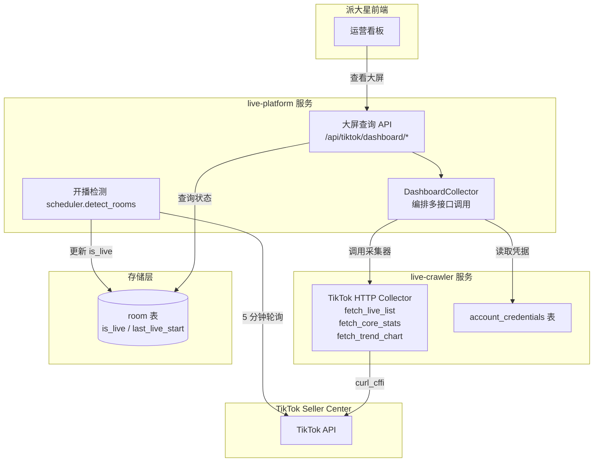
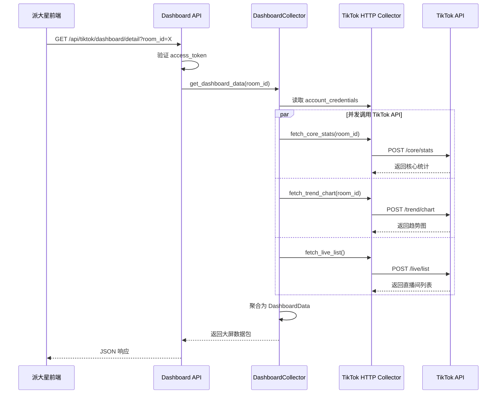

# TikTok 直播大屏采集开发摘要

## 1. 需求背景

派大星"直播运营中心-实时监控-直播大屏"模块需要实时展示 TikTok 直播间的核心指标与分析数据。数据来源于 TikTok Seller Center Workbench Live Overview (page 1) 的官方 API，前端按需拉取（不自动轮询），支持查看正在直播和已结束直播的数据。

**核心诉求**：
- 实时 GMV、观众数、订单、转化率等核心指标
- 趋势图（历史对比）
- 流量来源分析
- 观众画像（粉丝分层）
- 直播事件时间线（推品节奏）

---

## 2. API 调研结果

### 2.1 已确认可用的 API

| API 编号 | 接口名称 | 业务含义 | 优先级 |
|---------|---------|---------|-------|
| **01** | room/status | 直播间状态、时长、回放链接 | P0 |
| **06** | core/stats | **核心 API**：GMV、销量、UV/PV、转化率、ROI、市场/历史趋势对比 | P0 |
| **03** | source/new | 流量来源分析（一级/二级细分，各来源 GMV 和转化漏斗） | P1 |
| **04** | user/portrait | 观众画像（按粉丝类型统计订单/GMV/客单价） | P1 |
| **02** | event/timeline | 直播事件时间线（当前仅商品置顶事件） | P2 |

### 2.2 覆盖度评估

- ✅ **已覆盖 80% 核心需求**：GMV、流量、转化、画像、趋势、来源分析均完整
- ⚠️ **高优先级缺失**：
  1. **商品列表 API**（单品销量/库存/转化率）— 需补充抓包
  2. **弹幕/互动 API**（评论数/点赞数）— 需补充抓包

### 2.3 MVP 可行性

现有 5 个 API 已可构建直播大屏 MVP：
- 顶部卡片：`06-core-stats` 的 `gmv_local`、`sales`、`watch_uv`、`click_through_rate`
- 趋势图：`06-core-stats.stats_benchmark_data.self_cmp_data[]` 绘制历史对比
- 流量分析：`03-source-new` 饼图/柱状图
- 观众画像：`04-user-portrait` 粉丝分层表格
- 回放入口：`01-room-status` 的 `replay_url`

---

## 3. 技术架构

### 3.1 系统架构图



### 3.2 数据流时序



### 3.3 存储设计

**room 表扩展字段**（仅存状态标识，不存大屏数据）：

| 字段 | 类型 | 说明 | 索引 |
|------|------|------|------|
| `room_id` | VARCHAR(64) | 直播间唯一标识 | PRIMARY KEY |
| `platform` | VARCHAR(16) | 平台标识：tiktok | INDEX |
| `account_id` | VARCHAR(64) | 关联账号 ID | INDEX |
| `is_live` | BOOLEAN | 是否正在直播 | INDEX |
| `last_live_start` | DATETIME | 最近开播时间 | INDEX |
| `last_live_end` | DATETIME | 最近下播时间 | - |

**数据源策略**：
- ✅ **不引入 Redis 缓存**：按需实时拉取，保持简单
- ✅ **不走 Kafka 消费**：大屏数据实时变化，存储会立即过期
- ✅ **复用 live-crawler**：DRY 原则，集中维护 TikTok API 逻辑

### 3.4 API 规格

#### 查询单个直播间大屏数据

**请求**：
```http
GET /api/tiktok/dashboard/detail?room_id=7123456789
Headers:
  access_token: <ACCESS_TOKEN>
```

**响应**：
```json
{
  "code": 200,
  "message": "success",
  "data": {
    "room_info": {
      "room_id": "7123456789",
      "is_live": true,
      "live_start_time": "2026-06-11T10:30:00Z",
      "live_duration_seconds": 3600
    },
    "core_stats": {
      "gmv": "12345.67",
      "currency_code": "USD",
      "viewers": 1234,
      "peak_viewers": 5678,
      "orders": 89,
      "conversion_rate": "7.2%"
    },
    "trend_chart": {
      "viewers_timeline": [{"timestamp": 1717668600, "value": 100}],
      "gmv_timeline": [{"timestamp": 1717668600, "value": "100.00"}]
    }
  },
  "dataSource": "live_crawler_tiktok"
}
```

**错误码**：
- `401` - 未授权（access_token 无效）
- `4001` - 直播间不存在
- `4002` - 账号凭据失效
- `5000` - 服务内部错误

---

## 4. 实施计划（完整开发排期）

### 4.1 核心功能模块

本项目包含 **5 大核心模块**：

1. **实时直播大屏 API 采集**：正在直播的房间，按需拉取 TikTok 后台 9 个 API
2. **回放直播大屏 API 采集**：已结束直播的房间，复用同一套 API（只是 room_id 不同）
3. **SQLite → MySQL 迁移**：live-crawler 的 SQLite 数据库迁移到生产 MySQL
4. **内存状态 → Redis 迁移**：live-platform 的 5 分钟监控状态从内存迁移到 Redis
5. **派大星前端对接**：Vue 页面 + Echarts 图表渲染

---

### 4.2 开发排期表（从开发到上线稳定）

**总工期**：**15 个工作日**（3 周）

| 阶段 | 任务 | 负责人 | 工期 | 交付物 | 依赖 |
|------|------|--------|------|--------|------|
| **Phase 1: 基础设施准备** | | | **3d** | | |
| 1.1 | **SQLite → MySQL 迁移**<br>- 设计 MySQL 表结构（room/account_credentials/live_list 等）<br>- 编写迁移脚本（带数据校验）<br>- 生产环境迁移验证 | 后端 | 2d | 迁移脚本 + 数据对账报告 | 无 |
| 1.2 | **内存状态 → Redis 迁移**<br>- live-platform 的 `scheduler.detect_rooms()` 状态存储改造<br>- Redis key 设计：`live:room:{room_id}:status`<br>- 兜底策略：Redis 挂掉时降级到内存 | 后端 | 1d | Redis 状态管理模块 | 无 |
| **Phase 2: 采集器开发** | | | **3d** | | |
| 2.1 | **TikTok 大屏采集器扩展**<br>- 在 `collector.py` 新增 5 个 `fetch_*` 方法<br>- 单元测试覆盖（mock TikTok 响应） | 爬虫开发 | 2d | `collector.py` + 单测 | Phase 1.1 |
| 2.2 | **DashboardCollector 聚合器**<br>- 创建 `dashboard_collector.py`<br>- 并发调用 9 个 API（P0 优先）<br>- 统一错误处理 | 后端 | 1d | `DashboardCollector` 类 | Phase 2.1 |
| **Phase 3: 后端 API 开发** | | | **2d** | | |
| 3.1 | **API 路由开发**<br>- `GET /api/tiktok/dashboard/rooms`<br>- `GET /api/tiktok/dashboard/detail`<br>- Swagger 文档 | 后端 | 1.5d | API routes + 文档 | Phase 2.2 |
| 3.2 | **开播检测增强**<br>- `scheduler.detect_rooms()` 状态写入 Redis<br>- 更新 MySQL `room` 表时间字段 | 后端 | 0.5d | Scheduler 增强 | Phase 1 |
| **Phase 4: 采集稳定性测试** | | | **2d** | | |
| 4.1 | **压测 + 边界测试**<br>- 10 QPS 并发测试<br>- 登录态失效/超时/异常场景 | 测试 | 1d | 压测报告 | Phase 3 |
| 4.2 | **bug 修复**<br>- 修复压测问题<br>- 优化响应时间（< 3s） | 后端/爬虫 | 1d | bug 修复报告 | Phase 4.1 |
| **Phase 5: 数仓对接** | | | **2d** | | |
| 5.1 | **数仓表设计 + ETL 开发**<br>- 宽表/星型模型设计<br>- MySQL → 数仓同步脚本 | 数仓开发 | 2d | ETL 脚本 + 对账报告 | Phase 3 |
| **Phase 6: 前端对接** | | | **2d** | | |
| 6.1 | **派大星页面开发**<br>- 列表页（筛选+分页）<br>- 大屏详情页（7 区域可视化）<br>- Echarts 图表集成 | 前端 | 2d | Vue 页面 | Phase 3.1 |
| **Phase 7: 联调 + 上线** | | | **1d** | | |
| 7.1 | **端到端联调**<br>- 全链路测试<br>- 数据准确性验证 | 全员 | 0.5d | 联调报告 | Phase 6 |
| 7.2 | **灰度发布 + 监控配置**<br>- 灰度 1-2 个运营<br>- 飞书告警配置 | 运维 + 后端 | 0.5d | 发布记录 | Phase 7.1 |

---

### 4.3 关键里程碑

| 里程碑 | 时间节点 | 交付标准 |
|--------|---------|---------|
| **M1: 基础设施就绪** | Day 3 | SQLite 迁移完成 + Redis 状态管理上线 |
| **M2: 采集器可用** | Day 6 | 9 个 API 可抓取 + 单测通过 |
| **M3: 后端 API 可用** | Day 8 | `/rooms` 和 `/detail` 通过 Postman 测试 |
| **M4: 稳定性达标** | Day 10 | 压测通过（10 QPS）+ bug 清零 |
| **M5: 前端可用** | Day 12 | 派大星页面可渲染 7 区域数据 |
| **M6: 上线稳定** | Day 15 | 灰度 3 天无 P0 bug + 监控正常 |

---

### 4.4 人力配置

| 角色 | 工作量（人天） | 参与阶段 |
|------|--------------|---------|
| 后端开发 | 7d | Phase 1, 2.2, 3, 4.2 |
| 爬虫开发 | 3d | Phase 2.1, 4.2 |
| 数仓开发 | 2d | Phase 5 |
| 前端开发 | 2d | Phase 6 |
| 测试 | 1.5d | Phase 4.1, 7.1 |
| 运维 | 0.5d | Phase 7.2 |
| **总计** | **16 人天** | 2 人并行约 8 天（含 buffer 后 15 天） |

---

### 4.5 风险与 buffer

| 风险 | 概率 | 影响 | buffer |
|------|------|------|--------|
| TikTok API 字段变更 | 中 | 需修改解析逻辑 | +1d |
| 压测发现性能瓶颈 | 中 | 需优化查询/并发 | +1d |
| 数仓对接延期 | 低 | 不影响前端上线 | 不计入关键路径 |
| 前端联调字段缺失 | 低 | 需补充抓包 | +0.5d |

**总 buffer**：2.5 天 → **实际工期 15-18 天**

---

## 5. 风险与依赖

### 5.1 关键依赖

| 依赖项 | 现状 | 风险 | 缓解措施 |
|-------|------|------|---------|
| **account_credentials 表** | 必须有活跃 TikTok 凭据 | 凭据失效导致采集失败 | 返回 4002 错误码，前端提示重新登录 |
| **live-crawler TikTok HTTP collector** | 已实现 `fetch_core_stats` 等方法 | API 变更导致解析失败 | 集中在 collector 维护，增加响应格式监控 |
| **TikTok API 稳定性** | 未知限流策略 | 高频请求可能被限流 | Phase 3 增加防抖 + 重试逻辑 |

### 5.2 技术风险

| 风险 | 影响 | 概率 | 缓解措施 |
|------|------|------|---------|
| TikTok API 限流 | 查询失败，用户无法查看大屏 | 中 | 监控 API 失败率，超 10% 告警飞书；Phase 3 增加防抖 |
| 凭据失效 | 无法采集数据 | 高 | 返回明确错误码 4002，前端引导重新登录 |
| 响应慢（> 3s） | 用户体验差 | 中 | 设置 10s 超时；异步并发调用 3 个 API |
| 并发高（> 10 QPS） | 服务器压力大 | 低 | Nginx rate limit 限流；前端防抖 |

### 5.3 数据缺失风险

- **商品明细缺失**：当前 API 无单品销量/库存数据，需补充抓包验证是否有 `/product/sales` 接口
- **弹幕互动缺失**：无评论/点赞明细，若用户需要需补充抓包 `/comment/list` 或 WebSocket 连接

---

## 6. 下一步行动

### 立即执行（今日）

1. **数据库迁移**：`room` 表增加 `is_live` / `last_live_start` / `last_live_end` 字段，创建索引
2. **实现 DashboardCollector**：封装 `get_dashboard_data()` 方法，并发调用 3 个 TikTok API
3. **实现 API 路由**：`GET /api/tiktok/dashboard/detail`，集成 access_token 认证

### 短期（本周）

4. **开播检测增强**：`scheduler.detect_rooms()` 增加 `_update_room_status()` 逻辑
5. **单元测试**：覆盖 DashboardCollector 核心逻辑（mock TikTok API 响应）
6. **集成测试**：端到端验证（派大星前端 → live-platform API → TikTok API）

### 中期（下周）

7. **补充抓包**：在 TikTok Seller Center 大屏"商品"Tab 操作时，抓包验证是否有商品明细 API
8. **实现列表查询**：`GET /api/tiktok/dashboard/rooms`，支持过滤和分页
9. **监控告警**：接入飞书告警，监控 TikTok API 响应时间和失败率

---

## 附录：技术决策记录

### 为什么不引入缓存？

| 维度 | 实时拉取 | Redis 缓存 |
|------|---------|-----------|
| 实时性 | ✅ 最新数据 | ❌ 最多 5 分钟延迟 |
| 复杂度 | ✅ 简单 | ❌ 需处理缓存失效/穿透 |
| TikTok 频控 | ⚠️ 需注意限流 | ✅ 减少请求 |

**决策**：Phase 1 不引入缓存，保持简单。若后续遇到限流，Phase 3 增加 API 层防抖（10 秒内重复请求返回上次结果）。

### 为什么 room 表只存状态？

**决策**：`room` 表只存 `is_live` / `last_live_start` / `last_live_end` 等状态字段，不存储大屏数据（core_stats / trend_chart）。

**理由**：
1. 职责分离：`room` 表是"直播间状态追踪"，不是"数据仓库"
2. 时效性：大屏数据实时变化，存储会立即过期
3. 灵活性：TikTok API 支持任意时间窗查询，存储反而限制灵活性