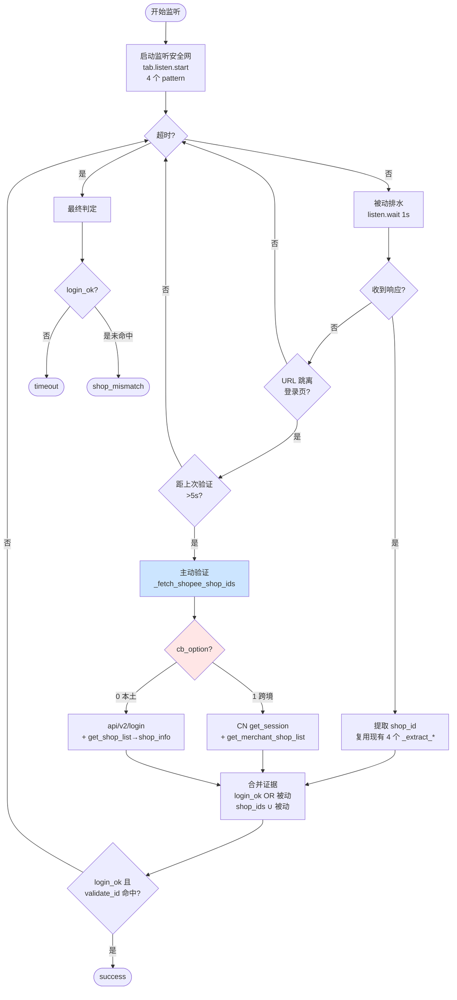
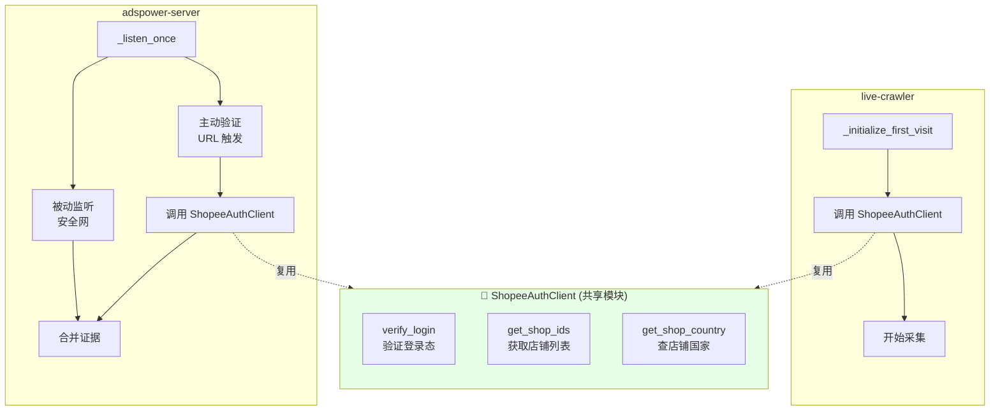
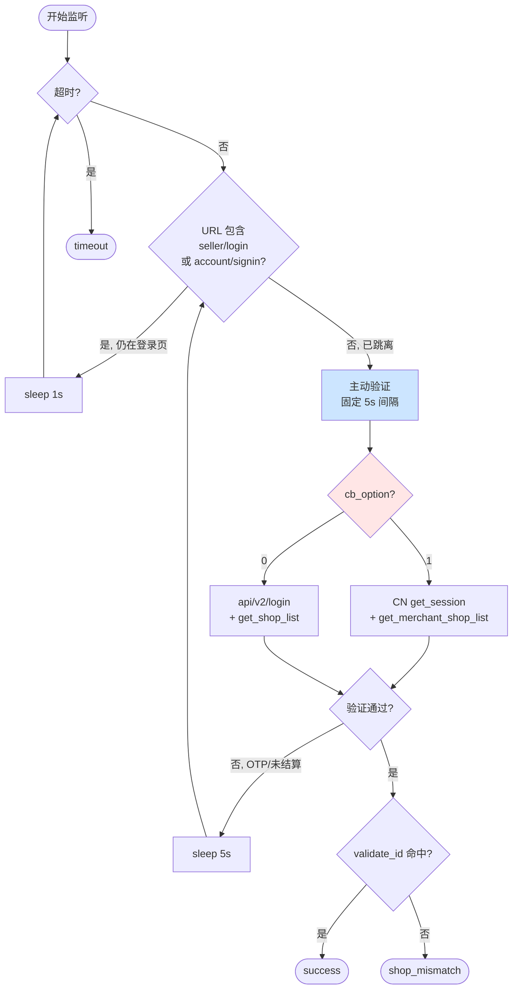

# Shopee 登录检测重构 - 方案对比

> 基于现状分析和补充信息，提出 3 种重构方案及推荐

## 补充信息总结

### 已确认信息

1. **跨境店多店铺接口**：`https://seller.shopee.cn/api/cnsc/selleraccount/get_merchant_shop_list/`
   - 返回所有店铺列表，包含 `shop_id`、`region`、`cb_option` 等字段
   - 响应结构与本土店的 `get_shop_list` 类似

2. **本土店兜底链已验证**：
   - `get_shop_list` → 持续"数据异常"（未返回详细错误码）
   - 自动兜底到 `shop_info` → 100% 成功获取 `shop_id` 和 `shop_region`

3. **登录页 URL 模式**：
   - SG 使用 `accounts.shopee.sg/seller/login`（accounts 域名）
   - 其他国家使用 `seller.shopee.{cc}/...` 或跨境店 `seller.shopee.cn/...`
   - 登录后跳转到 `creator-center`、`portal` 或 API 调用路径

4. **未记录的边界情况**：
   - 日志中无登出、会话过期、权限不足的详细响应
   - Shopee 登录成功率 100%（可能因为环境稳定或错误未被记录）

---

## 方案一：最小改动 - 监听安全网 + URL 触发主动验证

### 核心思路

保留现有被动监听能力（安全网），增加基于 URL 跳转的主动验证快速路径。**主动 OR 被动任一确认登录即成功**。

### 架构



### 实现要点

#### adspower-server 改动

1. **新增 `_fetch_shopee_shop_ids(session)` 方法**
   ```python
   def _fetch_shopee_shop_ids(self, session) -> tuple[bool, set[int], int]:
       """主动验证登录态并取 shop_id 集合。
       Returns: (login_ok, shop_ids, current_shop_id)
       """
       tab = session.drissionpage_tab
       if session.cb_option == 1:
           # 跨境店：get_session + get_merchant_shop_list
           _, session_data = self._js_fetch_json(
               tab, "https://seller.shopee.cn/api/cnsc/selleraccount/get_session/"
           )
           if not session_data or session_data.get("code") != 0:
               return False, set(), None
           
           current = self._to_int(
               (session_data.get("sub_account_info") or {}).get("current_shop_id")
           )
           
           # 取店铺列表
           _, list_data = self._js_fetch_json(
               tab, "https://seller.shopee.cn/api/cnsc/selleraccount/get_merchant_shop_list/"
           )
           shop_ids = {current} if current else set()
           if list_data and list_data.get("code") == 0:
               shops = list_data.get("data", {}).get("shops", [])
               shop_ids |= {self._to_int(s.get("shop_id")) for s in shops if s.get("shop_id")}
           
           return True, shop_ids, current
       else:
           # 本土店：api/v2/login + get_shop_list → shop_info 兜底
           domain = get_shopee_seller_domain(session.country)
           _, login_data = self._js_fetch_json(
               tab, f"https://{domain}/api/v2/login/"
           )
           if not login_data or login_data.get("errcode") != 0:
               return False, set(), None
           
           current = self._to_int(login_data.get("shopid"))
           shop_ids = {current} if current else set()
           
           # 尝试 get_shop_list
           _, list_data = self._js_fetch_json(
               tab, f"https://{domain}/api/selleraccount/subaccount/get_shop_list/"
           )
           if list_data and list_data.get("code") == 0:
               shops = list_data.get("shops", [])
               shop_ids |= {self._to_int(s.get("shop_id")) for s in shops if s.get("shop_id")}
           
           return True, shop_ids, current
   ```

2. **重构 `_listen_once` 方法**
   ```python
   def _listen_once(self, session) -> dict:
       tab = session.drissionpage_tab
       tab.listen.start(self.SHOPEE_PATTERN)
       
       login_ok = False
       shop_ids = set()
       last_active_verify = 0.0
       
       deadline = time.time() + settings.LOGIN_TIMEOUT_SECONDS
       while time.time() < deadline:
           # 被动排水
           packet = tab.listen.wait(timeout=1)
           if packet:
               ok, sid, sids = self._parse_passive_packet(packet)
               login_ok = login_ok or ok
               if sid: shop_ids.add(sid)
               shop_ids.update(sids)
           
           # URL 触发主动验证（节流 5s）
           url = tab.url or ""
           if ("seller/login" not in url and "account/signin" not in url 
               and time.time() - last_active_verify > 5):
               last_active_verify = time.time()
               ok, sids, _ = self._fetch_shopee_shop_ids(session)
               login_ok = login_ok or ok
               shop_ids.update(sids)
           
           # 任一路命中即成功
           if login_ok and str(session.validate_id) in {str(i) for i in shop_ids}:
               break
       
       tab.listen.stop()
       return {"login_ok": login_ok, "shop_ids": shop_ids}
   ```

3. **简化 `_run` 方法**
   ```python
   async def _run(self, session: Session) -> None:
       try:
           result = await asyncio.to_thread(self._listen_once, session)
       except Exception as exc:
           logger.warning("登录监听异常: {}", exc)
           session.login_status = "error"
           await self._handle_result(session, "error", "listen_error", None)
           return
       
       if result is None:
           session.login_status = "error"
           await self._handle_result(session, "error", "timeout", None)
           return
       
       login_ok = result.get("login_ok", False)
       shop_ids = result.get("shop_ids", set())
       validate_id = str(session.validate_id)
       
       if not login_ok:
           session.login_status = "error"
           await self._handle_result(session, "error", "timeout", None)
           return
       
       if validate_id in {str(i) for i in shop_ids}:
           session.login_status = "success"
           await self._handle_result(session, "success", "", int(validate_id))
       else:
           session.login_status = "error"
           reported_shop_id = next(iter(shop_ids), None)
           await self._handle_result(session, "error", "shop_mismatch", reported_shop_id)
   ```

#### live-crawler 改动

**无需改动**（已经是主动验证模式）。

### 可删除的代码

- `_check_session_cookie`（Cookie 兜底被主动验证替代）
- `_trigger_shop_info`（主动验证已覆盖）
- `fallback_triggered` 标记及相关逻辑
- `_extract_shop_id_from_data`、`_extract_shop_id_from_cn_session`（合并到 `_fetch_shopee_shop_ids`）

### 优点

- ✅ **改动最小**：只新增一个方法，重构一个方法
- ✅ **向后兼容**：保留被动监听，域名猜错时有安全网
- ✅ **快速响应**：URL 跳转后立即主动验证，不等被动监听
- ✅ **风险可控**：主动失败时回落到被动监听

### 缺点

- ⚠️ **逻辑仍然复杂**：被动 + 主动双路径共存
- ⚠️ **代码未完全收敛**：`_fetch_shopee_shop_ids` 和 live-crawler 的 `_fetch_login_info_via_js` 仍有重复

---

## 方案二：中度重构 - 提取共享认证客户端

### 核心思路

将 Shopee 登录验证逻辑抽成独立模块 `ShopeeAuthClient`，live-crawler 和 adspower-server 都复用，消除重复代码。

### 架构



### 实现要点

#### 新增共享模块 `common/shopee_auth_client.py`

```python
class ShopeeAuthClient:
    """Shopee 登录验证客户端（跨服务复用）"""
    
    def __init__(self, js_fetch_fn, country: str, cb_option: int):
        """
        Args:
            js_fetch_fn: JS 注入函数 (url, method, body) -> (status, data)
            country: 国家代码（MY/ID/TH...）
            cb_option: 0=本土店, 1=跨境店
        """
        self.js_fetch = js_fetch_fn
        self.country = country
        self.cb_option = cb_option
    
    def verify_login(self) -> tuple[bool, dict | None]:
        """验证登录态，返回 (is_logged_in, response_data)"""
        if self.cb_option == 1:
            _, data = self.js_fetch(
                "https://seller.shopee.cn/api/cnsc/selleraccount/get_session/",
                "GET", None
            )
            return data and data.get("code") == 0, data
        else:
            domain = get_shopee_seller_domain(self.country)
            _, data = self.js_fetch(
                f"https://{domain}/api/v2/login/", "GET", None
            )
            return data and data.get("errcode") == 0, data
    
    def get_shop_ids(self) -> tuple[bool, set[int], int | None]:
        """获取店铺列表，返回 (verified, shop_ids, current_shop_id)"""
        is_logged_in, login_data = self.verify_login()
        if not is_logged_in:
            return False, set(), None
        
        if self.cb_option == 1:
            # 跨境店
            current = self._extract_int(
                (login_data.get("sub_account_info") or {}).get("current_shop_id")
            )
            _, list_data = self.js_fetch(
                "https://seller.shopee.cn/api/cnsc/selleraccount/get_merchant_shop_list/",
                "GET", None
            )
            shop_ids = {current} if current else set()
            if list_data and list_data.get("code") == 0:
                shops = list_data.get("data", {}).get("shops", [])
                shop_ids |= {self._extract_int(s.get("shop_id")) for s in shops}
            return True, shop_ids, current
        else:
            # 本土店
            current = self._extract_int(login_data.get("shopid"))
            shop_ids = {current} if current else set()
            
            # 尝试 get_shop_list
            domain = get_shopee_seller_domain(self.country)
            _, list_data = self.js_fetch(
                f"https://{domain}/api/selleraccount/subaccount/get_shop_list/",
                "GET", None
            )
            if list_data and list_data.get("code") == 0:
                shops = list_data.get("shops", [])
                shop_ids |= {self._extract_int(s.get("shop_id")) for s in shops}
            # 不需要显式兜底 shop_info，因为 current 已从 login 拿到
            
            return True, shop_ids, current
    
    def get_shop_country(self, shop_id: str) -> str | None:
        """查询店铺所属国家（仅本土店，跨境店从 get_merchant_shop_list 已拿到）"""
        # 复用 live-crawler 的逻辑
        ...
```

#### adspower-server 调用

```python
def _fetch_shopee_shop_ids(self, session) -> tuple[bool, set[int], int]:
    tab = session.drissionpage_tab
    client = ShopeeAuthClient(
        js_fetch_fn=lambda url, method, body: self._js_fetch_json(tab, url, method, body),
        country=session.country,
        cb_option=session.cb_option or 0
    )
    return client.get_shop_ids()
```

#### live-crawler 调用

```python
def _fetch_login_info_via_js(self) -> bool:
    client = ShopeeAuthClient(
        js_fetch_fn=self._js_fetch_wrapper,
        country=self._get_country_code(),
        cb_option=1 if self.is_cross_border else 0
    )
    verified, shop_ids, current = client.get_shop_ids()
    if verified:
        self.media_shop_id = current
        # ... 其他逻辑
    return verified
```

### 优点

- ✅ **消除重复**：跨境/本土、列表兜底逻辑只写一次
- ✅ **统一维护**：接口变更只需改一处
- ✅ **测试友好**：`ShopeeAuthClient` 可独立单测

### 缺点

- ⚠️ **引入耦合**：两个服务依赖同一模块，需要协调发布
- ⚠️ **改动范围大**：live-crawler 现有逻辑需要重构适配
- ⚠️ **JS 注入差异**：live-crawler 用 `browser_api.run_js_fetch`，adspower-server 用自己的 `_js_fetch_json`，需要适配层

---

## 方案三：激进重构 - adspower-server 纯主动，live-crawler 保持不变

### 核心思路

**完全移除** adspower-server 的被动监听，改为纯主动轮询 URL + 验证。live-crawler 保持现有逻辑不变。

### 架构



### 实现要点

```python
def _detect_shopee_login(self, session) -> dict | None:
    tab = session.drissionpage_tab
    deadline = time.time() + settings.LOGIN_TIMEOUT_SECONDS
    
    while time.time() < deadline:
        url = tab.url or ""
        
        # 仍在登录页，继续等
        if "seller/login" in url or "account/signin" in url:
            time.sleep(1)
            continue
        
        # 已跳离，主动验证
        verified, shop_ids, current = self._fetch_shopee_shop_ids(session)
        if not verified:
            # 验证失败（OTP/未结算），等 5s 后重试
            time.sleep(5)
            continue
        
        # 验证成功，检查匹配
        validate_id = str(session.validate_id)
        if validate_id in {str(i) for i in shop_ids}:
            return {"status": "success", "shop_id": int(validate_id)}
        else:
            return {"status": "error", "reason": "shop_mismatch", "shop_id": current}
    
    return None  # timeout
```

### 可删除的代码

- **完全删除** `tab.listen` 相关逻辑
- `SHOPEE_PATTERN`
- `_parse_body` / `_find_shop_id` / `_extract_*`（4 个）
- `_check_session_cookie` / `_trigger_shop_info` / `fallback_triggered`

### 优点

- ✅ **逻辑最简洁**：单一路径，无分支纠缠
- ✅ **代码量最少**：删除 200+ 行，新增 50 行
- ✅ **可维护性最高**：无被动监听的不确定性

### 缺点

- ❌ **丢失安全网**：域名猜错时无被动监听兜底，900s 全浪费
- ❌ **风险最高**：OTP 页面 URL 判断错误会导致死循环
- ❌ **调试困难**：无法通过监听日志分析登录流程

---

## 推荐方案

**推荐方案一（最小改动）**，理由：

1. **风险可控**：保留被动监听安全网，域名猜错时有兜底
2. **改动最小**：不影响 live-crawler，adspower-server 只新增 1 个方法
3. **向后兼容**：现有监听日志、调试手段保持不变
4. **渐进优化**：验证稳定后，可逐步过渡到方案三

**不推荐方案二**：跨服务共享模块引入耦合，需要协调发布，收益不足以抵消成本。

**不推荐方案三**：风险过高，一旦 URL 判断逻辑有漏洞（如某些国家 OTP 页面不含 `signin`），会导致生产环境大面积失败。

---

## 后续演进路径

1. **Phase 1（本次）**：实施方案一，验证主动 + 被动混合模式的稳定性
2. **Phase 2（观察期）**：收集 1-2 周生产数据，统计主动验证成功率
3. **Phase 3（可选）**：如果主动验证成功率 > 95%，考虑移除被动监听（演进到方案三）
4. **Phase 4（长期）**：提取 `ShopeeAuthClient` 共享模块（演进到方案二）

