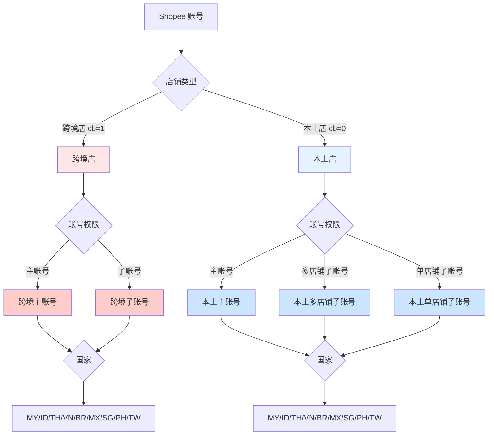

# Shopee 登录检测逻辑现状分析

> 梳理 live-crawler 和 adspower-server 两端当前的实现逻辑，识别分支点、缺失环节和需补充的信息

## 一、核心维度与分支点

### 1.1 三个维度的组合

### 1.2 当前已知的分支映射

| 维度 | 分支 | live-crawler 处理 | adspower-server 处理 | 缺失/问题 |
|------|------|-------------------|---------------------|-----------|
| **店铺类型** | 跨境店 (cb=1) | ✅ CN 域名 `seller.shopee.cn` | ✅ `session.cb_option == 1` | ❓ 跨境店是否有多店铺列表接口？ |
| | 本土店 (cb=0) | ✅ 国家域名 `seller.shopee.{domain}` | ✅ `session.cb_option == 0` | - |
| **账号权限** | 主账号 | ✅ `get_shop_list` 取列表 | ⚠️ 被动监听 | ❓ 主账号一定有列表权限吗？ |
| | 多店铺子账号 | ✅ `get_shop_list` 取列表 | ⚠️ 被动监听 | - |
| | 单店铺子账号 | ✅ 兜底 `shop_info` | ⚠️ 被动监听兜底接口 | ❓ 如何提前判断账号类型？ |
| **国家** | MY/ID/TH/... | ✅ 动态替换域名 | ⚠️ 仅靠 `session.country` 推断 | ❌ 推断错误无纠正机制 |

## 二、当前实现的详细流程

### 2.1 live-crawler 登录检测流程

```mermaid
flowchart TD
    Start(["首次访问采集页"]) --> Init["初始化<br/>解析 cb_option<br/>解析 country_domain"]
    
    Init --> OpenPage["打开采集页面<br/>替换为当前域名"]
    
    OpenPage --> CheckLogin["检查登录状态<br/>_check_login_status"]
    
    CheckLogin --> IsCB1{"cb_option?"}
    
    IsCB1 -->|1 跨境店| ApiCN["主动 JS fetch<br/>CN get_session"]
    IsCB1 -->|0 本土店| CookieCheck["Cookie 预检<br/>SPC_SC_SESSION"]
    
    CookieCheck -->|缺失| LoggedOut["判定登出"]
    
    %% 修复点：用双引号包裹包含 {domain} 的文本
    CookieCheck -->|存在| ApiLocal["主动 JS fetch<br/>{domain}/api/v2/login/"]
    
    ApiCN --> ApiResult{"API 验证"}
    ApiLocal --> ApiResult
    
    ApiResult -->|失败| LoggedOut
    ApiResult -->|成功| FetchInfo["获取登录信息<br/>_fetch_login_info_via_js"]
    
    LoggedOut --> AutoRelogin["尝试自动重登<br/>点击已保存账号"]
    AutoRelogin -->|失败| SendLogout["发送 logout 回调"]
    AutoRelogin -->|成功| FetchInfo
    
    FetchInfo --> Branch1{"cb_option?"}
    
    Branch1 -->|1| FetchCN["CN get_session<br/>+ userInfo"]
    
    %% 修复点：用双引号包裹包含 {domain} 的文本
    Branch1 -->|0| FetchLocal["{domain}/api/v2/login"]
    
    FetchCN --> ExtractIDs["提取 media_user_id<br/>media_shop_id"]
    FetchLocal --> ExtractIDs
    
    ExtractIDs --> GetValidate["从 remark 取<br/>validate_id"]
    
    GetValidate --> HasValidate{"validate_id?"}
    HasValidate -->|否| ErrNoValidate["返回 False<br/>终止采集"]
    
    HasValidate -->|是| Branch2{"cb_option?"}
    
    Branch2 -->|0 本土店| QueryCountry["查询店铺国家<br/>_get_shop_country_by_id"]
    Branch2 -->|1 跨境店| CheckRemark{"remark 有国家?"}
    
    QueryCountry --> TryList["尝试 get_shop_list"]
    TryList -->|成功| MatchDomain{"域名匹配?"}
    TryList -->|失败 权限不足| TryInfo["兜底 shop_info"]
    TryInfo --> MatchDomain
    
    MatchDomain -->|不匹配| UpdateDomain["切换域名<br/>_update_country_domain"]
    MatchDomain -->|匹配| SyncRemark["同步 remark 国家"]
    UpdateDomain --> SyncRemark
    
    CheckRemark -->|否| QueryCB["CN get_or_set_shop<br/>查跨境店国家"]
    CheckRemark -->|是| EnsureShop["确保正确店铺<br/>_ensure_correct_shop"]
    
    QueryCB --> SyncRemarkCB["同步 remark<br/>用于币种上报"]
    SyncRemarkCB --> EnsureShop
    
    SyncRemark --> EnsureShop
    
    %% 修复点：用双引号包裹包含 == 的文本
    EnsureShop --> ShopMatch{"media_shop_id<br/>== validate_id?"}
    
    ShopMatch -->|是| SendSuccess["发送 success 回调<br/>开始采集"]
    ShopMatch -->|否| SwitchShop["切换店铺<br/>_switch_to_shop"]
    
    SwitchShop --> ClickDetails["导航到店铺列表<br/>点击 Details"]
    ClickDetails --> VerifySwitch["重新获取 login 信息<br/>验证切换"]
    VerifySwitch -->|成功| SendSuccess
    VerifySwitch -->|失败| ErrSwitch["返回 False<br/>终止采集"]
    
    style IsCB1 fill:#ffe6e6
    style Branch1 fill:#ffe6e6
    style Branch2 fill:#ffe6e6
```

### 2.2 adspower-server 登录监听流程

```mermaid

graph TD
    Start([开始登录监听]) --> StartListen[启动接口监听<br/>api/v2/login, get_shop_list, shop_info, cn get_session]

    StartListen --> InitVars["初始化变量<br/>login_shop_id=None<br/>shop_list_ids=[]<br/>fallback_triggered=False"]

    InitVars --> LoopStart{"超时?<br/>LOGIN_TIMEOUT"}

    LoopStart -->|否| CookieCheckTime{"到Cookie检查间隔?<br/>5秒"}
    LoopStart -->|是| FinalVerify

    CookieCheckTime -->|否| WaitPacket
    CookieCheckTime -->|是| CookieCheckLogic{"Cookie有效<br/>且未获取shop_id<br/>且未触发兜底?"}

    CookieCheckLogic -->|是| TriggerFallback["触发兜底页面<br/>creator-center/insight/live"]
    CookieCheckLogic -->|否| WaitPacket
    TriggerFallback --> SetFallbackFlag["fallback_triggered=true"]
    SetFallbackFlag --> WaitPacket

    WaitPacket["等待接口响应<br/>2秒超时"] --> PacketReceived{"收到响应?"}

    PacketReceived -->|否| LoopStart
    PacketReceived -->|是| ParsePacket["解析响应体"]

    ParsePacket --> MatchUrl{"匹配哪个接口?"}

    MatchUrl -->|api/v2/login| ExtractLoginId["提取shop_id<br/>从根或user对象"]
    MatchUrl -->|get_shop_list| ExtractListIds["提取shops数组<br/>所有shop_id"]
    MatchUrl -->|shop_info| ExtractShopInfoId["提取data.shop_id<br/>兜底接口"]
    MatchUrl -->|cn get_session| ExtractCnId["提取current_shop_id<br/>跨境店接口"]

    ExtractLoginId --> StoreLoginId["存储到login_shop_id"]
    ExtractListIds --> StoreListIds["追加到shop_list_ids"]
    ExtractShopInfoId --> StoreLoginId
    ExtractCnId --> StoreLoginId

    StoreLoginId --> CheckMatch{"任一shop_id<br/>== validate_id?"}
    StoreListIds --> CheckMatch

    CheckMatch -->|是| BreakLoop["立即退出循环"]
    CheckMatch -->|否| LoopStart

    BreakLoop --> FinalVerify["最终API验证<br/>必要条件"]

    FinalVerify --> ApiVerifyMethod{"跨境店 vs 本土店"}

    ApiVerifyMethod -->|跨境店<br/>cb_option=1| ApiCN["CN get_session<br/>检查code==0"]
    ApiVerifyMethod -->|本土店| ApiLocal["MY api/v2/login<br/>检查errcode==0"]

    ApiCN --> ApiResult{"API验证结果"}
    ApiLocal --> ApiResult

    ApiResult -->|失败| StopListen["停止监听"]
    ApiResult -->|成功| SetApiFlag["api_login_verified=true"]

    SetApiFlag --> StopListen
    StopListen --> ValidateResult{"验证逻辑"}

    ValidateResult --> HasApiVerified{"api_login_verified<br/>== true?"}
    HasApiVerified -->|否| CallbackError["回调error<br/>reason: API验证失败"]

    HasApiVerified -->|是| CheckLoginId{"login_shop_id<br/>== validate_id?"}
    CheckLoginId -->|是| CallbackSuccess["回调success<br/>立即设置login_status"]

    CheckLoginId -->|否| CheckListIds{"validate_id<br/>in shop_list_ids?"}
    CheckListIds -->|是| CallbackSuccess

    CheckListIds -->|否| CallbackMismatch["回调error<br/>reason: shop_mismatch<br/>清除Cookies"]

    CallbackSuccess --> NotifyFrontend["通知前端<br/>login_success"]
    CallbackMismatch --> NotifyFrontendFail["通知前端<br/>login_failed"]
    CallbackError --> NotifyFrontendError["通知前端<br/>login_timeout/error"]

    NotifyFrontend --> ScheduleClose["调度关闭<br/>LOGIN_SUCCESS_DELAY"]
    NotifyFrontendFail --> ScheduleCloseFail["调度关闭<br/>LOGIN_FAILED_DELAY"]
    NotifyFrontendError --> ScheduleCloseError["调度关闭<br/>LOGIN_TIMEOUT_DELAY"]

    ScheduleClose --> MoveGroup{"target_group_id存在?"}
    MoveGroup -->|是| MoveToGroup["移动环境到分组"]
    MoveGroup -->|否| DelayClose
    MoveToGroup --> DelayClose

    ScheduleCloseFail --> DelayClose["延迟后关闭浏览器<br/>清理session"]
    ScheduleCloseError --> DelayClose

    DelayClose --> End([结束])

    style ApiVerifyMethod fill:#ffe6e6
    style HasApiVerified fill:#fff3cd
    style CallbackSuccess fill:#ccffcc
    style CallbackMismatch fill:#ffcccc
    style CallbackError fill:#ffcccc
```

## 三、关键问题与缺失信息

### 3.1 跨境店的未知点

| 问题 | 当前处理 | 需要确认 |
|------|---------|---------|
| 跨境店是否有多店铺列表接口？ | ❌ live-crawler 只用 `get_session` 的 `current_shop_id` | ✅ 请提供跨境店多店铺接口（如果存在） |
| 跨境主账号 vs 子账号的区别？ | ❌ 未区分 | ✅ 是否需要区分？接口是否不同？ |
| 跨境店切换店铺的方式？ | ⚠️ live-crawler 用本土店的切换逻辑 | ✅ 跨境店能否通过点击 Details 切换？ |

### 3.2 本土店的未知点

| 问题 | 当前处理 | 需要确认 |
|------|---------|---------|
| 单店铺子账号如何提前识别？ | ❌ 只能通过 `get_shop_list` 失败后才知道 | ✅ 有没有更早的判断方式？ |
| 主账号一定有 `get_shop_list` 权限吗？ | ⚠️ live-crawler 假设有 | ✅ 是否有反例？ |

### 3.3 域名与国家的未知点

| 问题 | 当前处理 | 需要确认 |
|------|---------|---------|
| 所有国家的登录页 URL 模式？ | ⚠️ 只知道 `seller/login` 和 `account/signin` | ✅ 是否有其他变体？（如 PH/TW） |
| 登录成功后的跳转 URL 模式？ | ❌ 未明确 | ✅ 各国跳转到的 URL 是否统一？ |
| OTP 页面的 URL 特征？ | ⚠️ 你提到包含 `account/signin` 或 `seller/login` | ✅ 是否所有国家都一致？ |

### 3.4 接口响应的未知点

| 问题 | 当前处理 | 需要确认 |
|------|---------|---------|
| `get_shop_list` 失败的响应码？ | ⚠️ live-crawler 检查 `code != 0` | ✅ 权限不足时的 `code` 和 `message` 是什么？ |
| `shop_info` 的适用场景？ | ⚠️ 只知道是单店铺子账号的兜底 | ✅ 是否有其他场景需要调用？ |
| CN `get_session` 的异常响应？ | ⚠️ live-crawler 检查 `code == 0` | ✅ 未登录/会话过期时的 `code` 是什么？ |

## 四、需要你补充的信息

### 4.1 跨境店相关

请提供以下信息（如果存在）：

1. **跨境店多店铺列表接口**
   - 接口 URL 和方法
   - 请求参数
   - 响应示例（成功和失败）
   - 是否区分主账号和子账号

2. **跨境店账号类型识别**
   - 如何判断是主账号还是子账号？
   - 两者在接口权限上有何区别？

3. **跨境店切换店铺**
   - 是否支持切换店铺？
   - 如果支持，流程是什么？（URL、点击元素、验证方式）

### 4.2 本土店相关

请提供以下信息：

1. **单店铺子账号的早期识别**
   - 是否有接口可以提前判断账号类型？
   - 或者只能通过 `get_shop_list` 失败后才知道？

2. **`get_shop_list` 权限不足的响应**
   - 完整的响应 JSON 示例
   - `code` 和 `message` 字段的值

3. **`shop_info` 接口详情**
   - 何时需要调用？（仅单店铺子账号？）
   - 响应示例

### 4.3 多国相关

请提供以下信息：

1. **各国登录页和 OTP 页的 URL 特征**
   - MY/ID/TH/VN/BR/MX/SG/PH/TW 各国的 URL 模式
   - 是否都是 `seller/login` 或 `account/signin`？

2. **登录成功后的跳转 URL**
   - 各国登录成功后跳转到哪里？
   - URL 是否包含固定的路径特征？（如 `portal`、`creator-center`）

3. **域名映射的完整性**
   - 当前 `_SHOPEE_SELLER_DOMAIN_MAP` 是否覆盖所有国家？
   - 是否有遗漏或错误？

### 4.4 接口响应的边界情况

请提供以下边界情况的响应示例：

1. **未登录时各接口的响应**
   - `api/v2/login` (本土店)
   - `CN get_session` (跨境店)
   - `get_shop_list`
   - `shop_info`

2. **会话过期时的响应**
   - 是否与未登录相同？

3. **权限不足时的响应**
   - `get_shop_list` 被拒绝
   - `shop_info` 被拒绝

## 五、补充信息后的优化方向

一旦你补充了上述信息，我可以：

1. **绘制完整的决策树**：涵盖所有 跨境/本土 × 主账号/多店铺子账号/单店铺子账号 × 9 个国家 的组合
2. **设计统一的认证客户端**：封装所有接口调用逻辑，屏蔽跨境/本土差异
3. **优化 adspower-server 的主动验证**：精确知道何时调用哪个接口、如何解析响应
4. **制定域名纠错策略**：当主动验证打到错误域名时，如何通过被动监听纠正
5. **简化分支逻辑**：消除所有"打补丁"式的 if-else，用策略模式或责任链模式重构

---

**请按上述 4.1~4.4 的结构，补充你能提供的信息。即使部分信息不全也没关系，我会根据现有信息设计容错方案。**
