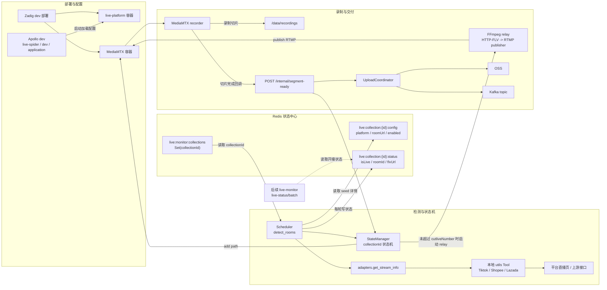
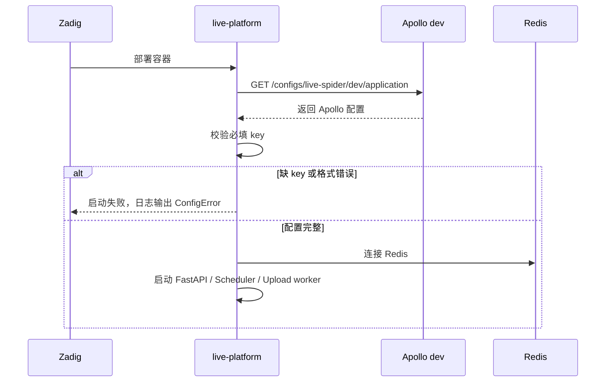
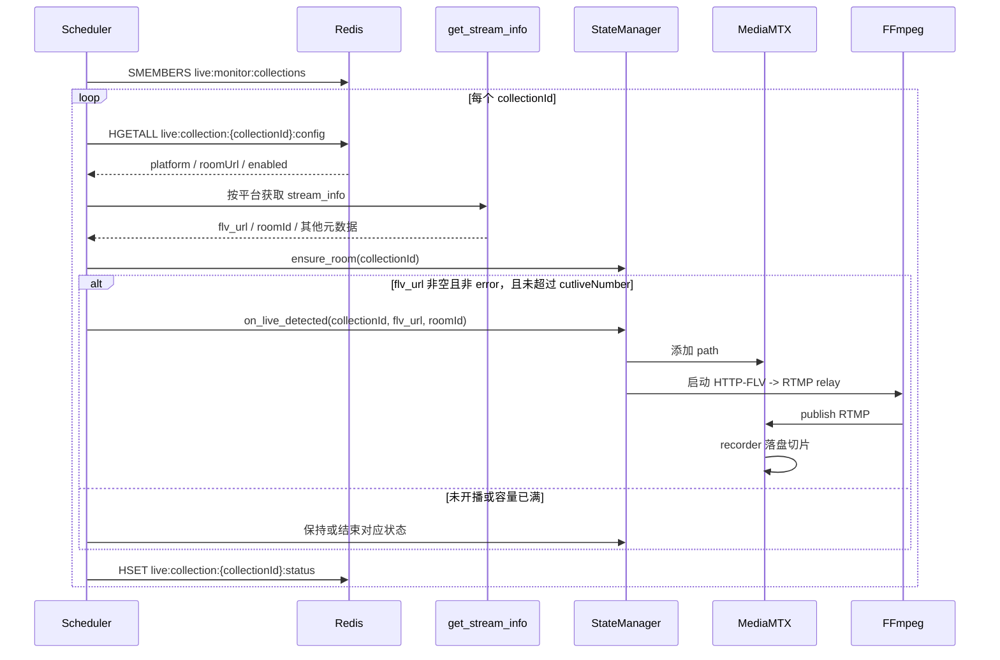
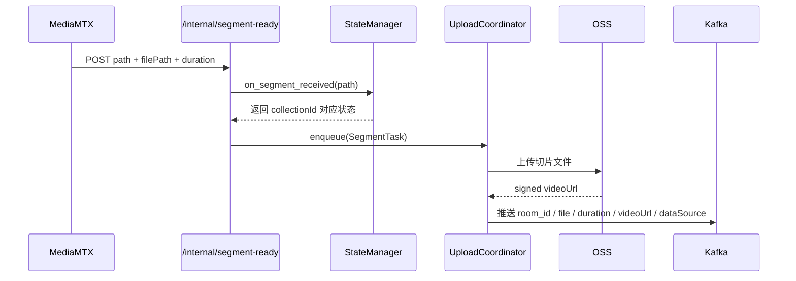

# live-platform 架构流程图

本文描述 `services/live-platform` 当前 dev 部署后的完整数据流。配置统一从 Apollo dev 读取；房间种子由 MySQL 同步到 Redis，开播状态统一落 Redis。录制链路中，FFmpeg 只做 `HTTP-FLV -> RTMP` relay，MediaMTX 负责 recorder、切片落盘和切片完成回调，后续由 OSS + Kafka 交付。

## 总览



图例：实线表示当前运行链路；虚线表示后续 `live-monitor` 接口复用的读取链路。FFmpeg relay 不写本地录制文件，只把平台 HTTP-FLV 流转推给 MediaMTX。Redis `config` 是房间 seed，Redis `status` 由 `live-platform` 每轮检测后写入。

## 启动与配置流



## 房间检测与 Redis 状态流



## 录制切片与上传流



如果 MediaMTX 日志持续出现 `runOnRecordSegmentComplete command launched`，但 live-platform 日志没有 `POST /internal/segment-ready` 或 `收到切片回调`，说明 recorder 已经触发回调命令，但回调未成功进入 FastAPI。此时状态机的 `last_active` 不会刷新，会按 `segmentTimeoutSeconds` 进入重连。

## Redis Key

```text
live:monitor:collections
  Set: collectionId

live:collection:{collectionId}:config
  Hash:
    collectionId
    platform
    roomUrl
    enabled

live:collection:{collectionId}:status
  Hash:
    collectionId
    isLive
    roomId
    flvUrl
    platform
    roomUrl
    status
    mediamtxPath
    updatedAt
    lastLiveStart
    lastLiveEnd
    errorMessage
```

## ID 口径

| 名称 | 含义 | 来源 |
|------|------|------|
| `collectionId` | 账号/任务主键，Redis seed 和状态主键 | 外部 seed 写入 Redis |
| `roomId` | 平台真实直播间号 | `utils/*Tool.py` 返回的 `stream_info.roomId` |
| `mediamtxPath` | MediaMTX path，格式为 `{platform}-{collectionId}` | `StateManager` 生成 |

## 并发口径

`cutliveNumber` 映射为单个 `live-platform` 实例的最大活跃录制并发。容量满时，服务仍会检测房间并写 Redis 状态，但不会启动新的 MediaMTX path 或 FFmpeg relay。
